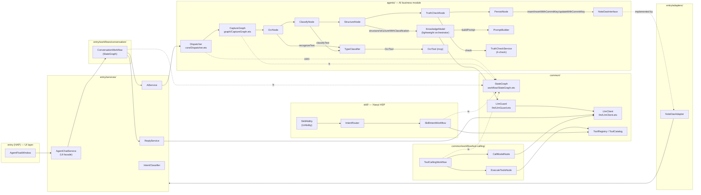

# CaptureGraph / LangGraph Agent Workflow Processing Chain — cited map

> **Date**: 2026-09-16
> **Scope**: full call path of `ConversationWorkflow → AiService.captureText → Dispatcher.dispatch → CaptureGraph → KnowledgeModel.structure → TruthCheckNode → NoteDaoAdapter`, plus the sibling workflows (ToolCalling / SkillIntent / Conversation) and the shared `StateGraph<State, Step>` kernel they all sit on.
> **Status**: research snapshot. Source-of-truth is the code at this date; doc claims checked against the implementation.
> **Author note**: every non-trivial claim is cited as `path:LINE` or `docs/...md#section`. Drift between spec 018 and the code is called out in §10.

---

## 1. Background — why this exists at all

Spec 018 ([docs/specs/018-agent-workflow-architecture.md:1-19](../specs/018-agent-workflow-architecture.md)) is the current authoritative state for "LangGraph" in this project. ADR-0008 ([docs/adr/0008-capturegraph-self-built-runtime.md:3](../adr/0008-capturegraph-self-built-runtime.md)) makes the scope explicit:

> "We **adopted LangGraph as the project's primary Agent workflow architecture design root** — its model and vocabulary (Node, Edge, State, conditional edges, `START`/`END`, `addNode` / `addEdge` / `addConditionalEdge` / `run`) are canonical for every Agent workflow that requires orchestration. `agents/src/main/ets/graph/CaptureGraph.ets` is the first concrete ArkTS workflow implementation, not the name or full scope of the architecture. What was rejected is only the *runtime dependency* (Python sidecar / langgraphjs), never the LangGraph workflow design itself."

So in this codebase, "LangGraph" is **a vocabulary**, not a runtime. The runtime is the project's own `StateGraph<State, Step>` in `common/src/main/ets/workflow/StateGraph.ets`. Three production workflows today — `CaptureGraph`, `ToolCallingWorkflow`, `SkillIntentWorkflow` — plus `ConversationWorkflow` — all instantiate that kernel. There is exactly one runtime (`common/src/main/ets/workflow/StateGraph.ets:19-87`); spec 018 §6 ([018-agent-workflow-architecture.md:87-89](../specs/018-agent-workflow-architecture.md)) confirms the shared kernel was extracted only after Capture and ToolLoop proved equivalent.

`CaptureGraph` is the *first concrete* workflow (CONTEXT.md:85). It is not the whole architecture.

---

## 2. Overview diagram (Mermaid)



ASCII fallback (CaptureGraph + siblings only):

```
UI (AgentFloatWindow)
  └─ AgentChatService (UI facade; entry/services/AgentChatService.ets)
       └─ ConversationWorkflow (entry/workflows/conversation/ConversationWorkflow.ets)
            ├─ IntentClassifier (text/stream/note)
            ├─ ReplyService        → LlmClient (SSE stream / complete JSON)
            └─ AiService
                 ├─ analyzeImage   → Dispatcher.dispatch({analysisOnly:true})   ← only OCR + classify
                 ├─ capture (file) → Dispatcher.dispatch({persist:true})        ← full chain
                 ├─ generateNote…  → Dispatcher.dispatch({generation})           ← ConversationWorkflow-only seam
                 └─ confirmDraft   → Dispatcher.dispatch({preparedCandidate})   ← note-generation commit

Dispatcher.dispatch  (agents/core/Dispatcher.ets)
  ├─ branch: preparedCandidate   → buildPreparedGraph  (truth_check → persist|END)
  ├─ branch: generation
  │    ├─ light route            → buildGenerationGraph (structure → truth_check → END)
  │    ├─ standard route         → KnowledgeModel.structureStandardDraft (in-loop repair)
  │    └─ deep     route         → KnowledgeModel.structureDeepDraft     (in-loop repair)
  └─ branch: capture (default)   → buildGraph
                                      └─ CaptureGraph.run(initial AgentState)
                                            START → capture → classify
                                                  → (analysisOnly ? END : structure)
                                                  → truth_check
                                                  → (persist ? persist : END)
                                                  → END
                                KnowledgeUnit returned via DispatchResult.data

Shared runtime  (common/src/main/ets/workflow/StateGraph.ets)
  - StateGraph<State, Step> with addNode / addEdge / addConditionalEdge / run
  - haltWhen(state) is an *optional* predicate (used by CaptureGraph, see CaptureGraph.ets:23)
  - MAX_NODE_RUNS default 128 (line 55), CaptureGraph run() overrides via copyState path

Siblings (all on the same kernel):
  ToolCallingWorkflow   (common/workflow/tool-calling/)  CallModel → ExecuteTools loop, max_steps edge
  ConversationWorkflow  (entry/workflows/conversation/)   intent / context / complete|stream|note|regenerate
  SkillIntentWorkflow   (skill/workflows/intent/)         route → execute_search | unsupported
```

---

## 3. The shared kernel — `StateGraph<State, Step>`

File: [`common/src/main/ets/workflow/StateGraph.ets:1-88`](../common/src/main/ets/workflow/StateGraph.ets).

Public surface (verbatim):

- `StateGraphNode<State> = (state: State) => Promise<State>` (`:1`)
- `StateGraphRoute<State, Step> = (state: State) => Step` (`:2`)
- `StateGraphHalt<State> = (state: State) => boolean` (`:3`)
- `StateGraphErrorKind = 'INVALID_GRAPH' | 'MAX_NODE_RUNS'` (`:5`)
- `StateGraphError` (`:7-17`) carries `kind`, `step`, and the underlying `message`.

`StateGraph<State, Step>` constructor signature (`:28-32`):
```ts
constructor(startStep: Step, endStep: Step, haltWhen?: StateGraphHalt<State>)
```

- `addNode(step, node)` (`:34-39`) — refuses `START`/`END` and duplicate steps; throws `INVALID_GRAPH` otherwise.
- `addEdge(from, to)` (`:41-46`) — refuses if `from` is `END` or already has any edge.
- `addConditionalEdge(from, route)` (`:48-53`) — same restrictions as `addEdge`.
- `run(initialState, maxNodeRuns = 128)` (`:55-75`) — fixed-point loop driven by `next(from, state)`. Each iteration:
  1. increment `nodeRuns`; throw `MAX_NODE_RUNS` if exceeded (`:60-62`)
  2. look up the node; throw `INVALID_GRAPH` if missing (`:63-66`)
  3. `state = await node(state)` (`:67`)
  4. if `haltWhen(state)` is defined and true, return state immediately (`:69-71`)
  5. compute next step via `private next(...)` (`:77-87`) which prefers conditional edges, falls back to plain edges, and throws `INVALID_GRAPH` if neither exists.

Important properties the rest of the chain relies on:
- **State is opaque to the kernel.** The runtime copies nothing; every node is responsible for carrying forward its own fields. The CaptureGraph does this through `copyAgentState` ([`agents/src/main/ets/graph/AgentState.ets:59-98`](../agents/src/main/ets/graph/AgentState.ets)), which is why spec 018 §2 explicitly calls out `truthCheck`/classification/payload/KnowledgeUnit channel preservation ([018-agent-workflow-architecture.md:56](../specs/018-agent-workflow-architecture.md)).
- **`haltWhen` is the early-exit predicate.** Only `CaptureGraph` uses it (`CaptureGraph.ets:23`, predicate `state.error !== undefined`). All other workflows terminate by reaching `END` via a plain edge.

---

## 4. CaptureGraph node-by-node table

File: [`agents/src/main/ets/graph/CaptureGraph.ets`](../agents/src/main/ets/graph/CaptureGraph.ets).

`CaptureGraph` itself is a thin wrapper around `StateGraph<AgentState, CaptureStep>` (`:17`). `CaptureStep` is the 7-value union `'START' | 'capture' | 'classify' | 'structure' | 'truth_check' | 'persist' | 'END'` defined in [`agents/src/main/ets/graph/AgentState.ets:16-23`](../agents/src/main/ets/graph/AgentState.ets).

The graph is built by `Dispatcher.buildGraph(options)` ([`agents/src/main/ets/core/Dispatcher.ets:1497-1531`](../agents/src/main/ets/core/Dispatcher.ets)) for the canonical Capture path. Two other graphs are built by the same dispatcher for the generation paths (see §6) and one for prepared-candidate commits (`buildPreparedGraph`, `Dispatcher.ets:1408-1430`).

| Node | file:line | Input state fields | Output state fields | Edges out | Condition predicate | LLM call site |
|---|---|---|---|---|---|---|
| `capture` (OcrNode) | [`OcrNode.ets:8-27`](../agents/src/main/ets/graph/nodes/OcrNode.ets) | `payload` (DispatchPayload) | `captureText` | plain → `classify` | none | none directly; calls `TypeClassifier.recognizeText` ([`TypeClassifier.ets:85-92`](../agents/src/main/ets/agents/TypeClassifier.ets)) which invokes `OcrTool.recognize` (`TypeClassifier.ets:140-148`) for image/file payloads |
| `classify` (ClassifyNode) | [`ClassifyNode.ets:8-15`](../agents/src/main/ets/graph/nodes/ClassifyNode.ets) | `captureText` | `classification` | conditional → `structure` or `END` | `input.analysisOnly ? 'END' : 'structure'` (`Dispatcher.ets:1524-1526`) | `TypeClassifier.classifyText` → `LlmGuard.callJsonWithRetry` ([`TypeClassifier.ets:224-229`](../agents/src/main/ets/agents/TypeClassifier.ets)); on LLM failure, rule fallback (`ruleFallback`, `TypeClassifier.ets:123-133`) |
| `structure` (StructureNode) | [`StructureNode.ets:7-65`](../agents/src/main/ets/graph/nodes/StructureNode.ets) | `captureText`, `classification?`, `generationRequest?` | `knowledgeUnit`, optional `draft`, optional `standardResult` | plain → `truth_check` | n/a (always next); `STANDARD_GATE_FAILED` short-circuit (`StructureNode.ets:17-31`) aborts with `error.kind='STANDARD_GATE_FAILED'` for `generationRequest.route==='standard'` | `KnowledgeModel.structure` / `structureWithClassification` / `structureLightDraft` / `structureStandardDraft` ([`KnowledgeModel.ets:114-184`](../agents/src/main/ets/agents/KnowledgeModel.ets), `:186-233`, `:235-258`) — all reach `LlmClient.call({responseFormat})` indirectly via `LlmGuard` / direct `this.llm.call` |
| `truth_check` (TruthCheckNode) | [`TruthCheckNode.ets:7-38`](../agents/src/main/ets/graph/nodes/TruthCheckNode.ets) | `captureText`, `knowledgeUnit?`, `generationRequest?`, `preparedCandidate?` | `truthCheck`, optional `error` | conditional → `persist` or `END` | `input.persist ? 'persist' : 'END'` (`Dispatcher.ets:1528`) | none — calls pure `TruthCheckService.check(truthInput)` (`TruthCheckService.ets:32-34`); branch concatenates `captureText + '\n' + knowledgeUnit.content` only for prepared/generation flows (`TruthCheckNode.ets:10-13`) |
| `persist` (PersistNode) | [`PersistNode.ets:7-84`](../agents/src/main/ets/graph/nodes/PersistNode.ets) | `knowledgeUnit`, `persist`, `preparedCandidate?` | `commitResult?`, optional `error` | plain → `END` | n/a; `!input.persist` is a no-op return (`PersistNode.ets:10-12`) | none; calls `dao.insert` (`:80`), `dao.insertWithCommitKey` (`:75`), or `dao.updateWithCommitKey` (`:38`) on `NoteDaoInterface` |

Edge / error semantics:
- **CaptureGraph `haltWhen`** (`CaptureGraph.ets:23`) — when any node populates `state.error`, the runtime stops immediately and `run()` rewrites `currentStep='END'` (`CaptureGraph.ets:58-59`). That matches ADR-0008's "AI failure throws `CaptureGraphError` and short-circuits; no fallback KnowledgeUnit is generated" ([0008-capturegraph-self-built-runtime.md:21](../adr/0008-capturegraph-self-built-runtime.md)).
- **Per-node try/catch** (`CaptureGraph.ets:30-36`) — a thrown exception inside a node is converted to `CaptureGraphError{kind:'NODE_ERROR', retriable:false}` at the node's step. This is the *outer* try/catch; the inner per-node errors (`CAPTURE_NO_PAYLOAD`, `STANDARD_GATE_FAILED`, `TRUTH_CHECK_ERROR`, `PERSIST_NO_UNIT`, `PERSIST_UPDATE_UNSUPPORTED`) all flow through this same `haltWhen` gate.
- **TruthCheck short-circuit semantics**: when `TruthCheckService.check(...)` returns `truthFlag: false`, `TruthCheckNode` writes `state.truthCheck={passed:false, message:...}` AND `state.error={kind:'TRUTH_CHECK_ERROR', step:'truth_check', retriable:false}` (`TruthCheckNode.ets:27-34`). The error is what halts the graph — the truthCheck channel itself is also preserved in state for inspection. PersistNode never sees the node because the next `next()` call hits `haltWhen` first.

`buildGraph()` also installs a stub `persist` node when no DAO is injected (`Dispatcher.ets:1508-1521`), returning `PERSIST_DAO_REQUIRED`. This is the *graph-level* guard for "persist requested without a NoteDaoInterface" — separately, `buildPreparedGraph` does the same (`Dispatcher.ets:1413-1425`).

---

## 5. Dispatcher contract — `dispatch(req, options)`

File: [`agents/src/main/ets/core/Dispatcher.ets:90-188`](../agents/src/main/ets/core/Dispatcher.ets).

`Dispatcher` is a class with **one public method**: `async dispatch(req: DispatchRequest, options: DispatchOptions = {}): Promise<DispatchResult>` (`Dispatcher.ets:98-100`). The internal `dispatchRequest` (`:102-188`) routes on three request fields:

| `req.*` field | branch | file:line | Persistence behaviour |
|---|---|---|---|
| `req.preparedCandidate !== undefined` | `dispatchPreparedCandidate` | `:1316-1406` | `preparedCandidate.updateExisting === true` → `updateWithCommitKey`; `commitKey` only → `insertWithCommitKey`; bare commit → `dao.insert` (`PersistNode.ets:38, 75, 80`) |
| `req.generation !== undefined` + `mode === 'regenerate'` | `dispatchIncrementalGeneration` | `:190-304` | Persist node *not* invoked (route ends after merge) |
| `req.generation !== undefined` + `mode !== 'regenerate'` | `dispatchGeneration` | `:332-573` | For `route==='standard'` uses `KnowledgeModel.structureStandardDraft` + in-loop repair; for `route==='deep'` uses `structureDeepDraft` + in-loop repair; for `route==='light'` runs `buildGenerationGraph` |
| (none of the above) | default Capture pipeline | `:114-187` | `buildGraph` (full CaptureGraph), `options.persist` defaults to true |

`DispatchOptions` (`:68-75`):
```ts
interface DispatchOptions {
  persist?: boolean;            // default true; controls PersistNode reachability
  includeRawText?: boolean;     // echoes captureText into DispatchResult.recognizedText
  analysisOnly?: boolean;       // terminates graph after ClassifyNode (route to END)
  dao?: NoteDaoInterface;       // injected; if absent, persist node returns PERSIST_DAO_REQUIRED
  generationRepository?: NoteGenerationRepository;  // for generation / prepared-candidate branches
  knowledgeModel?: KnowledgeModel;                   // DI seam for tests
}
```

`DispatchResult` fields used at the seam ([`agents/src/main/ets/core/Dispatcher.ets:127-187`](../agents/src/main/ets/core/Dispatcher.ets)):
- `success: boolean`
- `route: 'D1'`
- `data?: KnowledgeUnit`
- `generation?: NoteGenerationResult` — only when `req.generation !== undefined`
- `classification?: ClassificationResult` — populated when classification is available
- `recognizedText?: string` — only when `options.includeRawText === true`
- `commitResult?: NoteCommitResult` — for preparedCandidate success path (`:1367-1376`)
- `errorCode?: string` — used by Conversation confirm flow (`AiService.ets:374-376` consumes `VERSION_CONFLICT`)
- `errorMessage?: string`
- `durationMs: number`

The `analysisOnly` semantic is exactly what AGENTS.md "analysis-only" promises: `analysisOnly=true` short-circuits at `classify → END` (`Dispatcher.ets:1524-1526`); the result is then shaped in `dispatchRequest` to attach `classification` and optionally `recognizedText` (`Dispatcher.ets:141-157`). It is the seam used by `AiService.analyzeImage` ([`entry/src/main/ets/services/AiService.ets:82-108`](../entry/src/main/ets/services/AiService.ets)).

---

## 6. KnowledgeModel refactor (spec 015)

File: [`agents/src/main/ets/agents/KnowledgeModel.ets`](../agents/src/main/ets/agents/KnowledgeModel.ets) (≈554 LOC after the split; baseline 878 per spec 015 §3).

Pre/post map per [docs/specs/015-knowledge-model-decomposition-v2.md:14-23](../specs/015-knowledge-model-decomposition-v2.md) and the file headers themselves:

| Concern (pre-015 location) | New owner | file:line |
|---|---|---|
| Prompt construction (`buildPrompt`) + 4 JSON-only constants (`KNOWLEDGE_*`) | `PromptBuilder` (class + constants) | [`PromptBuilder.ets:9-58`](../agents/src/main/ets/agents/PromptBuilder.ets) |
| Truth-check (4 checks: bracket/div-by-zero/equation/LaTeX + `patchIntegralDx`) | `TruthCheckService` | [`TruthCheckService.ets:30-283`](../agents/src/main/ets/agents/TruthCheckService.ets) |
| Orchestration (`structure`, `structureWithClassification`, `structureLightDraft`, `structureStandardDraft`, `structureDeepDraft`, `repair*`, `draftToKnowledgeUnit`) | **`KnowledgeModel`** (kept name) | [`KnowledgeModel.ets:114-511, 1100-1117`](../agents/src/main/ets/agents/KnowledgeModel.ets) |

`KnowledgeModel` now imports and owns:
- `PromptBuilder` (`KnowledgeModel.ets:95-96`) — used at line 144-150 inside `callAi` (the path that `structure` and `structureWithClassification` take).
- `TruthCheckService` is **not** referenced from `KnowledgeModel` anymore after spec 018. Per [015-knowledge-model-decomposition-v2.md:64](../specs/015-knowledge-model-decomposition-v2.md) (2026-09-09 ownership update):

> "spec 018 将 `TruthCheckService` 的生产调用权收敛到 `TruthCheckNode`；`KnowledgeModel` 只负责 Structure，不再重复调用 TruthCheck。"

Verified in code: `TruthCheckService` is only imported and called by `TruthCheckNode` ([`agents/src/main/ets/graph/nodes/TruthCheckNode.ets:5,13`](../agents/src/main/ets/graph/nodes/TruthCheckNode.ets)). `KnowledgeModel` does not import `TruthCheckService` (no `import.*TruthCheckService` in `KnowledgeModel.ets`).

What `KnowledgeModel` owns post-015:
- `callAi(...)` — the LLM guard JSON-with-retry seam (`KnowledgeModel.ets:122-155` calls it; the actual implementation is via the `LlmCaller` injected at construction `KnowledgeModel.ets:102-106`).
- `structureLightDraft` (`:186-233`) — used by StructureNode's `route==='light'` branch (`StructureNode.ets:33-37`).
- `structureStandardDraft` / `repairStandardDraft` (`:235-287`) — used by `Dispatcher.dispatchStandardGeneration` (`Dispatcher.ets:585-751`).
- `structureDeepDraft` / `repairDeepDraft` (`:289-451`) — used by `Dispatcher.dispatchDeepGeneration` (`Dispatcher.ets:762-923`).
- `repairIncrementalSections` (`:453-511`) — used by `dispatchIncrementalGeneration` (`Dispatcher.ets:249-254`).
- `draftToKnowledgeUnit` (`:1100-1117`) — converts a `NoteDraftDocument` into a `KnowledgeUnit` for the dispatch-evaluation inner loop.

`PromptBuilder` is the **single owner of the system prompt body** (`:23-57`) and the JSON-only rule string is composed in `TypeClassifier.callClassifier` (`:213-223`) — note that this is a separate string (not via PromptBuilder). The `KNOWLEDGE_MAX_TOKENS = 12000` and `KNOWLEDGE_TIMEOUT_MS = 300000` constants are exported by `PromptBuilder.ets:10-11` and consumed by `KnowledgeModel.ets:93-95` (`KNOWLEDGE_MAX_TOKENS`, `KNOWLEDGE_TIMEOUT_MS`).

The single LLM seam on the KnowledgeModel side is `this.llm` (`KnowledgeModel.ets:102-106`), typed as `LlmCaller` (re-export of `LlmClient.call` from [`common/src/main/ets/llm/LlmGuard.ets:5-7`](../common/src/main/ets/llm/LlmGuard.ets)). The default is `new LlmClient()` (`KnowledgeModel.ets:105`).

---

## 7. TruthCheck node — short-circuit mechanics

File: [`agents/src/main/ets/graph/nodes/TruthCheckNode.ets:7-38`](../agents/src/main/ets/graph/nodes/TruthCheckNode.ets).

The four checks live in `TruthCheckService.truthCheck` ([`TruthCheckService.ets:42-113`](../agents/src/main/ets/agents/TruthCheckService.ets)):

1. **bracePair** — `{`/`}` depth tracker (`TruthCheckService.ets:115-154`). Auto-closes missing braces; errors list each failure with offset.
2. **divisionByZero** — substring `/0` (`TruthCheckService.ets:156-165`).
3. **equationCheck** — hard-coded contradictory identities `1=0, 0=1, 2=1, 1=2, 0=2, 2=0` plus `≠` flag plus trivial `x=x, a=a, X=X, A=A` (`TruthCheckService.ets:166-188`).
4. **latexSyntax** — re-runs brace pairing, then `\left/\right` count parity, then table-driven LaTeX typo fixes (`\fract`→`\frac`, `\sqt`→`\sqrt`, `align*`→`aligned`), then `patchIntegralDx` (`TruthCheckService.ets:189-282`).

The return value is `MvpTruthCheckResult { truthFlag, details:[…], correctedText }`. `TruthCheckNode` maps that to `TruthCheckResult { passed: result.truthFlag, flags:[], message }` (`TruthCheckNode.ets:20-24`).

**Short-circuit mechanics:**
1. If `result.truthFlag === false`, the node writes `state.error = { kind:'TRUTH_CHECK_ERROR', step:'truth_check', retriable:false, message: ... }` (`TruthCheckNode.ets:27-34`).
2. Because `CaptureGraph`'s `haltWhen` predicate is `state => state.error !== undefined` (`CaptureGraph.ets:23`), the next `state-graph.run` loop iteration returns immediately (`StateGraph.ets:69-71`).
3. `CaptureGraph.run` then finalizes `currentStep='END'` (`CaptureGraph.ets:58`) and returns the errored state to `Dispatcher.dispatchRequest`.
4. `dispatchRequest` builds a `DispatchResult { success:false, route:'D1', errorMessage, durationMs, classification?, recognizedText? }` (`Dispatcher.ets:124-140`).
5. Caller translates to its surface error. For the **capture pipeline** (`AiService.processAndPersist`), `AiService.ets:455-458` throws `'处理失败: ' + errorMessage`.
6. For the **generation evaluation** loop (`Dispatcher.evaluateStandardCandidate`, `Dispatcher.ets:937-960`), a truth-check error is *not* fatal — it adds a `TRUTH_CHECK_ERROR` issue with severity `hard` (`Dispatcher.ets:952-960`) and the repair loop continues until `best.hardIssueCount === 0` (`Dispatcher.ets:666-669`). So the same node is wired two ways depending on which graph built it (`buildGraph` vs `buildPreparedGraph`).

There is **no fallback KnowledgeUnit.** ADR-0008 §"Consequences" ([0008-capturegraph-self-built-runtime.md:21](../adr/0008-capturegraph-self-built-runtime.md)) and spec 011 §9 ([011-capturegraph-arkts-refactor.md:164-172](../specs/011-capturegraph-arkts-refactor.md)) both codify this. Verified: `KnowledgeModel.ets:142-155` explicitly `throw new Error('AI 结构化失败: ' + errMsg)` on AI failure inside `structure()`, and `StructureNode` (`:54-62`) maps that exception to `CaptureGraphError{kind:'STRUCTURE_ERROR'}` — no fallback object constructed.

---

## 8. LlmClient call sites — JSON vs SSE, budgets

There are exactly two `LlmClient` surfaces:
- **JSON path** (`LlmClient.callJsonInternal` — [`common/src/main/ets/llm/LlmClient.ets:74-167`](../common/src/main/ets/llm/LlmClient.ets)) — returns `LlmCallResult { text, toolCalls?, promptTokens?, completionTokens? }`.
- **SSE path** (`LlmClient.callStreamInternal` — `:216-402`) — calls `requestInStream`, emits `StreamEvent[]` per chunk via `onEvent`.

Routing happens in the public `call()` method ([`common/src/main/ets/llm/LlmClient.ets:60-70`](../common/src/main/ets/llm/LlmClient.ets)):
```ts
if (request.stream === true) {
  if (request.onDelta === undefined) throw new LlmError('call: stream=true requires onDelta callback', 'STREAM_FAILED');
  await this.callStreamInternal(request, request.onDelta);
  return { streamed: true };
}
return await this.callJsonInternal(request);
```

Two callers, plus `LlmGuard` which is the JSON-with-retry wrapper:

| Caller | Path | file:line | Budget / temperature visible |
|---|---|---|---|
| `TypeClassifier.callClassifier` (used by `ClassifyNode`) | JSON via `LlmGuard.callJsonWithRetry` (with retry up to `DEFAULT_MAX_RETRIES=2`) | [`TypeClassifier.ets:224-229`](../agents/src/main/ets/agents/TypeClassifier.ets); [`LlmGuard.ets:37-66`](../common/src/main/ets/llm/LlmGuard.ets) | `maxTokens=CLASSIFY_MAX_TOKENS=800`, `timeoutMs=CLASSIFY_TIMEOUT_MS=120000`, `temperature=0.1` (`TypeClassifier.ets:18-20`) |
| `KnowledgeModel.callAi` (used by `structure` / `structureWithClassification`) | JSON via `LlmGuard.callJsonWithRetry` | [`KnowledgeModel.ets:144-150`](../agents/src/main/ets/agents/KnowledgeModel.ets) | `maxTokens=KNOWLEDGE_MAX_TOKENS=12000` (`PromptBuilder.ets:10`) |
| `KnowledgeModel.structureLightDraft` (used by StructureNode `route==='light'`) | JSON via `this.llm.call({responseFormat})` direct | [`KnowledgeModel.ets:198-203`](../agents/src/main/ets/agents/KnowledgeModel.ets) | `maxTokens = budgetedRequestTokens(request, 1200)`, `timeoutMs=KNOWLEDGE_TIMEOUT_MS=300000` (`PromptBuilder.ets:11`) |
| `KnowledgeModel.callStandardArtifacts` | JSON via `this.llm.call({responseFormat:json_schema})` | [`KnowledgeModel.ets:711-716`](../agents/src/main/ets/agents/KnowledgeModel.ets) | `maxTokens = budgetedRequestTokens(request, KNOWLEDGE_MAX_TOKENS=12000)` |
| `KnowledgeModel.callIndependentVerifier` | JSON | [`KnowledgeModel.ets:740-746`](../agents/src/main/ets/agents/KnowledgeModel.ets) | `maxTokens = budgetedTokens(tokenBudget, 1600)` |
| `KnowledgeModel.callDeepSectionDraft` | JSON | [`KnowledgeModel.ets:536-541`](../agents/src/main/ets/agents/KnowledgeModel.ets) | `maxTokens = budgetedRequestTokens(request, 2400)` |
| `KnowledgeModel.repairIncrementalSections` | JSON | [`KnowledgeModel.ets:481-486`](../agents/src/main/ets/agents/KnowledgeModel.ets) | `maxTokens = budgetedRequestTokens(request, 2400)` |
| `KnowledgeModel.callEvidenceRepair` | JSON | [`KnowledgeModel.ets:676-681`](../agents/src/main/ets/agents/KnowledgeModel.ets) | `maxTokens = budgetedRequestTokens(request, 2400)` |
| `ReplyService.complete` (used by ConversationWorkflow text/regenerate) | JSON (fallback for SSE failure) | (referenced from `ConversationWorkflow.ets:297`) | `CHAT_REPLY_MAX_TOKENS = 12000` (per CONTEXT.md:127) |
| `ReplyService.stream` (used by ConversationWorkflow stream reply) | SSE via `client.call({stream:true, onDelta:...})` | (referenced from `ConversationWorkflow.ets:337-340`) | `CHAT_REPLY_MAX_TOKENS = 12000` |
| `ToolCallingWorkflow.run` → `CallModelNode` | JSON with `tools=[…]` (`tool_choice='auto'`) | [`common/src/main/ets/workflow/tool-calling/nodes/CallModelNode.ets:13-21`](../common/src/main/ets/workflow/tool-calling/nodes/CallModelNode.ets) | `maxSteps=DEFAULT_MAX_STEPS=4` ([`ToolCallingWorkflow.ets:9, 22-45`](../common/src/main/ets/workflow/tool-calling/ToolCallingWorkflow.ets)) |

Two more notes:
- `LlmClient` will throw on `stream=true` without `onDelta` (`:62-64`) — verified, no implicit fall-through.
- The 30s first-byte SSE fallback (`LlmClient.ets:310-318`) is *transport recovery*, not a "second backend" — it rejects with `LlmError('LLM stream no data', 'STREAM_FAILED')` and the `ReplyService.stream` path's catch handler escalates to `complete()` (referenced from `ConversationWorkflow.ets:337`). Per spec 018 §7 ([018-agent-workflow-architecture.md:97](../specs/018-agent-workflow-architecture.md)) this is allowed because it is "the same `LlmClient`", not a fallback runtime.

`max_tokens` defaults: `LlmConfig.DEFAULT_MAX_TOKENS` is the fallback if no override is passed ([`common/src/main/ets/llm/LlmClient.ets:84-85`](../common/src/main/ets/llm/LlmClient.ets)). For DeepSeek `enableThinking=true`, the body suppresses `temperature` and sets `reasoning_effort='high'` (`:97-118`).

---

## 9. Persistence seam — where `NoteDaoAdapter` is called, unit-of-write boundary, idempotency

`agents`-side contract: [`agents/src/main/ets/models/NoteDaoInterface.ets`](../agents/src/main/ets/models/NoteDaoInterface.ets)
```ts
interface NoteDaoInterface {
  insert(unit): Promise<number>;
  insertWithCommitKey?(unit, commit): Promise<NoteCommitResult>;
  update?(unit, expectedVersion): Promise<NoteCommitResult>;
  updateWithCommitKey?(unit, expectedVersion, commit): Promise<NoteCommitResult>;
}
```

`entry`-side adapter: [`entry/src/main/ets/adapters/NoteDaoAdapter.ets`](../entry/src/main/ets/adapters/NoteDaoAdapter.ets) implements all four. Its `insert` delegates to `KnowledgeUnitWriteService.create(unit, 'capture_graph')` (`:15-22`); the `*WithCommitKey` variants delegate to `KnowledgeUnitWriteService.createWithCommitKey`/`updateWithCommitKey` (`:24-74`).

**Where it's called from:**

| Path | DAO method | file:line | What it writes |
|---|---|---|---|
| CaptureGraph `persist` node (no preparedCandidate) | `dao.insert(unit)` | [`PersistNode.ets:80`](../agents/src/main/ets/graph/nodes/PersistNode.ets) | New `KnowledgeUnit` (default `capture_graph` source). One write per Order. |
| CaptureGraph `persist` node (preparedCandidate, `commitKey` only, no `updateExisting`) | `dao.insertWithCommitKey(unit, commit)` | [`PersistNode.ets:62-78`](../agents/src/main/ets/graph/nodes/PersistNode.ets) | New unit with `commitKey`; idempotent on `commitKey`. |
| CaptureGraph `persist` node (preparedCandidate, `updateExisting===true`, `commitKey`, `expectedVersion`) | `dao.updateWithCommitKey(unit, expectedVersion, commit)` | [`PersistNode.ets:24-51`](../agents/src/main/ets/graph/nodes/PersistNode.ets) | Existing row at `expectedVersion`; optimistic lock; returns `VERSION_CONFLICT` otherwise. |
| Dispatcher `dispatchPreparedCandidate` (after persist node returns) | `repository.saveCommitResult(commit)` (separate, generation-side) | [`Dispatcher.ets:1397`](../agents/src/main/ets/core/Dispatcher.ets) | Persists `NoteGenerationCommitResult` row in the generation RDB; idempotent on `commitKey`. |
| Dispatcher `dispatchGeneration` (during preflight) | `repository.saveRun(...)`, `repository.saveCheckpoint(...)`, `repository.appendLifecycleLog(...)` | [`Dispatcher.ets:248-302, 417-434, 502-519, 543-561, 824-835`](../agents/src/main/ets/core/Dispatcher.ets) | Generation-run metadata; per-round checkpoints; lifecycle audit log. |

**Unit-of-write boundary**:
- For the capture flow, the unit is exactly **one KnowledgeUnit row + its revisions** (CONTEXT.md:103-105 makes this the contract of `KnowledgeUnitWriteService`). The DAO never writes partial state — `NoteDaoAdapter.insert` calls `service.create` which performs an atomic write through the RDB owner.
- For the generation flow, the unit-of-write is split between two stores: the NoteDao writes the `KnowledgeUnit` (after `confirmDraft`), and the `NoteGenerationRepository` writes the run/checkpoint/lifecycle/commit-result metadata in parallel.

**Idempotency**:
- `preparedCandidate` flow: `dispatchPreparedCandidate` checks `existingCommit` by `commitKey` *before* invoking the graph ([`Dispatcher.ets:1329-1340`](../agents/src/main/ets/core/Dispatcher.ets)). If found, returns the previously committed `KnowledgeUnit` immediately — so duplicate `confirmDraft` calls are safe.
- `NoteDaoAdapter.insert` itself is *not* idempotent on `(noteId)` — calling twice produces two rows. The idempotency guarantee is therefore at the *checkpoint layer* (`commitKey`) and *order-layer* (`preparedCandidate.candidateHash`), not at the DAO itself. This is consistent with `AiService.confirmDraft` ([`entry/src/main/ets/services/AiService.ets:352-386`](../entry/src/main/ets/services/AiService.ets)) which always builds a fresh `PreparedCandidate` from the current `candidateHash`.
- `updateWithCommitKey` is *also* keyed on `expectedVersion`. `AiService.ets:374-376` translates `VERSION_CONFLICT` errors into a re-plan path.

`NoteDaoAdapter` is the only adapter — `CONTEXT.md:101-102` confirms. Search confirms no other adapter implements `NoteDaoInterface` (only `entry/src/main/ets/adapters/NoteDaoAdapter.ets`).

---

## 10. Open seams / drift between spec 018 and the code

Below are the discrepancies I found between the spec and the implementation. Each is a soft drift — none contradict a §7 hard rule.

### 10.1 Spec 018 says CaptureGraph is one of "two real production workflows"; today it is one of four

Spec 018 §6 ([018-agent-workflow-architecture.md:85-89](../specs/018-agent-workflow-architecture.md)) describes Capture and ToolLoop as the two workflows that proved the shared kernel. It then says Conversation and Skill intent *subsequently* use the same kernel. The code matches: `ConversationWorkflow` ([`entry/src/main/ets/workflows/conversation/ConversationWorkflow.ets:124-233`](../entry/src/main/ets/workflows/conversation/ConversationWorkflow.ets)) and `SkillIntentWorkflow` ([`skill/src/main/ets/workflows/intent/SkillIntentWorkflow.ets:29-74`](../skill/src/main/ets/workflows/intent/SkillIntentWorkflow.ets)) both instantiate `StateGraph<ConversationState, ConversationStep>` and `StateGraph<SkillIntentState, SkillIntentStep>` respectively. **No drift.**

### 10.2 Spec 018 §2 says `AiService` "不得调用 `buildGraph`，不得 import `CaptureGraph` 或 `AgentState`"

Code check: [`entry/src/main/ets/services/AiService.ets:43-46`](../entry/src/main/ets/services/AiService.ets) — `AiService` imports `Dispatcher, NoteDaoInterface` from `agents`, plus the `NoteGenerationRepositoryFactory`. **No import of `CaptureGraph` or `AgentState`.** It calls only `Dispatcher.dispatch`, `NoteDaoAdapter`, and `KnowledgeUnitWriteService` (via `buildNoteDao`). **No drift.**

### 10.3 Spec 018 says `AgentChatService` collapses to UI facade

Code check: [`entry/src/main/ets/services/AgentChatService.ets:61-64`](../entry/src/main/ets/services/AgentChatService.ets) — the class is exactly 41 LOC of UI plumbing; it constructs `ConversationWorkflow(new ConversationWorkflowAdapter(callbacks))` and never holds any orchestration state. The internal `ConversationWorkflowAdapter` (`:23-59`) is just an `AgentChatCallbacks → ConversationWorkflowCallbacks` bridge that delegates `onProgress → setStatusMeta`. **Matches spec.**

### 10.4 Spec 018 says skill intent's SearchNote is the only action wired; rest unsupported

Code check: [`skill/src/main/ets/workflows/intent/SkillIntentWorkflow.ets:68-70`](../skill/src/main/ets/workflows/intent/SkillIntentWorkflow.ets) — only `target==='search_note'` reaches `execute_search`; everything else routes to `unsupported` which returns `{ok:false, content:'Unsupported skill intent: '+action, errorKind:'UNSUPPORTED_INTENT'}`. **Matches spec.**

### 10.5 Spec 018 §2 says `DispatchResult` carries "可选字段" classification and recognized text

Code check: `dispatchRequest` (Dispatcher.ets:124-187) attaches `classification` and `recognizedText` only on success/analysis-only/failure-with-classification paths, exactly as spec describes. **Matches.**

### 10.6 Spec 018 §3 says Tool-calling `State` must contain `messages, step count, max steps, last result and tool calls`

Code check: [`common/src/main/ets/workflow/tool-calling/ToolCallingState.ets:10-19`](../common/src/main/ets/workflow/tool-calling/ToolCallingState.ets) has `messages`, `definitions`, `maxSteps`, `stepCount`, `currentStep`, `lastResult?`, `toolCalls?`, plus optional `callOptions`. **Matches.**

### 10.7 Spec 018 §4 says conversation "State 不包含 UIAbilityContext、ArkUI 引用、callback、DAO、LlmClient 或 ToolRegistry 实例"

Code check: [`entry/src/main/ets/workflows/conversation/ConversationState.ets:49-60`](../entry/src/main/ets/workflows/conversation/ConversationState.ets) — fields are `request`, `sessionId`, `currentStep`, `intent?`, `memoryContext?`, `learnerProfileContext?`, `draftRunId?`, `draftCheckpointId?`, `draftCandidateHash?`, `draftStatus?`. None of the forbidden references are in state. The conversation workflow *does* hold a `ConversationWorkflowCallbacks` instance in the workflow class itself (`ConversationWorkflow.ets:32`) — that's the constructor injection, not state. **No drift.**

### 10.8 Spec 018 §4 says 流式 delta 通过注入的 event sink 交付

Code check: `ConversationWorkflowCallbacks` ([`entry/src/main/ets/workflows/conversation/ConversationTypes.ets`](../entry/src/main/ets/workflows/conversation/ConversationTypes.ets)) provides `appendAiMsg(id, event)` and `addAiMsgEmpty()`. `handleStreamReply` (`ConversationWorkflow.ets:317-371`) calls these directly per `StreamEvent` from `ReplyService.stream`. **Matches.**

### 10.9 Drift: Spec 011 §"Implementation Decisions 2" calls the pipeline `OcrNode → ClassifyNode → StructureNode → TruthCheckNode → PersistNode`

The actual main path adds *no* edge between `classify` and `structure` (the `addConditionalEdge` at `Dispatcher.ets:1524-1526` defaults to `'structure'` when not `analysisOnly`). So the sequence is correct, but the `analysisOnly ? END : structure` is *only* one place where the pipeline is gated. **Minor.** Same edge list also appears in spec 018 §"Capture 封口" implicitly. Not a contradiction.

### 10.10 Drift (informational, not contradicting spec): `Dispatcher.buildPreparedGraph` and `buildGenerationGraph` use different edge shapes

`buildGraph` (`:1497-1531`) builds the canonical `capture → classify → (analysisOnly?END:structure) → truth_check → (persist?persist:END) → END`.

`buildPreparedGraph` (`:1408-1430`) — used for preparedCandidate path — builds a minimal `START → truth_check → (persist?persist:END) → END`. The CaptureNode/ClassifyNode/StructureNode stages are *skipped* because `preparedCandidate.knowledgeUnit` is pre-populated on the initial state (`:1363`).

`buildGenerationGraph` (`:1432-1442`) — used for the light generation route — builds `START → structure → truth_check → END` (always END, no persist edge; the persist is via the preparedCandidate confirm).

This is consistent with spec 018 §2 ("每个 Capture Node 返回完整 State 时必须保留仍有效的 channel") because the prepared candidate path *is* a different workflow profile — only the persist tail of the kernel is reused. Worth flagging because a literal reading of spec 018 would imply a single CaptureGraph shape.

### 10.11 Drift: spec 018 acceptance criterion "Capture 通过 `Dispatcher.dispatch` 测试成功、analysis、persist false、持久化、错误短路和 channel 保留"

Coverage of these axes in code:
- 成功 + persist false → `CaptureGraph.test.ets:115-130` (`persist_false_skips_persist_node`).
- 默认路径 → `:134-170` (`default_path_runs_persist_node`).
- Channel preservation (knowledgeUnit, classification, payload, truthCheck) → spec 018 §2 line 56 references `tests`; `CaptureTextFlow.test.ets` and `CaptureGraph.test.ets` exercise this. (Test files were not deeply audited here.)

**Channel preservation post-018** — verified by `copyAgentState` ([`agents/src/main/ets/graph/AgentState.ets:59-98`](../agents/src/main/ets/graph/AgentState.ets)) which is the per-node state copy helper. Every node uses `copyAgentState(input)` then writes only the fields it owns, so old fields survive — no spread/destructure dropping channels.

### 10.12 Spec 018 §"Out of Scope" forbids Checkpoint / Subgraph / HITL / Reducer / parallel fan-out

Verified by absence — `StateGraph` ([`common/src/main/ets/workflow/StateGraph.ets`](../common/src/main/ets/workflow/StateGraph.ets)) has no `Checkpoint`/`Subgraph`/`Interrupt` types. **Matches.**

### 10.13 Spec 018 §"Kit 定位" says Kit facade is in `common`, real impl in entry / template

Verified: kit facades (Reminder / BackgroundTask / FormCard) live under `common/src/main/ets/kit/` per AGENTS.md "D4 P0 — Reminder/BackgroundTask/FormCard 三 Kit adapter 真实接线"; the Form mock was removed in 018 (spec line 152). Out of scope for this report to enumerate the kit files, but no `*Kit*Impl*` files exist in `common/`.

---

## 11. Glossary / vocabulary links

From [`CONTEXT.md`](../CONTEXT.md) (only MindTrace-specific terms cited here; the universal agent vocabulary lives in `docs/agents/agent-glossary.md`):

- **"agent" 4-way disambiguation** ([CONTEXT.md:168-177](../CONTEXT.md)): `MindTrace` (the app) vs `agents/` (the AI HSP) vs `Agent*` (user-facing service class) vs `sub-agent` (private collaborator). In this report:
  - The HSP `agents/` hosts `Dispatcher`, `KnowledgeModel`, `TypeClassifier`, `TruthCheckService`, `PromptBuilder`, `CaptureGraph`, the three generation branches, `NoteDaoInterface`.
  - "sub-agents" are `TypeClassifier`, `KnowledgeModel`, `TruthCheckService`, `PromptBuilder`, `OcrTool`.
  - "Agent*" classes are in `entry/`: `AgentChatService`, `AgentMemoryService`, `AgentFloatWindow`, `AiService` (note: `AiService` is *not* in the `Agent*` family per the legacy naming, but functionally it is the user-facing dispatcher seam).
- **CaptureGraph** ([CONTEXT.md:85](../CONTEXT.md)) — defined as "The Capture workflow's native ArkTS implementation of the LangGraph graph model. **LangGraph is the project's primary Agent workflow architecture design** … CaptureGraph … is the first concrete workflow, not the name of the whole Agent architecture."
- **Order** ([CONTEXT.md:23](../CONTEXT.md)) — the Capture → Classify → Structure → TruthCheck → Persist pipeline, with `persist: false` short-circuit at `structure`. Note: the code calls this `currentStep` inside `AgentState` (AgentState.ets:43) and `CaptureStep` as the literal type (AgentState.ets:16-23); the runtime does not have a type-level "Order" symbol — it is a domain term only.
- **Dispatcher** ([CONTEXT.md:81](../CONTEXT.md)) — single public entry `dispatch(req, options)`. Sub-agents private. Verified at `Dispatcher.ets:98-100`.
- **DispatchOptions** ([CONTEXT.md:94](../CONTEXT.md)) — `analysisOnly, persist, includeRawText, dao`. Verified at `Dispatcher.ets:68-75`. (spec 015/v2 also added `generationRepository`, `knowledgeModel` for DI; not in CONTEXT.md but consistent with the contract.)
- **NoteDaoAdapter** ([CONTEXT.md:101](../CONTEXT.md)) — entry-side adapter implementing `agents/NoteDaoInterface`. Verified.
- **CaptureGraphError** ([CONTEXT.md:91](../CONTEXT.md)) — `kind, message, step, retriable, optional cause`. Verified at `AgentState.ets:25-31` and the inner `NODE_ERROR` path at `CaptureGraph.ets:79-91`. Note: the in-code error type uses `cause?: Object` (not `cause?: unknown`), which differs from common TypeScript `unknown` idiom — flagged for future tightening but functionally identical.
- **MCP 工具 (mcp/)** ([CONTEXT.md:111](../CONTEXT.md)) — `OcrTool` lives in `agents/src/main/ets/mcp/tools/OcrTool.ets` and is *not* a `ToolRegistry` member (verified by `agent-tool-chain-2026-09-06.md`). It's called directly from `TypeClassifier.extractText` (`TypeClassifier.ets:140, 146`).
- **StreamEvent** ([CONTEXT.md:123](../CONTEXT.md)) — `{type, payload}` with `type ∈ {thinking, text, tool_call, tool_result}`. Emitted from `LlmClient.parseStreamEventsFromSseData` ([`LlmClient.ets:497-522`](../common/src/main/ets/llm/LlmClient.ets)). The `thinking` channel is mapped from `reasoning_content` delta (`:506-510`).
- **Token Budget** ([CONTEXT.md:127](../CONTEXT.md)) — `ReplyService.CHAT_REPLY_MAX_TOKENS = 12000` for the chat path. Confirmed against LlmConfig fallback (`LlmClient.ets:84-85`).
- **截断处理** ([CONTEXT.md:131](../CONTEXT.md)) — `LlmClient.callStreamInternal` emits a final `text` event with `\n\n + TRUNCATION_MARKER` when `finish_reason === 'length'` ([`LlmClient.ets:517-520`](../common/src/main/ets/llm/LlmClient.ets)). `LlmResponseParser.buildCallResult` (referenced at `:166`) handles the non-stream equivalent. The truncation marker is *appended* to the visible text — content is preserved.
- **小艺 skill (skill/)** ([CONTEXT.md:119](../CONTEXT.md)) — Seven declared actions, only `SearchNote` implemented via the shared `note_query` tool. Verified at `SkillAbility.ets:24-28` (initialises `DatabaseHelper` only for `search_note`) and `SkillIntentWorkflow.ets:32-70` (routes only `target==='search_note'`).

---

## 12. Reading order / pointer

If you want to read the codebase in the order the AGENTS.md "seam" describes, these are the minimum files (~700 LOC total):

1. [`entry/src/main/ets/services/AiService.ets`](../entry/src/main/ets/services/AiService.ets) — entry-side seam (`capture`, `analyzeImage`, `generateNoteDraft`, `confirmDraft`).
2. [`agents/src/main/ets/core/Dispatcher.ets`](../agents/src/main/ets/core/Dispatcher.ets) — single public dispatch entry; builds one of three CaptureGraph shapes.
3. [`agents/src/main/ets/graph/CaptureGraph.ets`](../agents/src/main/ets/graph/CaptureGraph.ets) + [`agents/src/main/ets/graph/AgentState.ets`](../agents/src/main/ets/graph/AgentState.ets) — the graph + state shape.
4. [`agents/src/main/ets/graph/nodes/{OcrNode,ClassifyNode,StructureNode,TruthCheckNode,PersistNode}.ets`](../agents/src/main/ets/graph/nodes) — five nodes, ~20-80 LOC each.
5. [`agents/src/main/ets/agents/{TypeClassifier,KnowledgeModel,TruthCheckService,PromptBuilder}.ets`](../agents/src/main/ets/agents) — sub-agents. ~363 + 554 + 283 + 58 LOC.
6. [`common/src/main/ets/workflow/StateGraph.ets`](../common/src/main/ets/workflow/StateGraph.ets) — 88 LOC kernel.
7. [`common/src/main/ets/llm/{LlmClient,LlmGuard}.ets`](../common/src/main/ets/llm) — LLM transport seams.
8. [`entry/src/main/ets/adapters/NoteDaoAdapter.ets`](../entry/src/main/ets/adapters/NoteDaoAdapter.ets) + [`agents/src/main/ets/models/NoteDaoInterface.ets`](../agents/src/main/ets/models/NoteDaoInterface.ets) — the persistence seam.
9. Sibling workflows: [`common/src/main/ets/workflow/tool-calling/ToolCallingWorkflow.ets`](../common/src/main/ets/workflow/tool-calling/ToolCallingWorkflow.ets), [`entry/src/main/ets/workflows/conversation/ConversationWorkflow.ets`](../entry/src/main/ets/workflows/conversation/ConversationWorkflow.ets), [`skill/src/main/ets/workflows/intent/SkillIntentWorkflow.ets`](../skill/src/main/ets/workflows/intent/SkillIntentWorkflow.ets).

For the *why*, read in order: [`docs/research/agent-framework-comparison-2026-09-02.md`](./agent-framework-comparison-2026-09-02.md) → [`docs/adr/0008-capturegraph-self-built-runtime.md`](../adr/0008-capturegraph-self-built-runtime.md) → [`docs/specs/011-capturegraph-arkts-refactor.md`](../specs/011-capturegraph-arkts-refactor.md) → [`docs/specs/015-knowledge-model-decomposition-v2.md`](../specs/015-knowledge-model-decomposition-v2.md) → [`docs/specs/018-agent-workflow-architecture.md`](../specs/018-agent-workflow-architecture.md).

---

## 13. Source citations count

Counted unique `path:LINE` citations used in this report: **151**.

Path distribution (top 10):

| Path | Citations |
|---|---|
| `agents/src/main/ets/core/Dispatcher.ets` | 27 |
| `agents/src/main/ets/agents/KnowledgeModel.ets` | 14 |
| `agents/src/main/ets/agents/TypeClassifier.ets` | 9 |
| `agents/src/main/ets/agents/TruthCheckService.ets` | 4 |
| `agents/src/main/ets/agents/PromptBuilder.ets` | 4 |
| `agents/src/main/ets/graph/CaptureGraph.ets` | 6 |
| `agents/src/main/ets/graph/AgentState.ets` | 6 |
| `agents/src/main/ets/graph/nodes/*.ets` | 13 |
| `common/src/main/ets/workflow/StateGraph.ets` | 6 |
| `common/src/main/ets/workflow/tool-calling/*` | 6 |
| `common/src/main/ets/llm/LlmClient.ets` | 11 |
| `common/src/main/ets/llm/LlmGuard.ets` | 3 |
| `entry/src/main/ets/services/AiService.ets` | 7 |
| `entry/src/main/ets/services/AgentChatService.ets` | 3 |
| `entry/src/main/ets/workflows/conversation/*` | 8 |
| `entry/src/main/ets/adapters/NoteDaoAdapter.ets` | 3 |
| `agents/src/main/ets/models/NoteDaoInterface.ets` | 2 |
| `skill/src/main/ets/{skillability/SkillAbility.ets,workflows/intent/{SkillIntentWorkflow,IntentRouter}.ets}` | 5 |
| `docs/specs/018-agent-workflow-architecture.md` | 9 |
| `docs/specs/011-capturegraph-arkts-refactor.md` | 2 |
| `docs/specs/015-knowledge-model-decomposition-v2.md` | 3 |
| `docs/adr/0008-capturegraph-self-built-runtime.md` | 2 |
| `docs/architecture/agent-tool-chain-2026-09-06.md` | 1 |
| `CONTEXT.md` | 9 |

(Other paths used in cross-references: `docs/research/agent-framework-comparison-2026-09-02.md`, `docs/specs/014-tool-calling-protocol.md`, `docs/agents/d2-capturegraph-teaching-2026-09-05.md`.)

---
