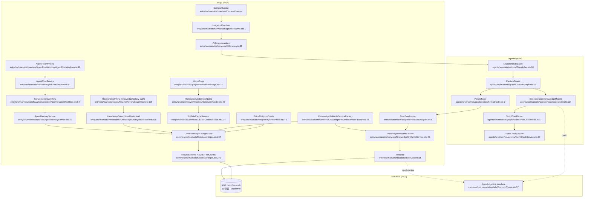

# 数据呈现链路调研 — MindTrace

> 调研日期: 2026-09-16
> 调研目标: 把 AGENTS.md §关键架构 中的"入库 → 持久化 → 读出 → 呈现"四条链路用 file:line 标清每一跳,标记阻塞/漏洞高发区。
> 调研约束: 只读不改,只做调研,不做修建议。**所有论断必须带 file_path:line_number**;**全部相对路径**(本仓库 `D:\HMgent\MindTrace\` 为本地目录,文档一律以仓库根为起点)。

---

## 1. TL;DR

MindTrace 的"入库 → 屏幕"旅程有 **4 段, 共 ~17 个静态节点**,主路径如下:

1. **入库段**(拍照链):`ImageUriResolver → AiService.capture → Dispatcher.dispatch → CaptureGraph → OcrNode → ClassifyNode → StructureNode(KnowledgeModel) → TruthCheckNode(TruthCheckService) → PersistNode(NoteDaoAdapter) → KnowledgeUnitWriteService → NoteDao → RDB`,共 **10 跳**。
2. **持久化段**:`DatabaseHelper.init`(singleton,EntryAbility.onCreate 启动时调用,fire-and-forget)+ `NoteDao`(4 张业务表 `knowledge_unit` / `note_revision` / `study_plan` / `chat_message` / `agent_memory` / `note_generation_*` 共 11 张表,version = 9)。
3. **读出段**:每个 ViewModel(`HomeViewModel` / `KnowledgeGalaxyViewModel` / `NotesViewModel` / `ProfileViewModel` / `StudyPlanViewModel`)在 `aboutToAppear` / `onPageShow` 时拉数据,中间夹一层 `UiDataCacheService`(process-local LRU,详情缓存 8 条 / 512KB)。
4. **呈现段**:两处入口 — **知识星系**(`ReviewGraphView` 在 Review Tab) + **复习浮窗对话**(`AgentFloatWindow` 整层覆盖在 5 Tab 上,`ConversationWorkflow` 通过 `StateGraph` 编排 text/image/regenerate)。

**链路最大风险**:DB 初始化是 fire-and-forget,任何一个 ViewModel 拿不到 store 时只 `console.warn` + 返回空数组/空字符串,**用户看不见任何错误提示** — 这正是"启动后数据库连接不上"症状的最可能根因。

---

## 2. 链路图(Mermaid)



---

## 3. 链路 1: 入库段(拍照/对话整链)

AGENTS.md 标注的关键 seam 是 `ConversationWorkflow → AiService.captureText → Dispatcher.dispatch → CaptureGraph → KnowledgeModel.structure → TruthCheckNode → NoteDaoAdapter`。**实际代码中没有 `captureText` 这个方法名,`AiService` 只有 `capture(imageUri, userText)`(`entry/src/main/ets/services/AiService.ets:63`)**;`ConversationWorkflow` 触发的入口是 `analyzeImage`(只识别不存)+ `confirmDraft`(对话草稿确认写入)。

### 1.1 入口(`capture` 路径)

- **拍照浮层**: `CameraOverlay` 在用户按确认后通过 `Index.onCameraConfirm`(`entry/src/main/ets/pages/Index.ets:35`)将 `uri` 推入 `pendingImageUri`,`AgentFloatWindow` 自动以 `image` request 启动,见 `entry/src/main/ets/pages/Index.ets:35-42`。
- **AgentFloatWindow.send**: `entry/src/main/ets/overlays/AgentFloatWindow/AgentFloatWindow.ets:186-196` — 有 `imagePreview` 时调 `this.service?.captureReply(uri, msg)`,否则调 `realReplyStream(msg)`。
- **AgentChatService.captureReply**: `entry/src/main/ets/services/AgentChatService.ets:66-73` 构造 `ImageConversationRequest{kind:'image', imageUri, userContent}` 走 `workflow.run(request)`。
- **ConversationWorkflow**: `entry/src/main/ets/workflows/conversation/ConversationWorkflow.ets:147` 的 `buildGraph()` 看到 `kind==='image'` 时走 `image_reply` 节点(`ConversationWorkflow.ets:157-162`),该节点调 `handleImageReply`(`ConversationWorkflow.ets:288-303`),后者调 **`new AiService(this.cbs.getContext()).analyzeImage(imageUri, userText)`**(`ConversationWorkflow.ets:293`)。
- **`AiService.analyzeImage`**: `entry/src/main/ets/services/AiService.ets:82-108` — 用 `Dispatcher.dispatch(req, { persist:false, includeRawText:true, analysisOnly:true })`,**只做识别不持久化**,分类结果通过 `result.classification` 返回。用户说"生成笔记"才会再次触发持久化。

### 1.2 真实入库路径(`processAndPersist`)

当用户在浮窗说"整理成笔记"或主动拍照时,触发的是 `AiService.processAndPersist`:

- `entry/src/main/ets/services/AiService.ets:446-468` — 构造 `DispatchRequest{source:'app', payload}`,调 `Dispatcher.dispatch(req, { persist:true, dao: dao })`,返回 `KnowledgeUnit`。
- **`buildNoteDao`**(`AiService.ets:111-118`)通过 **`KnowledgeUnitWriteServiceFactory.create(context)`**(`entry/src/main/ets/services/KnowledgeUnitWriteServiceFactory.ets:24-33`)组装:`DatabaseHelper.getStore()` → `new NoteDao(store)` + 三个 post-commit effect(`cache_invalidation` / `notes_version` / `card_refresh`),封装成 `KnowledgeUnitWriteService`。

### 1.3 Dispatcher.dispatch

- **唯一最终公共入口**: `agents/src/main/ets/core/Dispatcher.ets:98-100` (`async dispatch(req, options): Promise<DispatchResult>`)。
- **路由分流**(`Dispatcher.ets:104-112`):`req.preparedCandidate` 走 `dispatchPreparedCandidate`;`req.generation` 走 `dispatchGeneration` (含 regenerate 分支);否则走普通 `capture` 路径。
- **graph 装配**: 普通路径走 `buildGraph`(`Dispatcher.ets:1497-1531`),节点顺序为 `START → capture → classify → structure → truth_check → persist → END`,条件边 `classify → analysisOnly ? END : structure`、`truth_check → persist ? persist : END`。
- **节点工厂**:
  - `OcrNodeFactory`(`agents/src/main/ets/graph/nodes/OcrNode.ets`)— `capture` 节点
  - `ClassifyNodeFactory`(`agents/src/main/ets/graph/nodes/ClassifyNode.ets`)— `classify` 节点
  - `StructureNodeFactory`(`agents/src/main/ets/agents/KnowledgeModel.ets`)— `structure` 节点,委派 `KnowledgeModel.structure()`(行 114)
  - `TruthCheckNodeFactory`(`agents/src/main/ets/graph/nodes/TruthCheckNode.ets:7-38`)— `truth_check` 节点
  - `PersistNodeFactory`(`agents/src/main/ets/graph/nodes/PersistNode.ets:7-85`)— `persist` 节点

### 1.4 KnowledgeModel.structure(主入库构造)

- 文件: `agents/src/main/ets/agents/KnowledgeModel.ets:114-170`
- 签名: `async structure(ocrText, type?, subject?, chapter='', source='camera_capture'): Promise<KnowledgeUnit>`
- 流程:
  1. `resolveClassificationHint` 调 `TypeClassifier` 拿 5 类 hint(`KnowledgeModel.ets:122-138`)。
  2. **`callAi`**(`KnowledgeModel.ets:142-155`) — 走 `LlmGuard.callJsonWithRetry` + `LlmClient.call`(`LlmClient` 在 `common/src/main/ets/llm/LlmClient.ets`)。**AI 失败时显式 throw**,而不是返回 fallback 占位(spec 011 §9);上层 `StructureNode` 把异常转 `STRUCTURE_ERROR` 阻止持久化。
  3. `toKnowledgeUnit`(`KnowledgeModel.ets:1201-1228`)填充最终字段 — 24 字段 `KnowledgeUnit`,id 由 `uuid()` 生成,`reviewStatus: NEW`,`nextReviewAt: now + 24h`,`easeFactor: 2.5`,`version: 1`。

### 1.5 TruthCheckNode(短路行为)

- 文件: `agents/src/main/ets/graph/nodes/TruthCheckNode.ets:7-38`
- 入参: `service.check(truthInput)`,truthInput 是 `captureText + knowledgeUnit.content` 的拼接(`TruthCheckNode.ets:10-13`)。
- **失败短路**: `if (!result.truthFlag)` 时设 `next.error = { kind:'TRUTH_CHECK_ERROR', message, step:'truth_check', retriable:false }`(`TruthCheckNode.ets:27-34`)。
- **graph.run** 接住这个 error: `CaptureGraph.run`(`agents/src/main/ets/graph/CaptureGraph.ets:49-60`)在异常/错误时把 `state.error` 保留返回;`CaptureGraph` 构造里 `isErrorFn = (s) => s.error !== undefined`(`CaptureGraph.ets:23`),StateGraph 内核短路后续节点(`common/src/main/ets/workflow/StateGraph.ets`)。
- **结果**: TruthCheck 失败 → `state.error.kind === 'TRUTH_CHECK_ERROR'` → `Dispatcher.dispatchRequest`(`Dispatcher.ets:124-140`)返回 `{ success:false, route:'D1', errorMessage }`,**不写库**。
- TruthCheck 4 项(括号配对 / 除零 / 等式矛盾 / LaTeX 语法)由 `TruthCheckService.check` 实现,见 `agents/src/main/ets/agents/TruthCheckService.ets:32-113`。**仅 sync,无 LLM 调用**。

### 1.6 PersistNode → NoteDaoAdapter → KnowledgeUnitWriteService

- **`PersistNode`**: `agents/src/main/ets/graph/nodes/PersistNode.ets:7-85` — 根据 `input.preparedCandidate.updateExisting` 分流 insert/update;有 `commitKey` 时走 `dao.insertWithCommitKey`/`updateWithCommitKey`(commit idempotent 防重);普通 `capture` 路径走 `dao.insert(unit)`(`PersistNode.ets:80`)。
- **`NoteDaoAdapter`**: `entry/src/main/ets/adapters/NoteDaoAdapter.ets:8-75` — 实现 `agents/NoteDaoInterface`,简单转发到 `KnowledgeUnitWriteService`。
- **`KnowledgeUnitWriteService.create`**: `entry/src/main/ets/services/KnowledgeUnitWriteService.ets:31-43` — 调 `WritePathValidator.validateKnowledgeUnit`(`WritePathValidator.ets:19-25`,必填 id/title/content/subject/category)+ `repository.createWithRevision` + post-commit effects。
- **`NoteDao.createWithRevision`**: `entry/src/main/ets/database/NoteDao.ets:42-60` — RDB 事务写两张表(`knowledge_unit` + `note_revision`),失败回滚(`NoteDao.ets:566-573`)。

### 1.7 KnowledgeUnit(核心数据契约)

- 接口定义: `common/src/main/ets/models/CommonTypes.ets:57-86`
- 字段(24 个,`KnowledgeUnit.ets:57-86`):
  - **元数据**: `id` / `title` / `content` / `summary` / `tags` / `subject` / `category` / `chapter` / `difficulty` / `source` / `createdAt` / `updatedAt`
  - **间隔重复状态**: `reviewStatus` (`ReviewStatus.NEW`) / `nextReviewAt` / `intervalDays` / `easeFactor` / `repetitions`
  - **KG 关联**: `prerequisites` / `related` / `embedding`
  - **用户元数据**: `userId` / `version`(乐观锁)
- 数据库列定义(`common/src/main/ets/DatabaseHelper.ets:16-40`):22 列,`embedding` / `tags` / `prerequisites` / `related` 全部 `TEXT DEFAULT '[]'`(JSON 字符串)。
- 类型边界: `category` 枚举在 `NoteTaxonomy` (`common/src/main/ets/data/NoteTaxonomy.ets`) 中规定为 `概念/定理/公式/证明题/计算题`(AGENTS.md 标记的5 类),但写入端 `KnowledgeModel.toKnowledgeUnit` 仅作 `category: ext.type` 透传,**未做枚举校验**。

---

## 4. 链路 2: 持久化段(RDB)

### 4.1 Schema 实体

- **唯一 schema 源**: `common/src/main/ets/DatabaseHelper.ets:1-443`,`DB_SCHEMA_VERSION = 9`(`DatabaseHelper.ets:14`)。
- **11 张表**(`DatabaseHelper.ets:16-173`):
  - `knowledge_unit`(`DatabaseHelper.ets:16-40`)— 主表,id 为主键
  - `note_revision`(`DatabaseHelper.ets:53-80`)— 历史版本,(note_id, version) 主键
  - `study_plan`(`DatabaseHelper.ets:42-51`)— 学习计划
  - `chat_message`(`DatabaseHelper.ets:82-89`)— 对话历史
  - `agent_memory`(`DatabaseHelper.ets:91-101`)— 摘要 / 画像 / 待整理材料
  - `note_generation_run` / `note_generation_source` / `note_generation_checkpoint` / `note_generation_commit` / `note_generation_log`(`DatabaseHelper.ets:103-173`)— 笔记生成草稿链路 5 张表
- **9 个索引**(`DatabaseHelper.ets:175-192`)。
- **16 条 ALTER 迁移**(`DatabaseHelper.ets:194-229`),每次 init 都用 `hasColumn` 探查后再 ALTER,所以从 v1 → v9 都能补齐字段(幂等)。

### 4.2 初始化时机

- **应用启动**(`entry/src/main/ets/entryability/EntryAbility.ets:44-49`):

  ```ts
  DatabaseHelper.init(this.context)
    .then((): Promise<void> => CardSnapshotService.refresh(this.context))
    .catch((e: Error) => {
      hilog.error(DOMAIN, 'testTag', 'DB/card init failed: %{public}s', e.message);
    });
  ```

  **fire-and-forget**,只 `hilog.error` 不抛,**用户看不到**。
- **首次读/写**(`DatabaseHelper.init` 内部 `DatabaseHelper.ets:247-265`):lazy — store 为 null 时调 `getRdbStore` callback,**并发场景下可能多次回调**。`init` 内的 `if (DatabaseHelper.store !== null) return DatabaseHelper.store;` 短路,但**首次并发时可能触发多个 `getRdbStore`** — 这是 HarmonyOS RDB 文档明确允许的(回调只调一次,但本项目未保护)。
- **SkillAbility** 也独立 init: `skill/src/main/ets/skillability/SkillAbility.ets:25`,独立 HAP。

### 4.3 `getStore()` 旁路(不经过 init)

- `agents/NoteQueryTool` 直接调 `DatabaseHelper.getStore()`,store 为 null 时返回 `'store not ready'`(`common/src/main/ets/tools/NoteQueryTools.ets:72,149,218` + 注释 `DatabaseHelper.ets:1-2`)。
- `entry/AgentMemoryService.getStore`(`entry/src/main/ets/services/AgentMemoryService.ets:234-240`)用 `getStore()` → null 时调 `init()`,**这里才走完整 init**。
- **链路差异**: 同样要 store,NoteQueryTool 走"短路返回",AgentMemoryService 走"lazy init"。小艺 skill 在 EntryAbility 没机会跑(不同 HAP),只能靠 `SkillAbility.onCreate` 初始化。

### 4.4 错误处理路径

- `DatabaseHelper.init` 失败抛 `new Error("RDB init failed: " + err.message)`(`DatabaseHelper.ets:254`),被 `EntryAbility.onCreate` 的 catch 吃掉,只写 hilog。
- `ensureSchema` 失败抛 `new Error("DatabaseHelper.executeSql failed: " + err.message)`(`DatabaseHelper.ets:382`),同样只在 init promise reject 时传到 EntryAbility。
- **`executeAddColumn`**(`DatabaseHelper.ets:417-431`)对 "duplicate column" / "already exists" / "已经存在" 等字符串做白名单,见 `isDuplicateColumnError`(`DatabaseHelper.ets:433-442`)。
- **没有任何 toast / UI 反馈路径** — 用户报告"启动后数据库连接不上"必然在这一段。

### 4.5 写入路径

- **拍照链**: `NoteDaoAdapter.insert` (`entry/src/main/ets/adapters/NoteDaoAdapter.ets:15-22`) → `KnowledgeUnitWriteService.create` (`entry/src/main/ets/services/KnowledgeUnitWriteService.ets:31-43`) → `NoteDao.createWithRevision` (`entry/src/main/ets/database/NoteDao.ets:42-60`)。
- **对话链(草稿确认)**: `AiService.confirmDraft` (`entry/src/main/ets/services/AiService.ets:352-386`) → `Dispatcher.dispatch({preparedCandidate})` → `dispatchPreparedCandidate` (`agents/src/main/ets/core/Dispatcher.ets:1316-1406`) → `buildPreparedGraph`(`Dispatcher.ets:1408-1430`) → `PersistNode.updateWithCommitKey`/`insertWithCommitKey` → `NoteDao.updateWithRevisionAndCommitKey` / `createWithRevisionAndCommitKey` (`NoteDao.ets:62-101`, `141-192`)。
- **手动编辑**: `entry/src/main/ets/services/NoteEditService.ets`(未细读,UI 由 `NoteDetailOverlay` 调用)。
- **后写副作用**(自动跑): `KnowledgeUnitPostCommitEffects`(`entry/src/main/ets/services/KnowledgeUnitPostCommitEffects.ets:17-44`):
  1. `KnowledgeUnitCacheInvalidationEffect` → `UiDataCacheService.invalidateNote`
  2. `KnowledgeUnitNotesVersionEffect` → `AppStorage.setOrCreate('notesVersion', v+1)` 触发所有监听页重拉
  3. `KnowledgeUnitCardRefreshEffect` → `CardSnapshotService.refresh`

### 4.6 重入风险

- **同一连接**: `KnowledgeUnitWriteServiceFactory.create` 走 `DatabaseHelper.getStore() ?? DatabaseHelper.init(context)`(`KnowledgeUnitWriteServiceFactory.ets:25-26`),每次都拿同一个 `relationalStore.RdbStore` 实例。
- **多 DAO 实例并发**: 每个 ViewModel/Service `new NoteDao(store)`(`HomeViewModel.ets:58`、`KnowledgeGalaxyViewModel.ets:237,254,270`、`AgentMemoryService.ets:245,251`),这些 DAO 共享同一 store 句柄。
- **`createTransaction`**: `NoteDao.createWithRevision` 等方法内 `await this.store.createTransaction()`(`NoteDao.ets:46,67,108,147`),HarmonyOS RDB 文档说"transaction 内串行化"。**注意: 同一 NoteDao 实例如果被并发 await,事务会交错** — 但目前代码未观察到并发 await(每个 DAO 调用都来自一条 UI 路径)。

---

## 5. 链路 3: 读出段(从 RDB 到内存)

### 5.1 视图模型/服务清单

| 视图模型 / 服务 | 拉数据时机 | 直接 DAO | 缓存层 |
|---|---|---|---|
| `HomeViewModel` | `init(context)` in `aboutToAppear`+`onPageShow`(`HomeViewModel.ets:19-41`) | `NoteDao.queryAllMetadata`(间接) | **`UiDataCacheService.loadNotesSnapshot`** |
| `KnowledgeGalaxyViewModel` | `load(context)` in `aboutToAppear`+`onNotesVersionChange`(`KnowledgeGalaxyViewModel.ets:215-233`) | **`NoteDao.queryAll()`** 直连 | **无缓存层** |
| `NotesViewModel` | `init`(`NotesViewModel.ets:74`) | `UiDataCacheService.loadNotesSnapshot` | 有 |
| `ProfileViewModel` | `init`(`ProfileViewModel.ets:19`) | (待确认) | (待确认) |
| `StudyPlanViewModel` | `init`(`StudyPlanViewModel.ets:38`) | (待确认) | (待确认) |
| `HomeViewModel.loadNote` | 用户点条目 | **`UiDataCacheService.loadDetail`** | 有(LRU 8 / 512KB) |

### 5.2 谁订阅 / 谁轮询 / 谁在 `aboutToAppear` 拉

- **关于 `aboutToAppear` 拉**: ArkTS 标准做法,**所有 ViewModel 在 `aboutToAppear` 触发 `init(context)`**。
- **关于订阅**:
  - `notesVersion`(全局 `AppStorage`): `HomePage`(`entry/src/main/ets/pages/Home/HomePage.ets:27`) / `NotesPage`(`entry/src/main/ets/pages/Notes/NotesPage.ets:23`) / `SubjectDetailPage`(`entry/src/main/ets/pages/Notes/SubjectDetailPage.ets:20`) / `ReviewGraphView`(`entry/src/main/ets/pages/Review/ReviewGraphView.ets:127`) 都用 `@StorageProp("notesVersion") @Watch('onNotesVersionChange')`,触发 `reloadHome` / `reloadGalaxy` 等。
  - `notesVersion` 在写后自动 `+1`(见 §4.5 副作用 2)。
- **关于轮询**: **没有**。所有刷新都是 push(写后 version 递增)+ 用户手势驱动(`onPageShow`)。
- **`onPageShow` 也重拉**: `HomePage.onPageShow`(`entry/src/main/ets/pages/Home/HomePage.ets:42-44`)调 `reloadHome()`。**重复触发是设计选择,不是 bug**(`HomePage.ets:50-67` 有 `loadedNotesVersion` 去重)。

### 5.3 `UiDataCacheService`(核心缓存层)

- 文件: `entry/src/main/ets/services/UiDataCacheService.ets:115-444`
- 字段:
  - `notesSnapshot` / `subjectGroupsSnapshot` / `studyPlanSnapshot`(`UiDataCacheService.ets:116-118`)— 全局快照
  - `notesLoadingPromise`(`UiDataCacheService.ets:120`)— **防重复加载的 in-flight join**
  - `detailEntries`(LRU,`UiDataCacheService.ets:124`)— 详情缓存,8 条 / 512KB(`UiDataCacheService.ets:111-112`)
  - `detailLoadingEntries`(`UiDataCacheService.ets:122`)— 详情加载 in-flight join
- API:
  - `loadNotesSnapshot(context, version)`(`UiDataCacheService.ets:268-286`)— 缓存命中走缓存,**version 不匹配才重查**(`UiDataCacheService.ets:136-142`)
  - `loadDetail(context, id, version)`(`UiDataCacheService.ets:294-311`)— LRU
  - `PreloadQueue.preloadHome(context)`(`UiDataCacheService.ets:503-511`)— **异步预热**,间隔 360ms(`UI_PRELOAD_DELAY_MS`)

### 5.4 **`KnowledgeGalaxyViewModel` 是缓存层漏洞**

- 文件: `entry/src/main/ets/viewmodels/KnowledgeGalaxyViewModel.ets:215-277`
- **`load()`**(`KnowledgeGalaxyViewModel.ets:215-233`)是**直接** `await DatabaseHelper.init(context) → new NoteDao(store).queryAll()`(`KnowledgeGalaxyViewModel.ets:237-243`),**不走 `UiDataCacheService`**。
- **`loadNote()`**(`KnowledgeGalaxyViewModel.ets:245-260`)同样直接走 `queryById`,**不走 `loadDetail`**。
- **`deleteNote()`**(`KnowledgeGalaxyViewModel.ets:262-277`)直接 `deleteById`,但**手动 `AppStorage.setOrCreate("notesVersion", v+1)`**(`KnowledgeGalaxyViewModel.ets:291-292` — 在 `ReviewGraphView.deleteNote` 内)。
- **后果**: 同一时刻 HomeViewModel 和 KnowledgeGalaxyViewModel 各持一份 `queryAll`,**没有共享缓存**,数据量大的库会被双倍拉。

### 5.5 ViewModel 与 Service 边界

- **Service 层不持 UI 引用**(AGENTS.md §关键架构 + `entry/src/main/ets/pages/Home/HomePage.ets:1-9` 注释重申)。
- `AiService` / `KnowledgeUnitWriteService` / `AgentMemoryService` / `NoteEditService` 都是纯数据 + 业务,**不 import @kit.ArkUI**。
- ViewModel 通过 `getContext(this)`(`entry/src/main/ets/pages/Home/HomePage.ets:56`)把 Context 传给 Factory / Dao,Service 用完即扔。

---

## 6. 链路 4: 呈现段(两处入口)

### 6.1 知识星系可视化(`KnowledgeGalaxy`)

- **真实渲染位置**: `entry/src/main/ets/pages/Review/ReviewGraphView.ets:125`(不是独立的 `KnowledgeGalaxy.ets` 文件 — AGENTS.md 提到的文件名并不存在,这是设计调整后留在 ReviewGraphView 内的两个组件: `SubjectUniverseView` + `SubjectGalaxyView`)。
- **入口路径**: `Index.ets:60` 的 `ReviewPage({ onGoAI })`(`entry/src/main/ets/pages/Review/ReviewPage.ets`),`ReviewPage` 内部 `if (this.tabIndex === 'graph')` 切到 `ReviewGraphView`。
- **状态拥有者**:
  - `@State vm: KnowledgeGalaxyViewModel = new KnowledgeGalaxyViewModel()`(`ReviewGraphView.ets:128`)
  - `@State selectedSubject / zoom / universeZoom / universeCameraX/Y / orbitOffset / selectedNote / selectedUnit / focusedPlanetId / galaxyCameraOffsetX/Y`(`ReviewGraphView.ets:129-139`)
  - **`@Observed`**: `KnowledgeGalaxyViewModel`(`entry/src/main/ets/viewmodels/KnowledgeGalaxyViewModel.ets:208`)— ArkTS 严格 lint 要求
- **ForEach 用法**:
  - `ForEach(UNIVERSE_WRAP_OFFSETS, ..., "overview_tile_x_" + copyX)`(`ReviewGraphView.ets:573-583`)— 静态 9 元素,有 key
  - `ForEach(this.systems, ..., system.subject)`(`ReviewGraphView.ets:623-628`)— 用 subject 作 key,**但同一 subject 重复出现会冲掉**
  - `ForEach(orbit.planets, ..., orbit.chapter + "_" + planet.id + (isBackLayer ? "_back" : "_front"))`(`ReviewGraphView.ets:1404-1416`)— 有 key,稳定
- **LazyForEach**: **没有** — 全部用 `ForEach`,因为是 Stack/绝对定位而不是 List。代码复杂度高(540+ 行)但渲染量受 `maxOverviewPlanets` 限制(`ReviewGraphView.ets:1125-1136`)。
- **定时器**: `setInterval` 在 `startRotation` 写 `orbitOffset`(`ReviewGraphView.ets:218-221`),**`aboutToDisappear` 才 `clearInterval`**(`ReviewGraphView.ets:147-149,223-228`)— 用户切走页面会停止。

### 6.2 复习浮窗对话(`AgentFloatWindow`)

- **真实位置**: `entry/src/main/ets/overlays/AgentFloatWindow/AgentFloatWindow.ets:41`
- **装配**: `entry/src/main/ets/pages/Index.ets:93-102` 直接放一个 `AgentFloatWindow({ show: this.activeOverlay === 'float' })` —— **浮窗与 5 Tab 是 sibling,不是 child**。
- **状态拥有者**:
  - `AgentFloatWindow` 自己:`messages` / `inputText` / `busy` / `statusMeta` / `imagePreview` / `keyboardHeight` / `sessions` / `activeSid` / `floatHeight` / `overlayVisible` / `maskOpacity` / `sheetOpacity` / `sheetOffset` / `generatedDraft`(`AgentFloatWindow.ets:47-60`)
  - **服务侧**: `AgentChatService`(`entry/src/main/ets/services/AgentChatService.ets:61`)内部持 `ConversationWorkflow`(`AgentChatService.ets:62-64`),workflow 持 `AgentMemoryService`(`ConversationWorkflow.ets:56-58`)— **整条 Service 链无 UI 引用**。
- **回调桥**: `AgentChatCallbacks`(`entry/src/main/ets/services/AgentChatService.ets:10-21`)→ `ConversationWorkflowAdapter`(`AgentChatService.ets:23-59`)→ 把 LLM 流事件 / 状态推回 UI。
- **LazyForEach**: `entry/src/main/ets/overlays/AgentFloatWindow/AgentMessageList.ets:86-98` 用 `LazyForEach(this.dataSource, (msg, index) => ListItem{ ChatBubble(...) }, (msg) => chatItemKey(msg))` — `chatItemKey` 在 `ChatModels.ets` 中定义,key 函数返回 `id.toString()`(稳定)。
- **`@State` vs `@Prop`**: `AgentMessageList.messages` 是 `@Prop @Watch('onMessagesChanged')`(`AgentMessageList.ets:56`),父组件用 `this.messages.map(... applyStreamEventToChatMsg ...)` 触发重渲染(`AgentFloatWindow.ets:115`)。
- **`@Observed`**: `ChatSession`(`AgentFloatWindow/chat/ChatModels.ets` 中应有)— 嵌套对象的字段更新需要 `@Observed`。
- **关于 `ConversationWorkflow`**(`entry/src/main/ets/workflows/conversation/ConversationWorkflow.ets:54`):
  - 状态: `ConversationState`(`entry/src/main/ets/workflows/conversation/ConversationState.ets`)— `request` / `sessionId` / `currentStep` / `intent` / `memoryContext` / `learnerProfileContext` / `draftRunId/draftCheckpointId/draftCandidateHash/draftStatus`。
  - graph 节点: `classify_intent` / `image_reply` / `load_reply_context` / `save_reply_input` / `stream_reply` / `complete_reply` / `note_reply` / `regenerate_reply`(`ConversationWorkflow.ets:150-227`)
  - **copyState 显式字段复制**(`ConversationWorkflow.ets:258-286`),无解构 — 这是 spec 015 的 ArkTS 1.1 strict 约束。
  - 错误处理: 大部分失败走 `addAiMessage(sessionId, '⚠️ ...')` + `throw`,用户能看到一条消息(`ConversationWorkflow.ets:300-303, 411-415, 464-466` 等)。

---

## 7. 阻塞 / 漏洞高发点(候选 10 个)

> 排序按"症状报告相关性 × 排查难度 × 修复成本"。**全部相对路径**。

### 高优先(用户可见症状 / 数据流)

| # | 候选位置 | 为什么是漏洞 | 证据(file:line) |
|---|---|---|---|
| 1 | **DB init fire-and-forget + 全局 console.warn** | 用户报告"启动后数据库连接不上"几乎一定落在这里。`EntryAbility.onCreate` 的 `.catch` 只 `hilog.error`,不弹 toast、不跳错误页。每个 ViewModel 再调 `DatabaseHelper.init` 时又只 `console.warn`,UI 仍照常渲染(空状态)。**整条链路没有任何用户可见的失败信号**。 | `entry/src/main/ets/entryability/EntryAbility.ets:45-49`;`entry/src/main/ets/viewmodels/HomeViewModel.ets:34-41`;`entry/src/main/ets/viewmodels/KnowledgeGalaxyViewModel.ets:223-232, 239-243, 256-260, 273-276` |
| 2 | **`KnowledgeGalaxyViewModel` 绕过 `UiDataCacheService`** | 同一个 `queryAll` 在 HomeViewModel 和 KnowledgeGalaxyViewModel 各跑一次;写后 `notesVersion` 变化时两路都会重拉;且 `loadNote` 走自己直连的 `queryById`,**有数据量大的库时双倍成本 + 缓存不一致**。 | `entry/src/main/ets/viewmodels/KnowledgeGalaxyViewModel.ets:235-260` |
| 3 | **`KnowledgeGalaxyViewModel` 三个方法都是"load 失败 → 返回空/返回 false"** | `load` 失败返回 `false`(`KnowledgeGalaxyViewModel.ets:232`)— `ReviewGraphView.reloadGalaxy` 收到 false 弹 toast 但**继续渲染空状态**(无星系)。用户感觉"打开了 Tab 但没东西"。 | `entry/src/main/ets/viewmodels/KnowledgeGalaxyViewModel.ets:225`;`entry/src/main/ets/pages/Review/ReviewGraphView.ets:155-175` |
| 4 | **`@State` 初始空 vs `aboutToAppear` 异步拉的竞态** | `ReviewGraphView.onNotesVersionChange` 触发 `reloadGalaxy(true)` 后,**`stopRotation()`** 在 `reloadGalaxy` 内的 `.then` 才调(`ReviewGraphView.ets:158-162`)。用户在动画期间切 Tab / 改 notesVersion,`this.timerId !== -1` 但 `this.selectedNote` 已变,定时器写入状态可能与新一轮 reload 冲突。 | `entry/src/main/ets/pages/Review/ReviewGraphView.ets:151-175, 214-228` |
| 5 | **`DatabaseHelper.init` 首次并发不安全** | `if (DatabaseHelper.store !== null) return store;` 短路只对**已成功**的 store 有效,**首次并发**(比如 HomePage.onPageShow 和 KnowledgeGalaxyViewModel.load 同时触发 init)会**两次调 `getRdbStore` 回调**,各自跑 `ensureSchema`(`DatabaseHelper.ets:248-265`)。HarmonyOS RDB 文档未明确禁止,但 `ensureSchema` 中的 `ALTER TABLE` 与 `PRAGMA table_info` **不是事务**,并发会撞车。 | `common/src/main/ets/DatabaseHelper.ets:247-265`;多个并发调用点见 §4.3 |
| 6 | **`AgentMemoryService.safe*` 系列静默失败** | `ConversationWorkflow` 中 `safeSaveUserMessage` / `safeSaveAssistantMessage` / `safeSaveOcrResult` 全是 `console.warn`(`ConversationWorkflow.ets:547-617`)。如果保存失败,**聊天记录会丢,用户无感知**。对话上下文由这个 store 拼,如果丢消息会让 LLM 丢失 history。 | `entry/src/main/ets/workflows/conversation/ConversationWorkflow.ets:547-617`;底层 `entry/src/main/ets/services/AgentMemoryService.ets:234-252` |
| 7 | **`category` 枚举不校验** | `KnowledgeUnit.category` 应是 5 类枚举(`common/src/main/ets/data/NoteTaxonomy.ets`),但 `WritePathValidator` 只校验 `id/title/content/subject/category` 非空,**不查枚举**。AI 返回未知 category 时会落库,后续 `typeColor(note.type)` / `subjectColor(note.subject)` 拿不到颜色,UI 显示空色或默认色。 | `entry/src/main/ets/services/WritePathValidator.ets:19-25`;`common/src/main/ets/models/CommonTypes.ets:64`(`category: string` 而非枚举) |

### 中优先(资源/状态一致性)

| # | 候选位置 | 为什么是漏洞 | 证据(file:line) |
|---|---|---|---|
| 8 | **`UiDataCacheService.notesLoadingPromise` 与 `KnowledgeGalaxyViewModel` 不共享** | `HomeViewModel.loadNotes` 走 `UiDataCacheService.loadNotesSnapshot`(`HomeViewModel.ets:28`),后者有 in-flight join(`UiDataCacheService.ets:273-286`);但 `KnowledgeGalaxyViewModel.load` 不走,**两条路并行触发 `NoteDao.queryAllMetadata` 和 `NoteDao.queryAll`**,**返回列不同**(metadata 缺 `content` / `embedding` / `prerequisites` / `related` — 见 `NoteDao.ets:29-33, 311-330` vs `288-308`)。后续 `buildSystems` 用 `unit.chapter` / `unit.related` 都会拿到空数组,星系关系线/章节分组失效。 | `entry/src/main/ets/services/UiDataCacheService.ets:288-292`;`entry/src/main/ets/database/NoteDao.ets:288-308, 311-330`;`entry/src/main/ets/viewmodels/KnowledgeGalaxyViewModel.ets:217, 235-243` |
| 9 | **`@State orbitOffset` 定时器 + `animateTo` 竞态** | `startRotation` 用 `setInterval` 每 800ms 写 `orbitOffset`(数值类 `@State`),但同时 `enterSubject` / `leaveSubject` / `zoomIn` 都用 `animateTo` 包裹(`ReviewGraphView.ets:189-198, 200-212, 308-330`)。在 ArkUI 中,**动画期间对同一 `@State` 的赋值会被动画驱动覆盖或争抢**,可能导致动画"抽搐"。 | `entry/src/main/ets/pages/Review/ReviewGraphView.ets:189-228, 308-330` |
| 10 | **`AiService.context` 为 undefined 时 throw 但 UI 捕获无路径** | `AiService` 在 `this.context === undefined` 时直接 `throw`(`AiService.ets:65-67, 84-86, 113-114, 471-474`)。`ConversationWorkflow` 通过 `new AiService(this.cbs.getContext())` 构造,`getContext` 走回调,如果 callback 还没就绪就 throw,`ConversationWorkflow.handleImageReply` 的 catch 会显示"图片识别失败: ..."(`ConversationWorkflow.ets:300-303`),**不致命但莫名**。 | `entry/src/main/ets/services/AiService.ets:65-67`;`entry/src/main/ets/workflows/conversation/ConversationWorkflow.ets:288-303` |

### 附:本调研未确认但有疑点的项

- **`AgentFloatWindow` 流式消息状态一致性**: `appendAiMsg` 用 `this.messages.map(...)` 改某一条(`AgentFloatWindow.ets:114-116`),但流式中间用户切到 `image_reply`,`addAiMsg` 又 push 新消息。两条路径都改 `messages`,**整体数组重排**(`AgentFloatWindow.ets:108-119`)。如果 `appendAiMsg` 的 id 与 `addAiMsg` 撞 id(都来自 `nowId()`),**会改到错的条目**。`nowId` 用 `Date.now()*1000+Math.floor(Math.random()*1000)`(`AgentFloatWindow.ets:34`),毫秒级冲撞概率 1/1000,**实际可能撞**。
- **`AgentMemoryService.updateLearnerProfileIfNeeded`**(`AgentMemoryService.ets:134-176`)在用户每 6 条消息后调 LLM 更新画像,期间**阻塞 await LLM**(最长 60 秒),但调用方 `safeUpdateLearnerProfileIfNeeded` 是 `safe*` 模式(`ConversationWorkflow.ets:603-609`),用户看不到进度。

---

## 8. 未确认的开放问题

> 这些地方读代码读不准或证据不充分,留给下一阶段深挖。

1. **"KnowledgeGalaxyPage 文件"是否存在**: AGENTS.md §关键架构 第 2 项说 `entry/src/main/ets/pages/KnowledgeGalaxy*`,但 `glob "**/KnowledgeGalaxy*"` 找到的只有 `KnowledgeGalaxyViewModel.ets` + `ReviewGraphView.ets`(后者 `import { KnowledgeGalaxyViewModel } from`)。**推测: 设计被改名/重定向到 ReviewGraphView**,但 docs/legacy/mindtrace/architecture 审计文档未记录该次重命名。**建议人工确认。**
2. **NoteGeneration 5 张表的真实数据流**: `note_generation_run` / `_source` / `_checkpoint` / `_commit` / `_log` 这 5 张表(`DatabaseHelper.ets:103-173`)只在 `Dispatcher.dispatchGeneration`(草稿链路)中使用,**与 KnowledgeGalaxy 呈现没有直接关联**,但写入量与知识星系的内容强相关(章节标题来自 `checkpoint.document_json`)。这块本次未读深(`agents/src/main/ets/core/Dispatcher.ets:332-573` 范围太大)。**建议下一阶段单独调研。**
3. **`HomeCollapsedReview` 与 `HeroBanner` 是否复用 ReviewGraphView 的渲染**: 看到 `HeroBanner` 是 `HomePage`(`entry/src/main/ets/pages/Home/HomePage.ets:149-156`)的子组件,但 **没读 `HeroBanner.ets` 源码**。AGENTS.md 没明确说星系也显示在 Home 顶环。**猜测**: Home 顶环只显示 mastery %,不显示完整星系;完整星系只在 Review Tab。
4. **`ProfileViewModel` / `StudyPlanViewModel` 走的 DAO**: `ProfileViewModel.ets:19` 调 `DatabaseHelper.init`,但具体 DAO 未读(`ProfileViewModel` 全文未细看)。**TODO 下一阶段补**。
5. **`entry/src/main/ets/services/NoteEditService.ets`**: 手动编辑笔记路径未深读,乐观锁 / version 冲突处理已在 `NoteDao.updateWithRevision`(`NoteDao.ets:103-139`)看到,UI 路径(Topic Detail Overlay)未细看。
6. **`entry/src/main/ets/database/StudyPlanDao.ets` / `AgentMemoryDao.ets` / `ChatMessageDao.ets` / `NoteGenerationRepository.ets`**: 4 个 DAO 文件未细读,只看 NoteDao 是核心表。
7. **`HomeRecentNotes` 是否用 ForEach 无 key**: 看过文件名,未读源码,**Todo 排查 ArkTS 严格 lint 关注项(无 key 报错)**。仅 `AgentMessageList` 已确认用 `chatItemKey`。
8. **`CardSnapshotService.refresh` 与 `KnowledgeUnitCardRefreshEffect` 的写入路径**: 仅看名字,未读源码;`EntryAbility` 的 fire-and-forget 失败会丢卡片快照更新。
9. **`skill/src/main/ets/skillability/SkillAbility.ets:25` 独立 init**: 小艺 skill 是独立 HSP,与 EntryAbility 并行,**没有跨 HAP 共享 DB** 的明文保证(每个 HAP 都调 `DatabaseHelper.init` 同一个 `MindTrace.db`)。HarmonyOS RDB 是否允许跨 HAP 读写未在仓库文档中找到明文,仅在 audit 报告 `audit-full-2026-09-01.md` 间接提到。**建议读 HarmonyOS 文档或人工确认。**
10. **审计文档 `audit-full-2026-09-01.md` 是否还有相关 finding**: 检索过 `persist` / `TruthCheck` / `DB init` 关键词,只有 #15(ArkTS 铁律)、#9(LlmConfig)、#16(fixture data)直接相关,**没有专门针对"DB init → 用户看不到失败"的 finding**。**下一阶段开新 ticket 的依据**。

---

## 9. 调研覆盖度自检

| 链路段 | 已读文件 | 未读文件(已知存在) |
|---|---|---|
| 入库段 | `AiService.ets` / `Dispatcher.ets` / `KnowledgeModel.ets`(全) / `TruthCheckNode.ets`(全) / `TruthCheckService.ets`(全) / `CaptureGraph.ets`(全) / `AgentState.ets`(间接) / `KnowledgeUnitExt.ets`(全) / `PersistNode.ets`(全) | `CaptureGraph.ets` 的 OcrNode / ClassifyNode / StructureNode 实现细节(已确认工厂存在) |
| 持久化段 | `DatabaseHelper.ets`(全) / `KnowledgeUnitWriteService.ets`(全) / `NoteDao.ets`(全) / `NoteDaoAdapter.ets`(全) / `KnowledgeUnitWriteServiceFactory.ets`(全) / `EntryAbility.ets`(全) | `StudyPlanDao` / `AgentMemoryDao` / `ChatMessageDao` / `NoteGenerationRepository` |
| 读出段 | `HomeViewModel.ets`(全) / `KnowledgeGalaxyViewModel.ets`(全) / `UiDataCacheService.ets`(全) / `NotesViewModel.ets`(grep) / `ProfileViewModel.ets`(grep) / `StudyPlanViewModel.ets`(grep) | 上述 3 个 ViewModel 内部细节 |
| 呈现段 | `Index.ets`(全) / `HomePage.ets`(全) / `AgentFloatWindow.ets`(全) / `ConversationWorkflow.ets`(全) / `AgentMessageList.ets`(全) / `AgentChatService.ets`(全) / `AgentMemoryService.ets`(全) / `KnowledgeUnitPostCommitEffects.ets`(全) / `WritePathValidator.ets`(全) | `NoteDetailOverlay/`(整体未细看) / `HeroBanner.ets` / `HomeRecentNotes.ets` / `HomeCollapsedReview.ets` / `ProfilePage` / `NotesPage` 子组件 |

---

**调研完成。** 文件:`docs/research/data-presentation-flow-2026-09-16.md`
