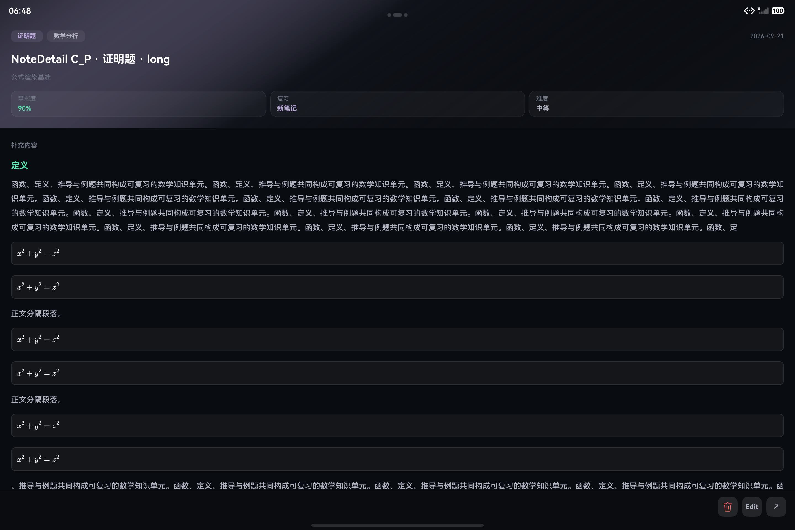

# NoteDetail 模拟器性能与 WebKeepAlive A/B 证据

> 本文记录 #189 与 #188 在无真机条件下的最大可执行验收。它是模拟器证据，不是目标设备性能达标证明。

## 结论

- **WebKeepAlive 保持默认关闭。** 同一次模拟器启动内、同一 fixture 的开/关 A/B 结果是混合的：AI 关闭时开启 KeepAlive 会拖慢 C/C′ 冷开首屏；AI 开启时 C 冷开首屏近似持平但稳定更慢，C′ 冷开首屏和公式可见更慢。warm run 只有部分稳定时间改善，且没有足够重复样本或可接受的驻留内存结论支持默认启用。
- **B 组 #184 / #186 / #183 / #187 的实现验收通过。** #187 后复测的 C/C′、AI 开/关四组 cold/warm 运行均在 4 秒窗口内达到公式可见和 500ms 稳定，且每轮均为 6/6 Web 创建、6/6 Web 工作、0 次公式降级。
- 用户接受以本轮模拟器结果作为实现验收结论；证据仍明确属于模拟器，不能改写为真机 p50/p95、真实长帧或稳态内存结论，spec 024 继续保持 `in progress`。

## 环境与方法

| 项 | 值 |
|---|---|
| 设备 | DevEco 模拟器 `emulator` |
| 系统 | OpenHarmony 6.1.1.125，API 24，x86_64 |
| 分辨率 | 2880 × 1920 |
| 应用 | `com.example.mathmind` debug HAP |
| 启动 | `EntryAbility` 显式 `mindtrace://note-detail-benchmark/...` URI；普通启动默认关闭 benchmark 与 KeepAlive |
| 单次进程内序列 | cold open 4s → close 1s → warm reopen 4s → close |
| 指标来源 | `NoteDetailRenderMetrics` hilog；进程 PSS 来自 `hidumper --mem <pid> --prune` |

fixture、AI 助手和 KeepAlive 标签由启动 URI 固定。KeepAlive 只在 `Index` 根部挂载，cold 与 warm 两次 NoteDetail 的关闭/重开不会重建根部 KeepAlive。

模拟器 shell 无权终止应用 renderer 子进程，强杀尝试未改变 PID，也未产生 `onRenderExited`；因此有限恢复只有纯逻辑和构建证据，没有设备行为结论。外部帧采样器未接入本轮模拟器命令行，`longFrameCount` 与 `maxWebCreatesPerFrame` 的零值不得解读为无长帧或满足单帧预算。应用内 heap 字段同样未注入，内存比较只采用外部 PSS。

## #187 后公式调度复测

以下结果来自 #187 的页面就绪握手、实例级 Web 创建预算和“就绪工作优先于下一次创建”修复之后。后续交互调优采用每轮最多 3 个创建、最多 5 个创建在途、16ms 滚动补位；四组均使用 KeepAlive off。每格为同一进程内 cold/warm 各一次的代表样本，不是 p50/p95。

| Fixture | AI | Cold first / formula / stable (ms) | Warm first / formula / stable (ms) | Cold/Warm Web create / work | Degradation |
|---|---:|---:|---:|---:|---:|
| C long · 公式 | off | 41 / 909 / 1931 | 13 / 259 / 1738 | 6/6 · 6/6 | 0 / 0 |
| C long · 公式 | on | 66 / 1515 / 2332 | 29 / 518 / 2278 | 6/6 · 6/6 | 0 / 0 |
| C′ long · 证明题 | off | 44 / 947 / 2034 | 14 / 256 / 1834 | 6/6 · 6/6 | 0 / 0 |
| C′ long · 证明题 | on | 99 / 1217 / 2390 | 38 / 208 / 2297 | 6/6 · 6/6 | 0 / 0 |

C′ 冷开约 3.2 秒的截图显示六个连续公式均为 KaTeX 排版，没有裸 `$$`；上滑后可到达后续正文、标签、来源和复习信息，页面没有“继续阅读”。AI helper 开启时的 C/C′ 运行也都在窗口内完成，说明 NoteDetail 与聊天 Web 竞争负载下未再出现工作饥饿。

六套 renderer 均通过真实 `NoteDetailOverlay` smoke。概念、定理、计算题和兜底的 cold 首屏分别为 83 / 52 / 45 / 56ms，stable 分别为 674 / 622 / 628 / 638ms，Web create 与 degradation 均为 0；公式和证明题由上表覆盖。

## WebKeepAlive A/B（#187 前历史基线）

以下是稳定时间“首次成功即锁定”修复后的最终代表性运行；同一应用进程内 cold/warm 各一次，八组均来自同一次模拟器启动。`—` 表示运行窗口内未观察到该事件。模拟器抖动明显，每格都只是单次代表性样本，只用于决定不默认启用，不能作为 p50/p95 或真机达标证据。PSS 只在 AI 关闭矩阵中采集，来自较早的独立 2 秒 active / 两轮关闭后采样，不与本表时序强绑定。

| Fixture | AI | KeepAlive | Cold first / formula / stable (ms) | Warm first / formula / stable (ms) | Active PSS (kB) | Closed PSS (kB) |
|---|---:|---:|---:|---:|---:|---:|
| C long | off | off | 56 / 2263 / 3337 | 13 / 417 / 1922 | 182135 | 224686 |
| C long | off | on | 86 / 3127 / 3769 | 8 / 350 / 1950 | 191190 | 212560 |
| C′ long | off | off | 72 / 2399 / 2921 | 43 / 300 / 1375 | 194525 | 219245 |
| C′ long | off | on | 221 / 3908 / — | 17 / 257 / 1022 | 191183 | 205636 |
| C long | on | off | 315 / — / 4092 | 841 / — / — | — | — |
| C long | on | on | 314 / — / 4470 | 664 / — / — | — | — |
| C′ long | on | off | 212 / — / — | 120 / 1662 / 3268 | — | — |
| C′ long | on | on | 262 / 3740 / — | 260 / 1696 / 2521 | — | — |

每次 NoteDetail 打开仍创建相同数量的业务 Web：C 为 6，C′ 的证明题 surface 为 1。关闭后进程列表中，KeepAlive off 观察到 1 个 `com.example.mathmind:render`，KeepAlive on 观察到 2 个；PSS 波动没有形成可重复的可接受成本结论。由于收益不明确，实验不进入默认产品路径。

AI 开启矩阵同样没有给出一致收益：C 的 cold/warm 均未观察到公式可见，开启 KeepAlive 后 cold stable 从 4092ms 变为 4470ms；C′ 开启组的 cold 首屏和公式可见更慢，warm stable 虽从 3268ms 改善到 2521ms，但首屏同时从 120ms 变为 260ms。个别 stable 超过名义 4 秒窗口，是模拟器 JavaScript timer 延迟后的首次成功探针，按原始日志记录，不代表通过 4 秒门禁。

## 公式密集与 renderer smoke（#187 前历史基线）

| 场景 | Cold first / formula / stable (ms) | Warm first / formula / stable (ms) | Web creates |
|---|---:|---:|---:|
| A short · 概念 | 75 / N/A / 未重采 | 29 / N/A / 未重采 | 0 |
| A long · 定理 | 85 / N/A / 未重采 | 29 / N/A / 未重采 | 0 |
| A long · 计算题 | 76 / N/A / 未重采 | 7 / N/A / 未重采 | 0 |
| A short · 兜底 | 108 / N/A / 未重采 | 28 / N/A / 未重采 | 0 |
| B long · 公式 | 89 / 2434 / 未重采 | 24 / 494 / 未重采 | 2 |
| C short · 公式 | cold 日志被 Web 日志覆盖 | 29 / 1296 / — | 6 |
| C′ long · 证明题 | 72 / 2399 / 2921 | 43 / 300 / 1375 | 1 |

六类 renderer 均通过真实 NoteDetailOverlay 启动 smoke（概念、定理、公式、证明题、计算题、兜底），但当时公式正确性没有通过：C′ 冷开约 3 秒的截图中，首个公式已渲染，后续连续公式仍显示原始分隔符。该失败已由上面的 #187 后复测取代。

早期 harness 只在 overlay 卸载时调用稳定判定，导致约 4 秒的关闭时间被误记成 stable。该观测缺口已修为运行期间每 100ms 探测；随后又修正为首次满足 500ms 静默后锁定 `stableTs`，避免周期探针持续把稳定时间推迟到关闭附近。回归测试覆盖第二次 `markStable()` 不改写首次结果；上表没有保留 A/B/普通 renderer 的旧 stable 数值，C/C′ 行使用最终语义下的日志。

## 验收边界与后续门禁

- #189 的当前决策是“否决默认启用”，不是“真机证明无收益”。未来只有在目标设备重复 A/B 显示明确收益且驻留内存可接受时，才能重新讨论开启。
- 本轮可据用户授权判定 B 组实现验收通过；是否关闭 #188 仍由最终验收负责人决定。本证据不能替代真机 20 次矩阵、p50/p95、外部帧采样和稳态内存门禁。
- `maxWebCreatesPerFrame=0`、`longFrameCount=0` 与 heap `-1` 仍表示外部采样未注入，不能据此声明单帧预算、真实长帧或内存已达标。
