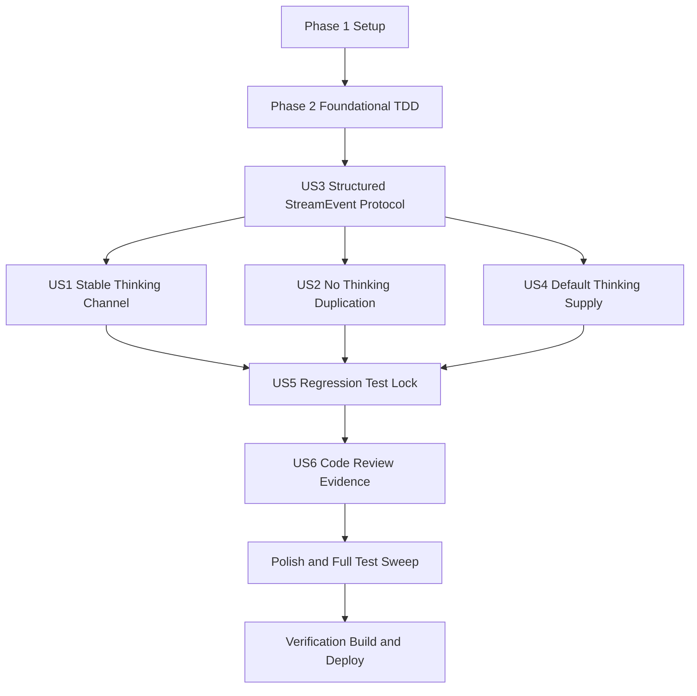

# Tasks: 019 Reasoning Process Display P0 — #111 StreamEvent Protocol Vertical Slice

**Input**: Design documents from `D:\HMgent\MindTrace\spec\019-reasoning-process-display-p0\`
**Prerequisites**: `D:\HMgent\MindTrace\spec\019-reasoning-process-display-p0\plan.md`, `D:\HMgent\MindTrace\spec\019-reasoning-process-display-p0\spec.md`
**Verification Scope**: build-only (`Run verification` selected)

**Tests**: Required. User requested TDD where possible, pre-agreed seams are Seam A (`common/src/test`) and Seam B (`entry/src/test`, or documented integration fallback if direct adapter test is not feasible).

**Organization**: Tasks are grouped by dependency and user story. P1 stories are ordered so the protocol contract lands before channel consumption.

## Format: `[ID] [P?] [Story] Description`

- **[P]**: Can run in parallel when dependencies are satisfied and files do not conflict
- **[Story]**: Maps to a user story from `spec.md` (`US1`..`US6`)
- Each task includes exact target file path(s)

## Path Conventions

- **Project root**: `D:\HMgent\MindTrace`
- **Feature artifacts**: `D:\HMgent\MindTrace\spec\019-reasoning-process-display-p0\`
- **Common LLM source**: `D:\HMgent\MindTrace\common\src\main\ets\llm\`
- **Entry conversation/UI source**: `D:\HMgent\MindTrace\entry\src\main\ets\`
- **Common tests**: `D:\HMgent\MindTrace\common\src\test\`
- **Entry tests**: `D:\HMgent\MindTrace\entry\src\test\`

## Phase 1: Setup (Shared Infrastructure)

**Purpose**: Establish branch isolation, implementation constraints, and TDD guardrails before touching `.ets` files.

- [X] T001 Confirm current branch is `feature/spec-019-p0`, identify unrelated pre-existing dirty files to exclude from staging, and record the scoped file inventory in `D:\HMgent\MindTrace\spec\019-reasoning-process-display-p0\delivery-checklist.md`
- [X] T002 [P] Review ArkTS strict constraints before `.ets` edits in `D:\HMgent\MindTrace\docs\style\arkts-1.1.md`
- [X] T003 [P] Review ADR-0015 same-PR protocol and fallback constraint before implementation in `D:\HMgent\MindTrace\docs\adr\0015-structured-stream-events.md`
- [X] T004 [P] Review existing stream callsite inventory and update scoped implementation notes in `D:\HMgent\MindTrace\spec\019-reasoning-process-display-p0\delivery-checklist.md`

---

## Phase 2: Foundational (Blocking Prerequisites)

**Purpose**: Create failing TDD seams and confirm the exact protocol/callsite migration surface. This phase blocks all user story implementation.

- [X] T005 [P] Create failing Seam A tests for SSE delta to StreamEvent conversion in `D:\HMgent\MindTrace\common\src\test\LlmStreamEvents.test.ets`
- [X] T006 [P] Create failing Seam B tests for stream event to ChatMsg field dispatch, or document direct-test infeasibility in `D:\HMgent\MindTrace\entry\src\test\AgentChatStreamEvents.test.ets`
- [X] T007 Inventory all old `(delta, kind)` stream callback callsites and record required migrations in `D:\HMgent\MindTrace\spec\019-reasoning-process-display-p0\delivery-checklist.md`

**Checkpoint**: TDD seams exist and should fail for the current implementation before production changes begin.

---

## Phase 3: User Story 3 - 结构化事件协议支持当前与后续过程类型 (Priority: P1) 🎯 MVP Protocol

**Goal**: Establish the `StreamEvent` contract and migrate public callback signatures so downstream stories can consume structured events.

**Independent Test**: Typechecking should show the old `(delta, kind)` callback contract no longer remains in the migrated stream surface, and reserved event types are represented without being emitted in P0.

### Tests for User Story 3

- [X] T008 [P] [US3] Extend protocol-oriented assertions in Seam A tests for four defined event categories in `D:\HMgent\MindTrace\common\src\test\LlmStreamEvents.test.ets`

### Implementation for User Story 3

- [X] T009 [US3] Define the structured StreamEvent event family and migrate `LlmStreamCallback` / `LlmCallRequest.onDelta` contract in `D:\HMgent\MindTrace\common\src\main\ets\llm\LlmTypes.ets`
- [X] T010 [US3] Export StreamEvent-related types for entry consumers in `D:\HMgent\MindTrace\common\src\main\ets\Index.ets`
- [X] T011 [US3] Update LlmClient stream callback references to the structured event contract in `D:\HMgent\MindTrace\common\src\main\ets\llm\LlmClient.ets`
- [X] T012 [US3] Update ReplyService stream sink contract to accept structured stream events in `D:\HMgent\MindTrace\entry\src\main\ets\services\ReplyService.ets`
- [X] T013 [US3] Update ConversationWorkflow callback contract to accept structured stream events in `D:\HMgent\MindTrace\entry\src\main\ets\workflows\conversation\ConversationTypes.ets`

**Checkpoint**: Structured protocol compiles through type surfaces; old stream callback shape is no longer the primary contract.

---

## Phase 4: User Story 1 - 稳定展示 AI 思考通道 (Priority: P1)

**Goal**: Ensure thinking-only or thinking-first stream data reaches the AI message reasoning channel instead of disappearing.

**Independent Test**: A stream fixture with non-empty `reasoning_content` and empty `content` produces a thinking event and updates ChatMsg.reasoning without changing ChatMsg.content.

### Tests for User Story 1

- [X] T014 [P] [US1] Add/adjust Seam A fixture for reasoning-only stream chunks in `D:\HMgent\MindTrace\common\src\test\LlmStreamEvents.test.ets`
- [X] T015 [P] [US1] Add/adjust Seam B fixture for thinking event accumulation into ChatMsg.reasoning in `D:\HMgent\MindTrace\entry\src\test\AgentChatStreamEvents.test.ets`

### Implementation for User Story 1

- [X] T016 [US1] Implement SSE payload to StreamEvent conversion for `thinking` and `text` events in `D:\HMgent\MindTrace\common\src\main\ets\llm\LlmClient.ets`
- [X] T017 [US1] Route parsed StreamEvent objects through LlmClient stream buffer and final-buffer processing in `D:\HMgent\MindTrace\common\src\main\ets\llm\LlmClient.ets`
- [X] T018 [US1] Forward structured stream events through ReplyService without filtering out `thinking` events in `D:\HMgent\MindTrace\entry\src\main\ets\services\ReplyService.ets`
- [X] T019 [US1] Forward structured stream events through ConversationWorkflow streaming reply handling in `D:\HMgent\MindTrace\entry\src\main\ets\workflows\conversation\ConversationWorkflow.ets`
- [X] T020 [US1] Forward structured stream events through AgentChatService adapter callbacks in `D:\HMgent\MindTrace\entry\src\main\ets\services\AgentChatService.ets`
- [X] T021 [US1] Consume `thinking` events into `reasoning` and `text` events into `content` in `D:\HMgent\MindTrace\entry\src\main\ets\overlays\AgentFloatWindow\AgentFloatWindow.ets`

**Checkpoint**: Thinking events can flow from SSE parser to UI message state independently of final answer text.

---

## Phase 5: User Story 2 - 最终回答不重复思考文本 (Priority: P1)

**Goal**: Remove the reasoning-to-content masquerade and ensure final answer content contains only true answer text.

**Independent Test**: A reasoning-only stream produces no text event and leaves final reply content empty while reasoning still accumulates.

### Tests for User Story 2

- [X] T022 [P] [US2] Add/adjust Seam A regression for reasoning non-empty plus content empty producing exactly one thinking event in `D:\HMgent\MindTrace\common\src\test\LlmStreamEvents.test.ets`
- [X] T023 [P] [US2] Add/adjust Seam B regression for thinking/text channel separation in `D:\HMgent\MindTrace\entry\src\test\AgentChatStreamEvents.test.ets`

### Implementation for User Story 2

- [X] T024 [US2] Remove reasoning-to-content fallback emission from SSE delta handling in `D:\HMgent\MindTrace\common\src\main\ets\llm\LlmClient.ets`
- [X] T025 [US2] Ensure ReplyService stream result accumulates only `text` events as final answer content in `D:\HMgent\MindTrace\entry\src\main\ets\services\ReplyService.ets`
- [X] T026 [US2] Ensure interruption and fallback UI messages are appended through the final-answer text path in `D:\HMgent\MindTrace\entry\src\main\ets\workflows\conversation\ConversationWorkflow.ets`
- [X] T027 [US2] Ensure persisted streamed assistant messages contain final answer text only in `D:\HMgent\MindTrace\entry\src\main\ets\workflows\conversation\ConversationWorkflow.ets`

**Checkpoint**: The prior duplicate-thinking fallback cannot reappear without failing tests.

---

## Phase 6: User Story 4 - 默认开启思考供给 (Priority: P1)

**Goal**: Make thinking supply stable by default and remove callsite overrides that force it off.

**Independent Test**: Default configuration and reset behavior should enable thinking, and ReplyService should not force `enableThinking: false` in its chat reply calls.

### Tests for User Story 4

- [X] T028 [P] [US4] Add/adjust configuration expectations for default thinking behavior in `D:\HMgent\MindTrace\common\src\test\LlmStreamEvents.test.ets`

### Implementation for User Story 4

- [X] T029 [US4] Change LlmConfig initial thinking default to enabled in `D:\HMgent\MindTrace\common\src\main\ets\llm\LlmConfig.ets`
- [X] T030 [US4] Change LlmConfig preferences load fallback and reset defaults to enabled thinking in `D:\HMgent\MindTrace\common\src\main\ets\llm\LlmConfig.ets`
- [X] T031 [US4] Remove ReplyService explicit `enableThinking: false` overrides from complete, stream, and fallback reply paths in `D:\HMgent\MindTrace\entry\src\main\ets\services\ReplyService.ets`

**Checkpoint**: Chat reply requests use LlmClient config fallback for thinking supply instead of forcing thinking off.

---

## Phase 7: User Story 5 - 回归风险被测试锁定 (Priority: P2)

**Goal**: Complete the requested regression test coverage and run regular typechecking/single-test validation.

**Independent Test**: Seam A and Seam B tests pass for null delta, empty choices, thinking-only, thinking-before-text, and channel separation cases.

### Tests for User Story 5

- [X] T032 [US5] Make Seam A tests pass for reasoning-only, null delta, empty choices, and thinking-before-text fixtures in `D:\HMgent\MindTrace\common\src\test\LlmStreamEvents.test.ets`
- [X] T033 [US5] Make Seam B tests pass for thinking-to-reasoning and text-to-content dispatch, or record integration fallback evidence in `D:\HMgent\MindTrace\entry\src\test\AgentChatStreamEvents.test.ets`
- [X] T034 [US5] Run ArkTS strict checks for changed source and test files, then fix diagnostics in `D:\HMgent\MindTrace\common\src\main\ets\llm\LlmTypes.ets`
- [X] T035 [US5] Run related single test files regularly and record results in `D:\HMgent\MindTrace\spec\019-reasoning-process-display-p0\delivery-checklist.md`

**Checkpoint**: Parser and dispatch regressions are test-locked before cross-cutting cleanup.

---

## Phase 8: User Story 6 - 使用指定模型完成代码审查 (Priority: P2)

**Goal**: Preserve the user's code-review model preference and provide a verifiable review record.

**Independent Test**: Delivery report records whether `GLM-5.3` with reasoning `max` was used, or records the environment limitation and the alternate code-review path.

### Implementation for User Story 6

- [X] T036 [US6] Prepare the code-review reference point, model preference, and model-switching capability note in `D:\HMgent\MindTrace\spec\019-reasoning-process-display-p0\review-report.md`
- [X] T037 [US6] Run code-review after implementation changes and record findings or no-finding evidence in `D:\HMgent\MindTrace\spec\019-reasoning-process-display-p0\review-report.md`

**Checkpoint**: Code review evidence is available before final delivery commit is created by the main agent after verification.

---

## Phase 9: Polish & Cross-Cutting Concerns

**Purpose**: Final cleanup, full test sweep, scope isolation, and delivery preparation before build/deploy verification.

- [X] T038 Run full project ArkTS lint scan and fix #111-related findings in `D:\HMgent\MindTrace\scripts\arkts-lint\index.mjs`
- [X] T039 Run full arkts-lint test suite once at the end and record results in `D:\HMgent\MindTrace\spec\019-reasoning-process-display-p0\delivery-checklist.md`
- [X] T040 Run naming lint for newly created files and record results in `D:\HMgent\MindTrace\spec\019-reasoning-process-display-p0\delivery-checklist.md`
- [X] T041 Review `git diff` and update the final scoped staging list excluding unrelated dirty files in `D:\HMgent\MindTrace\spec\019-reasoning-process-display-p0\delivery-checklist.md`
- [X] T042 Update task completion evidence and implementation summary in `D:\HMgent\MindTrace\spec\019-reasoning-process-display-p0\delivery-checklist.md`

---

## Phase 10: Verification

<!-- verification_scope: build-only -->

**Purpose**: Build and deploy validation for the implemented feature. UI verification is intentionally omitted because Phase 3 selected `Run verification`.

- [X] T043 Build project and fix compilation errors with HarmonyOS build tooling using `D:\HMgent\MindTrace\build-profile.json5`
- [X] T044 Deploy application to device/emulator with the entry module metadata in `D:\HMgent\MindTrace\entry\src\main\module.json5`

---

## 📊 Dependency Graph



## ⚡ Parallel Execution Guide

| Phase | Tasks | Required Files | Execution Notes |
|-------|-------|----------------|-----------------|
| Setup | T002, T003, T004 | `D:\HMgent\MindTrace\docs\style\arkts-1.1.md`; `D:\HMgent\MindTrace\docs\adr\0015-structured-stream-events.md`; `D:\HMgent\MindTrace\spec\019-reasoning-process-display-p0\delivery-checklist.md` | Can run in parallel after T001 branch/scope confirmation |
| Foundational | T005, T006 | `D:\HMgent\MindTrace\common\src\test\LlmStreamEvents.test.ets`; `D:\HMgent\MindTrace\entry\src\test\AgentChatStreamEvents.test.ets` | Both are failing TDD seam setup tasks and touch different modules |
| US3 | T008 | `D:\HMgent\MindTrace\common\src\test\LlmStreamEvents.test.ets` | Test task can be prepared before protocol implementation; T009-T013 should be sequential due callback contract dependencies |
| US1 | T014, T015 | `D:\HMgent\MindTrace\common\src\test\LlmStreamEvents.test.ets`; `D:\HMgent\MindTrace\entry\src\test\AgentChatStreamEvents.test.ets` | Test fixtures can run in parallel; implementation T016-T021 follows stream path order |
| US2 | T022, T023 | `D:\HMgent\MindTrace\common\src\test\LlmStreamEvents.test.ets`; `D:\HMgent\MindTrace\entry\src\test\AgentChatStreamEvents.test.ets` | Regression tests can run in parallel; implementation T024-T027 follows parser-to-persistence order |
| US4 | T028 | `D:\HMgent\MindTrace\common\src\test\LlmStreamEvents.test.ets` | Test can be prepared before LlmConfig updates; T029-T031 sequential by config/callsite dependency |
| Polish | T038, T039, T040 | `D:\HMgent\MindTrace\scripts\arkts-lint\index.mjs`; `D:\HMgent\MindTrace\scripts\arkts-lint\package.json`; `D:\HMgent\MindTrace\scripts\naming-lint\package.json` | Run after user story work; results recorded in delivery checklist |
| Verification | T043, T044 | `D:\HMgent\MindTrace\build-profile.json5`; `D:\HMgent\MindTrace\entry\src\main\module.json5` | Build must pass before deploy |

## Parallel Example

```text
After T001 confirms scope, T002/T003/T004 can run independently because they read different reference files and only T004 writes the delivery checklist.
After T007 completes inventory, T005 and T006 can be prepared independently because Seam A lives in common/src/test and Seam B lives in entry/src/test.
After US3 establishes the protocol, US1 test fixture work (T014/T015) and US2 regression fixture work (T022/T023) can be prepared in parallel, then implementation must converge through LlmClient and ReplyService in dependency order.
```

## Dependencies & Execution Order

### Phase Dependencies

- **Setup (Phase 1)**: No dependencies; start immediately.
- **Foundational (Phase 2)**: Depends on Setup; blocks all user story work.
- **US3 Protocol (Phase 3)**: Depends on Foundational; blocks US1/US2/US4 implementation because callback contracts must exist first.
- **US1/US2/US4 (Phases 4-6)**: Depend on US3; implement parser, distribution, fallback removal, and thinking supply.
- **US5 (Phase 7)**: Depends on US1/US2/US4 behavior being implemented.
- **US6 (Phase 8)**: Depends on implementation diff existing; code-review evidence must reference final implementation state before verification.
- **Polish (Phase 9)**: Depends on all implementation user stories.
- **Verification (Phase 10)**: Depends on Polish completion.

### User Story Dependencies

- **US3 (P1)**: First P1 story by dependency; establishes stream event contract.
- **US1 (P1)**: Depends on US3; thinking channel must exist before stable display supply can flow.
- **US2 (P1)**: Depends on US3 and overlaps US1 parser path; ensures no duplicate final answer.
- **US4 (P1)**: Depends on US3 only; can be implemented after protocol migration without waiting for all UI adapter details.
- **US5 (P2)**: Depends on behavior from US1/US2/US4.
- **US6 (P2)**: Depends on implementation diff and test evidence.

### Within Each User Story

- Tests are written or adjusted first and should fail before implementation when feasible.
- Shared protocol changes precede service and UI adapter changes.
- Parser behavior precedes ReplyService and ConversationWorkflow forwarding.
- ReplyService final-content separation precedes persistence validation.
- Typechecking and single-test runs occur repeatedly after logical `.ets` file groups.

## Implementation Strategy

### MVP First

1. Complete Setup and Foundational tasks.
2. Complete US3 protocol migration.
3. Complete US1 thinking channel and US2 fallback removal together as the same safe slice.
4. Complete US4 thinking supply default.
5. Validate with Seam A/Seam B tests before broader polish.

### Final Validation and Delivery

1. Run regular `arkts_check` after `.ets` modifications.
2. Run the new/affected single test files regularly.
3. Run full project lint/test suite once at the end.
4. Run code-review and record whether `GLM-5.3` + `max` was available.
5. Run build/deploy verification.
6. Main agent creates the final scoped commit after verification, excluding unrelated pre-existing dirty files.

## Summary Report

| Metric | Count / Decision |
|--------|------------------|
| Total tasks | 44 |
| Setup tasks | 4 |
| Foundational tasks | 3 |
| User story tasks | 30 |
| Polish tasks | 5 |
| Verification tasks | 2 |
| Parallel opportunities | 12 marked `[P]` tasks |
| Suggested MVP scope | T001-T031 (Setup + Foundational + US3 + US1 + US2 + US4) |
| Verification phase | Build + deploy only, no UI verification |

## Notes

- Every task starts with `- [ ]` and has a unique sequential ID from T001 to T044.
- User-story phase tasks contain `[USx]` labels; Setup, Foundational, Polish, and Verification tasks do not.
- Verification section contains `<!-- verification_scope: build-only -->` and omits UI verification.
- Commit only after verification succeeds or completes with documented failures; stage only #111-related files and SDD artifacts.
- Do not push; user requested local commit on the current branch only.
