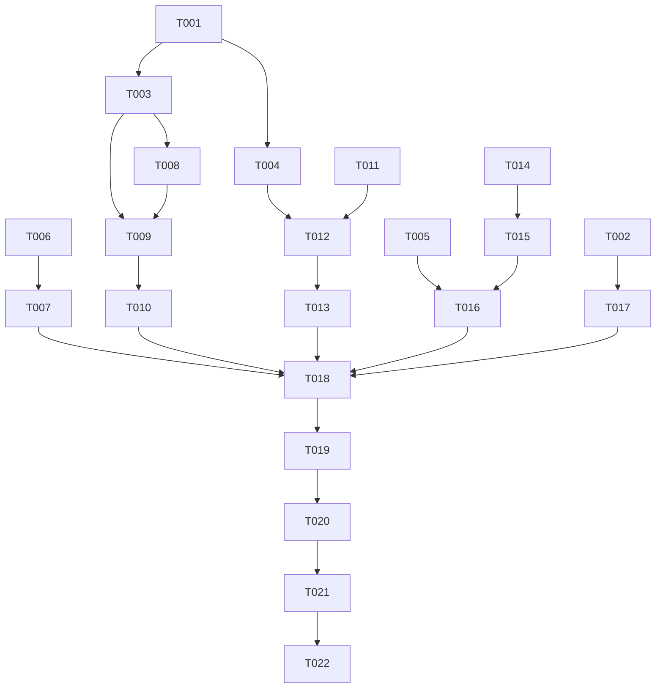

# Tasks: 021 合并结果 Review Remediation

**Input**: Design documents from `spec/021-review-remediation/`
**Prerequisites**: `spec.md` and `plan.md` approved
**Verification scope**: build-only; no UI verification task is included.

## Format

Every task uses `- [ ] [TaskID] [P?] [Story?] Description with exact file path`.

- `[P]` means the task can run in parallel with the listed independent tasks.
- `[USx]` maps a task to the corresponding user story in `spec.md`.
- Setup, Foundational, Polish, and Verification tasks intentionally have no story label.

## Path Conventions

All paths are relative to the project root `D:\HMgent\MindTrace` unless otherwise stated. Source and test paths follow the existing MindTrace entry-module layout; no new module or MVVM directory is introduced.

## Phase 1: Setup

**Purpose**: Establish the approved remediation baseline without expanding into #142/#143/#144.

- [X] T001 Confirm the current `develop` baseline, review finding list, affected files, and out-of-scope tickets against `spec/021-review-remediation/spec.md` and `spec/021-review-remediation/plan.md`
- [X] T002 [P] Preserve ADR-0017 frozen budget and emulator follow-up traceability by checking `docs/adr/0017-renderer-scheduler-budget-baseline.md` and recording any verification note only in `spec/021-review-remediation/spec.md`

**Acceptance**: The implementation scope is limited to the five confirmed review findings; no `StreamingReplyDocument`, chat renderer migration, or budget change is introduced.

---

## Phase 2: Foundational

**Purpose**: Prepare shared contracts that user-story implementations depend on.

- [X] T003 Define the centralized in-memory copy and persistence snapshot copy contracts in `entry/src/main/ets/overlays/AgentFloatWindow/chat/ChatModels.ets`
- [X] T004 Define the externally observable idle/no-write result state alongside the existing AtomicFile stages in `entry/src/main/ets/services/ChatHistoryPersistence.ets`, preserving the existing blocked, failure, retry, and actual write-stage semantics
- [X] T005 [P] Document the production persistence boundary and test-only capability seam in `entry/src/test/ChatPersistenceCapability.ets`

**Checkpoint**: Shared copy semantics and persistence result vocabulary are ready; no caller has been left with an ambiguous contract.

---

## Phase 3: User Story 1 - 不静默接受第二个 RenderTick 实例 (Priority: P1) 🎯 MVP

**Goal**: Make the single-instance policy explicit and independent of build mode.

**Independent Test**: Construct a first instance, attempt a second instance using the default/release path, verify explicit failure and first-instance continuity, dispose the first instance, then verify replacement construction.

### Tests for User Story 1

- [X] T006 [US1] Update `entry/src/test/RenderTick.test.ets` to assert that a second live instance fails under the default/release construction path, leaves no timer or reservation, preserves the first instance, and permits a replacement after disposal

### Implementation for User Story 1

- [X] T007 [US1] Implement the unified second-instance failure policy in `entry/src/main/ets/services/RenderTick.ets` without changing the existing tick phase order, pause behavior, or disposal contract

**Acceptance**: A second live instance never becomes a disabled no-op; the first instance and post-dispose replacement lifecycle tests pass.

---

## Phase 4: User Story 2 - 保持内存会话与持久化快照语义一致 (Priority: P1)

**Goal**: Remove duplicated copy logic while preserving the intentional UI-only field boundary.

**Independent Test**: Copy a session containing content, reasoning, streaming state, and reasoning expansion state through both named contracts; verify memory retains UI interaction state and persistence excludes UI-only state.

### Tests for User Story 2

- [X] T008 [P] [US2] Extend `entry/src/test/ChatHistoryPersistence.test.ets` with assertions for memory-copy field preservation and persistence-snapshot exclusion of `reasoningExpanded`

### Implementation for User Story 2

- [X] T009 [US2] Implement the named copy contracts in `entry/src/main/ets/overlays/AgentFloatWindow/chat/ChatModels.ets` with immutable session/message results and explicit UI-only field handling
- [X] T010 [US2] Replace duplicate copy implementations in `entry/src/main/ets/overlays/AgentFloatWindow/chat/ChatSession.ets` and `entry/src/main/ets/services/ChatHistoryPersistence.ets` with the centralized contracts, preserving TaskPool/Worker pure-data requirements

**Acceptance**: There is one discoverable definition for each copy semantic; all persistence snapshots remain pure data and omit `reasoningExpanded`.

---

## Phase 5: User Story 3 - 准确表达空闲 flush 结果 (Priority: P1)

**Goal**: Distinguish a successful no-write flush from an actual AtomicFile write stage.

**Independent Test**: Verify idle, pending-write, in-flight, blocked, failed, and retry flush outcomes independently.

### Tests for User Story 3

- [X] T011 [US3] Add idle flush assertions and regression coverage for pending/in-flight versus idle results in `entry/src/test/ChatHistoryPersistence.test.ets`

### Implementation for User Story 3

- [X] T012 [US3] Return the dedicated idle/no-write result from `entry/src/main/ets/services/ChatHistoryPersistence.ets` only when no pending or in-flight write exists, while preserving actual PREPARE/WRITE/COMMIT/VERIFY failures
- [X] T013 [US3] Update result consumers and test-side result contracts in `entry/src/main/ets/overlays/AgentFloatWindow/chat/ChatSession.ets`, `entry/src/test/ChatPersistenceCapability.ets`, and `entry/src/test/ChatPersistenceCapability.test.ets` so idle, not-initialized, blocked, and failure states remain distinguishable

**Acceptance**: Idle `flush` no longer reports `PREPARE`; actual writes and failures retain their existing stage and retry diagnostics.

---

## Phase 6: User Story 4 - 明确持久化能力与 Worker 协议边界 (Priority: P2)

**Goal**: Make capability probe, production persistence, and Worker request/response responsibilities discoverable without changing compatible behavior.

**Independent Test**: Review headers and tests, then exercise capability probe, valid write request, and unsupported structured request paths with content-safe diagnostics.

### Tests for User Story 4

- [X] T014 [P] [US4] Rename or expand protocol-boundary assertions in `entry/src/test/ChatPersistenceCapability.test.ets` to distinguish test-side capability probing from production persistence and to cover unsupported Worker request diagnostics

### Implementation for User Story 4

- [X] T015 [US4] Document capability probe, structured write request, unsupported request, response stages, and diagnostic restrictions in `entry/src/main/ets/workers/ChatPersistenceWorker.ets`
- [X] T016 [US4] Align production-boundary comments and test naming in `entry/src/test/ChatPersistenceCapability.ets`, `entry/src/test/ChatPersistenceCapability.test.ets`, and `entry/src/main/ets/services/ChatHistoryPersistence.ets` with the private-file production path and Preferences migration-read-only rule

**Acceptance**: Maintainers can distinguish the test probe from production persistence and can identify each Worker message category and failure boundary.

---

## Phase 7: User Story 5 - 如实记录性能 follow-up (Priority: P2)

**Goal**: Keep the frozen budgets and explicitly preserve the emulator performance follow-up without claiming a pass.

**Independent Test**: Compare the remediation traceability record with ADR-0017 and verify values, target, and #139 follow-up remain unchanged and explicit.

### Implementation for User Story 5

- [X] T017 [US5] Record the unchanged ADR-0017 values, DevEco emulator `T_finishToStable` follow-up status, and #139 true-device evidence responsibility in `spec/021-review-remediation/spec.md` without changing `docs/adr/0017-renderer-scheduler-budget-baseline.md`

**Acceptance**: The remediation record states `1` Web creation per frame, `16ms` Web work budget, the unchanged 500ms initial target, and the non-passing emulator follow-up status.

---

## Phase 8: Polish & Cross-Cutting Concerns

**Purpose**: Keep contracts, headers, tests, and documentation internally consistent.

- [X] T018 [P] Run the repository naming and diff checks against all modified paths and resolve only remediation-related findings in `spec/021-review-remediation/` and the affected entry files
- [X] T019 Review ArkTS strict compatibility and file-header consistency for `entry/src/main/ets/services/RenderTick.ets`, `entry/src/main/ets/services/ChatHistoryPersistence.ets`, `entry/src/main/ets/overlays/AgentFloatWindow/chat/ChatModels.ets`, `entry/src/main/ets/overlays/AgentFloatWindow/chat/ChatSession.ets`, and `entry/src/main/ets/workers/ChatPersistenceWorker.ets`
- [X] T020 Confirm `entry/src/test/List.test.ets` includes all changed behavioral tests and that no test or implementation references #142/#143/#144 rendering migration behavior

**Acceptance**: Documentation, tests, source headers, and task traceability agree; no out-of-scope chat renderer or performance-budget changes are present.

---

## Phase 9: Verification

<!-- verification_scope: build-only -->

**Purpose**: Build, deploy, and validate the implemented remediation. UI verification is intentionally omitted because the selected scope is build-only.

- [X] T021 Run full ArkTS/static/lint/Node/naming/diff verification and build the project with `build_project`; fix remediation-caused failures and repeat build verification until the project compiles
- [X] T022 Deploy the built application to an available HarmonyOS device or emulator with `start_app` and record the deploy result; do not claim UI verification

---

## Dependencies & Execution Order

### Dependency Graph

### Phase Dependencies

- **Setup (Phase 1)**: No implementation dependency; establishes scope and evidence traceability.
- **Foundational (Phase 2)**: Depends on Setup; blocks all user-story implementation.
- **User Stories (Phases 3–7)**: Depend on Foundational; execute in priority order or in parallel where the table permits.
- **Polish (Phase 8)**: Depends on all source-affecting story tasks.
- **Verification (Phase 9)**: Depends on Polish; deployment follows successful build verification.

### User Story Dependencies

- **US1 (P1)**: Depends on Setup; independent of US2–US5.
- **US2 (P1)**: Depends on Foundational copy contracts; independent of US1 after that contract exists.
- **US3 (P1)**: Depends on Foundational result vocabulary; consumes the copy contract only where save snapshots are involved.
- **US4 (P2)**: Depends on persistence result and capability boundaries; documentation/test alignment follows protocol behavior.
- **US5 (P2)**: Depends only on Setup evidence review; must not modify ADR-0017 values.

### Within Each User Story

- Tests are defined before implementation tasks where behavior changes.
- Shared model/result contracts precede callers.
- Service changes precede consumer/test-boundary alignment.
- Each story ends with an explicit acceptance checkpoint.

## Parallel Execution Guide

| Phase | Tasks | Required Files | Execution Notes |
|---|---|---|---|
| Setup | T001, T002 | `spec/021-review-remediation/spec.md`, `spec/021-review-remediation/plan.md`, `docs/adr/0017-renderer-scheduler-budget-baseline.md` | T001 establishes baseline; T002 can verify performance traceability in parallel. |
| Foundational | T003, T004, T005 | `ChatModels.ets`, `ChatHistoryPersistence.ets`, `ChatPersistenceCapability.ets` | T003 and T004 touch different contracts; T005 is documentation-only and can run in parallel, then callers depend on the results. |
| US1 | T006, then T007 | `RenderTick.test.ets`, `RenderTick.ets` | Test contract first; implementation follows the test contract. |
| US2 | T008, then T009, T010 | `ChatHistoryPersistence.test.ets`, `ChatModels.ets`, `ChatSession.ets`, `ChatHistoryPersistence.ets` | T009 depends on T003; T010 consumes the centralized contracts. |
| US3 | T011, then T012, T013 | `ChatHistoryPersistence.test.ets`, `ChatHistoryPersistence.ets`, `ChatSession.ets`, capability tests | T012 depends on T004; consumers follow the result contract. |
| US4 | T014, then T015, T016 | Worker and capability files/tests | Protocol tests and documentation must agree before final boundary alignment. |
| US5 | T017 | `spec/021-review-remediation/spec.md` | No budget or ADR rewrite; record only the approved follow-up. |
| Polish | T018, T019, T020 | Affected source/tests/spec files | Run after story changes; T018 can begin after the relevant story changes are complete. |
| Verification | T021, then T022 | Project root and built entry module | Build/fix loop precedes deploy; UI verification is excluded. |

## Parallel Example

The independent setup/evidence and foundational documentation work may proceed in parallel:

- T002 can verify ADR-0017 traceability while T001 confirms the source baseline.
- T003, T004, and T005 can proceed concurrently because they establish separate shared seams.
- After the foundational checkpoint, T014 and T017 can proceed independently of the P1 implementation stories, subject to their stated file dependencies.

## Implementation Strategy

1. Complete Setup and Foundational contracts.
2. Implement P1 User Stories 1–3 with tests first where applicable.
3. Implement P2 protocol documentation and performance traceability.
4. Complete Polish consistency checks.
5. Run build-only verification, deploy, and report any failures without claiming UI verification.

## Notes

- **Total tasks**: 22.
- **Per-story tasks**: US1 = 2, US2 = 3, US3 = 3, US4 = 3, US5 = 1.
- **Non-story tasks**: Setup = 2, Foundational = 3, Polish = 3, Verification = 2.
- Every task has a sequential ID, a checkbox, an exact repository path, and a story label when it belongs to a user-story phase.
- No new project structure, source module, global Document, global RenderTick, or chat renderer migration is permitted.
- The verification phase is explicitly `build-only`; no UI verification task is present.
