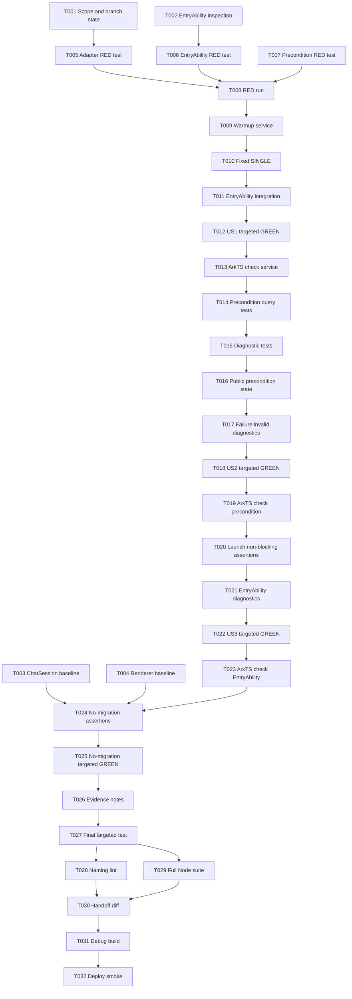

# Tasks: Restore ArkWeb Engine Warmup Gate

**Input**: Design documents from `spec/restore-arkweb-warmup/`
**Prerequisites**: `spec/restore-arkweb-warmup/plan.md`, `spec/restore-arkweb-warmup/spec.md`
**Tests**: Required. User requested TDD where possible at pre-agreed seams: ArkWeb API adapter seam, EntryAbility launch seam, and BenchmarkBaselinePrecondition failure/query seam.
**Organization**: Tasks are grouped by independently testable user stories and must be executed in dependency order unless marked `[P]`.

## Format: `[ID] [P?] [Story] Description`

- **[P]**: Can run in parallel when dependencies are satisfied and files do not conflict.
- **[Story]**: User story mapping from `spec.md`.
- All source-path tasks include exact target file paths.

## Path Conventions

- **Project root**: repository root
- **Feature artifacts**: `spec/restore-arkweb-warmup/`
- **Entry module ArkTS source**: `entry/src/main/ets/`
- **EntryAbility startup seam**: `entry/src/main/ets/entryability/EntryAbility.ets`
- **Warmup/precondition service seam target**: `entry/src/main/ets/services/ArkWebWarmupService.ets`
- **Node regression tests**: `scripts/arkts-lint/tests/arkweb-warmup-gate.test.mjs`
- **Hypium behavior test**: `entry/src/test/ArkWebWarmupService.test.ets`

## Phase 1: Setup (Shared Infrastructure)

**Purpose**: Confirm scope, branch safety, and existing project seams before writing tests or implementation.

- [X] T001 Confirm issue #119, parent spec 021/Q1/Q4 scope, current branch, and existing working tree state for repository root
- [X] T002 [P] Inspect current EntryAbility startup integration and ArkWeb usage targets in `entry/src/main/ets/entryability/EntryAbility.ets`
- [X] T003 [P] Inspect existing chat renderer and Preferences paths to establish no-migration baseline in `entry/src/main/ets/overlays/AgentFloatWindow/chat/ChatSession.ets`
- [X] T004 [P] Inspect existing MarkdownRenderer and FormulaSplitRenderer references to establish no-removal baseline in `entry/src/main/ets/shared/molecules/FormulaSplitRenderer.ets`

---

## Phase 2: Foundational (Blocking Prerequisites)

**Purpose**: Create RED tests and public seam expectations before any user story implementation.

**⚠️ CRITICAL**: No user story implementation can begin until these TDD foundation tasks are complete.

- [X] T005 Create failing ArkWeb warmup adapter seam tests for supported API invocation and fixed `SINGLE` render process mode in `scripts/arkts-lint/tests/arkweb-warmup-gate.test.mjs`
- [X] T006 Create failing EntryAbility launch seam regression test for warmup-before-content-load integration in `scripts/arkts-lint/tests/arkweb-warmup-gate.test.mjs`
- [X] T007 Create failing BenchmarkBaselinePrecondition query tests for success valid and recoverable failure invalid states in `scripts/arkts-lint/tests/arkweb-warmup-gate.test.mjs`
- [X] T008 Run the single targeted warmup/precondition test file and record the expected RED result in `scripts/arkts-lint/tests/arkweb-warmup-gate.test.mjs`

**Checkpoint**: Foundational RED tests exist and fail for the missing/restored warmup and precondition gate.

---

## Phase 3: User Story 1 - 预热先于基线采集 (Priority: P1) 🎯 MVP

**Goal**: EntryAbility performs SDK-supported ArkWeb warmup/configuration before any future chat rendering benchmark baseline can run.

**Independent Test**: Adapter seam and EntryAbility launch seam tests pass without invoking chat components.

### Tests for User Story 1 ⚠️

> **NOTE**: T005-T008 must be written and observed RED before US1 implementation tasks.

### Implementation for User Story 1

- [X] T009 [US1] Implement the ArkWeb warmup/precondition service seam using SDK-supported ArkWeb APIs in `entry/src/main/ets/services/ArkWebWarmupService.ets`
- [X] T010 [US1] Ensure the warmup service fixes render process mode specifically to `SINGLE` and does not expose a configurable alternative in `entry/src/main/ets/services/ArkWebWarmupService.ets`
- [X] T011 [US1] Integrate the ArkWeb warmup seam into EntryAbility startup before page content loading in `entry/src/main/ets/entryability/EntryAbility.ets`
- [X] T012 [US1] Run the single targeted warmup/precondition test file and make the US1 assertions pass in `scripts/arkts-lint/tests/arkweb-warmup-gate.test.mjs`
- [X] T013 [US1] Run ArkTS check on changed EntryAbility and warmup service files in `entry/src/main/ets/services/ArkWebWarmupService.ets`

**Acceptance note for T009/T010**: `setRenderProcessMode` 的具体模式值必须为 `SINGLE`，与 Q1 已冻结决策一致；不允许以“配置化”为由留空或选择其他模式。

**Checkpoint**: User Story 1 is functional and testable independently.

---

## Phase 4: User Story 2 - 预热失败不产出有效基线前置状态 (Priority: P1)

**Goal**: Warmup success/failure updates a public, queryable BenchmarkBaselinePrecondition state for future benchmark consumers.

**Independent Test**: Targeted tests verify success → valid and recoverable failure → invalid through the public seam. #119 does not add or verify benchmark collection scripts.

### Tests for User Story 2 ⚠️

- [X] T014 [US2] Extend targeted tests for public BenchmarkBaselinePrecondition valid/invalid query behavior in `scripts/arkts-lint/tests/arkweb-warmup-gate.test.mjs` and `entry/src/test/ArkWebWarmupService.test.ets`
- [X] T015 [US2] Extend targeted tests for recoverable ArkWeb warmup failure diagnostics without user-content leakage in `scripts/arkts-lint/tests/arkweb-warmup-gate.test.mjs` and `entry/src/test/ArkWebWarmupService.test.ets`

### Implementation for User Story 2

- [X] T016 [US2] Implement public BenchmarkBaselinePrecondition query state in the warmup service seam in `entry/src/main/ets/services/ArkWebWarmupService.ets`
- [X] T017 [US2] Implement recoverable failure handling that marks BenchmarkBaselinePrecondition invalid and keeps diagnostics content-safe in `entry/src/main/ets/services/ArkWebWarmupService.ets`
- [X] T018 [US2] Run the single targeted warmup/precondition test file after precondition changes in `scripts/arkts-lint/tests/arkweb-warmup-gate.test.mjs`
- [X] T019 [US2] Run ArkTS check on changed warmup/precondition service files in `entry/src/main/ets/services/ArkWebWarmupService.ets`

**Acceptance note for T014/T016/T017**: 预热失败必须将 `BenchmarkBaselinePrecondition` 状态标记为 invalid，且该状态必须通过公共接口可查询，供未来基准脚本消费；#119 不新增基准采集脚本，“invalid 时基准采集失败”属于 spec 021 下游执行点，不在本 ticket 验证。

**Checkpoint**: User Story 2 exposes the future benchmark gate state without adding benchmark scripts.

---

## Phase 5: User Story 3 - 预热不破坏正常启动 (Priority: P1)

**Goal**: Warmup restoration does not block or crash normal app launch.

**Independent Test**: Recoverable failure remains non-blocking for normal startup; launch smoke is handled in Verification.

### Tests for User Story 3 ⚠️

- [X] T020 [US3] Extend targeted EntryAbility launch seam assertions for non-blocking warmup diagnostics in `scripts/arkts-lint/tests/arkweb-warmup-gate.test.mjs`

### Implementation for User Story 3

- [X] T021 [US3] Add non-blocking diagnostic logging for warmup success/failure in EntryAbility integration in `entry/src/main/ets/entryability/EntryAbility.ets`
- [X] T022 [US3] Run the single targeted warmup/precondition test file after launch-safety changes in `scripts/arkts-lint/tests/arkweb-warmup-gate.test.mjs`
- [X] T023 [US3] Run ArkTS check on changed EntryAbility and warmup service files in `entry/src/main/ets/entryability/EntryAbility.ets`

**Checkpoint**: User Stories 1-3 satisfy the P1 hard gate and launch safety requirements.

---

## Phase 6: User Story 4 - 现有 chat 渲染与持久化保持不变 (Priority: P2)

**Goal**: Ensure #119 does not introduce downstream spec 021 rendering or persistence migration.

**Independent Test**: Diff and targeted regression checks confirm existing renderer and Preferences paths remain intact.

### Tests for User Story 4 ⚠️

- [X] T024 [US4] Add or update no-migration regression assertions for StreamingReplyDocument absence and existing renderer/persistence preservation in `scripts/arkts-lint/tests/arkweb-warmup-gate.test.mjs`

### Implementation for User Story 4

- [X] T025 [US4] Run targeted no-migration regression assertions after implementation changes in `scripts/arkts-lint/tests/arkweb-warmup-gate.test.mjs`

**Checkpoint**: Current chat rendering and Preferences persistence behavior remain untouched by #119.

---

## Phase 7: User Story 5 - 在已确认 seam 上执行 TDD (Priority: P2)

**Goal**: Complete requested TDD cadence at the pre-agreed seams and preserve evidence for handoff.

**Independent Test**: The single warmup test file demonstrates adapter, EntryAbility, and precondition behavior; implementation report records RED→GREEN evidence.

### Implementation for User Story 5

**TDD evidence (issue #119)**: T008 was observed RED because the planned warmup service did not exist. After T009-T011 added the service and EntryAbility integration, T012/T018/T022/T025 targeted runs were GREEN. The repair pass adds executable Hypium behavior coverage in `entry/src/test/ArkWebWarmupService.test.ets` for adapter injection, `SINGLE` ordering, reset, success→valid, failure→invalid safe diagnostics, successful idempotency, and retry after an initial failure. The changed ArkTS files also passed `arkts_check` in T013/T019/T023 and the repair pass re-ran `arkts_check` after `.ets` edits.

- [X] T026 [US5] Consolidate targeted test evidence and RED→GREEN notes for the agreed seams in `spec/restore-arkweb-warmup/tasks.md`
- [X] T027 [US5] Re-run the single targeted warmup/precondition test file before final broader checks in `scripts/arkts-lint/tests/arkweb-warmup-gate.test.mjs`

**Checkpoint**: Agreed seam tests are green and ready for final broader checks.

**Repair-pass targeted evidence (2026-09-14)**: `node --test tests/arkweb-warmup-gate.test.mjs` passed with 7 tests and 0 failures. The documented Hypium command `hvigorw test -p module=entry -p coverage=false -p scope=ArkWebWarmupService.issue119_behavior` was attempted, but could not execute because `hvigorw` is not installed or available on `PATH` in this Windows environment; no repository `hvigorw` wrapper was found. This is an environment blocker, not a passing Hypium result.

---

## Phase 8: Polish & Cross-Cutting Concerns

**Purpose**: Cleanup, repository conformance, and handoff preparation without starting `/code-review` or committing.

- [X] T028 [P] Run project naming lint and address only issue #119-related naming violations in `.naminglintrc.json`
- [X] T029 Run the full relevant Node test suite once after targeted tests are green in `scripts/arkts-lint/package.json`
- [X] T030 Inspect the final diff for scope boundaries and prepare a stop-before-code-review handoff in `spec/restore-arkweb-warmup/tasks.md`

**Polish repair evidence (2026-09-14)**: naming lint passed with 0 violations. The full relevant Node suite passed with 103 tests and 0 failures. The approved documentation maintenance scope is recorded in `plan.md`. After the review repair pass, the changed ArkTS files passed `arkts_check`, the debug build passed, and the application was installed and launched successfully on the running `MatePad Pro 13` emulator.

---

## Phase 9: Verification

<!-- verification_scope: build-only -->

**Purpose**: Build and deploy verification only. UI verification is intentionally omitted because the Phase 3 verification choice was `Run verification`.

- [X] T031 Build the project in debug mode and fix compilation errors within issue #119 scope for `build-profile.json5`
- [X] T032 Deploy/start the application on an available device or emulator and record launch-smoke result or environment blocker for `spec/restore-arkweb-warmup/tasks.md`

**Verification status**: T031-T032 were executed by the parent `spec-verify` build-only phase on 2026-09-14. Debug build attempt 1/10 completed successfully for product `default`; no #119-scope compilation fix was required. Build emitted only existing deprecation warnings and unsigned-package warnings because no signing profile is configured. `start_app` installed and launched `com.example.mathmind/EntryAbility` successfully on the running `MatePad Pro 13` emulator (`127.0.0.1:5555`). No `verify_ui` step was run because this phase is explicitly `build-only`.

**Verification audit evidence (2026-09-14)**: The feature directory contains no drive-letter paths. The warmup service uses the SDK-supported `@ohos.web.webview` APIs, fixes `RenderProcessMode.SINGLE`, calls `initializeWebEngine()` in order, exposes the state+diagnostic-only `getBenchmarkBaselinePrecondition()` query, remains idempotent after success, and permits retry after an initial recoverable failure. Diagnostics are limited to sanitized `errorName`/`errorCode` metadata and exclude user content, message, stack, serialized errors, and a recoverable precondition field. Existing MarkdownRenderer, FormulaSplitRenderer, and Preferences chat-history paths remain intact; no benchmark collection script, StreamingReplyDocument migration, persistence migration, or WebKeepAlive wiring was introduced. Approved API-documentation maintenance remains recorded in `spec.md` and `plan.md`. Targeted Node regression evidence remains 7 passed/0 failed, relevant Node suite evidence remains 103 passed/0 failed, naming lint remains 0 violations, and the documented Hypium command remains blocked because `hvigorw` is unavailable on PATH (not treated as a pass).

**Post-review repair verification (2026-09-14)**: The review findings were fixed without touching unrelated dirty streams: `EntryAbility.ets` now documents the ArkWeb warmup responsibility, the ArkTS maintenance section uses the current `6.1.1(24)` baseline, `ArkWebWarmupService` shares one success-result helper, and the Node gate has an issue #119 purpose header. `arkts_check` passed on `EntryAbility.ets`, `ArkWebWarmupService.ets`, `ArkWebWarmupService.test.ets`, and `List.test.ets`; the targeted gate and full relevant Node suite passed (103/103); `git diff --check` passed. `build_project` completed a debug `entry` build successfully, and `start_app` installed and launched `com.example.mathmind/EntryAbility` on `127.0.0.1:5555`. The documented `hvigorw test -p module=entry -p coverage=false -p scope=ArkWebWarmupService.issue119_behavior` command was retried after the device became available and still failed because `hvigorw` is not installed or available on PATH; device availability does not remove this local test-runner blocker. No UI verification was run because the recorded scope is build-only.

---

## Dependencies & Execution Order

### Phase Dependencies

- **Setup (Phase 1)**: No dependencies; confirms scope and baselines.
- **Foundational (Phase 2)**: Depends on Setup; blocks all user story work.
- **User Story 1 (Phase 3)**: Depends on Foundational RED tests.
- **User Story 2 (Phase 4)**: Depends on US1 warmup seam and fixed `SINGLE` behavior.
- **User Story 3 (Phase 5)**: Depends on US1/US2 real warmup/precondition behavior.
- **User Story 4 (Phase 6)**: Depends on implementation diff from US1-US3.
- **User Story 5 (Phase 7)**: Depends on all targeted seam tests and evidence.
- **Polish (Phase 8)**: Depends on desired user stories being complete.
- **Verification (Phase 9)**: Depends on implementation and polish completion.

### User Story Dependencies

- **User Story 1 (P1)**: Can start after Foundational; MVP for the warmup gate.
- **User Story 2 (P1)**: Depends on US1 so precondition state reflects actual warmup success/failure.
- **User Story 3 (P1)**: Depends on US1/US2 to verify non-blocking launch behavior around real state transitions.
- **User Story 4 (P2)**: Depends on final changed-file set.
- **User Story 5 (P2)**: Depends on test cadence and evidence from US1-US4.

### Within Each User Story

- Tests must be written and observed failing before implementation where feasible.
- Warmup/precondition service comes before EntryAbility integration.
- `SINGLE` mode is a fixed acceptance condition, not a runtime/user configuration.
- Targeted single test file runs after each seam change.
- ArkTS check runs after `.ets` edits.
- Full suite runs once near the end.
- `/code-review`, staging, and commit are not executed by this workflow unless the user later confirms after their own review.

## 📊 Dependency Graph



## ⚡ Parallel Execution Guide

| Phase | Tasks | Required Files | Execution Notes |
|---|---|---|---|
| Setup | T002, T003, T004 | EntryAbility, ChatSession, FormulaSplitRenderer | Can inspect in parallel after T001; read-only. |
| Foundational | T005, T006, T007 | `arkweb-warmup-gate.test.mjs` | Same file, so coordinate edits; all precede T008 RED run. |
| US1 | T009-T013 | Warmup service, EntryAbility, test file | Sequential TDD slice: service → fixed SINGLE → startup integration → targeted test → ArkTS check. |
| US2 | T014-T019 | Test file, warmup service | Sequential TDD slice for public precondition state. |
| US3 | T020-T023 | Test file, EntryAbility | Sequential launch-safety slice. |
| US4 | T024-T025 | Test file | No-migration assertions after final changed-file set is known. |
| Polish | T028, T029 | Naming config, test package | Can run after targeted tests; address only #119-related issues. |
| Verification | T031 then T032 | Build profile, tasks artifact | Build must pass before deploy/start smoke. |

## Parallel Example: User Story 1

```text
US1 is intentionally mostly sequential because the acceptance criteria depend on a single fixed warmup seam:
Task: T009 Implement warmup/precondition service seam in entry/src/main/ets/services/ArkWebWarmupService.ets
Task: T010 Confirm the service fixes render process mode to SINGLE, with no configurable alternative
Task: T011 Integrate warmup service from entry/src/main/ets/entryability/EntryAbility.ets
Task: T012 Run scripts/arkts-lint/tests/arkweb-warmup-gate.test.mjs and confirm GREEN
Task: T013 Run ArkTS check on changed .ets files
```

## Implementation Strategy

### MVP First (User Story 1 Only)

1. Complete Setup and Foundational RED tests.
2. Implement the ArkWeb warmup/precondition service seam.
3. Lock render process mode to `SINGLE`.
4. Integrate it in EntryAbility startup before page content loading.
5. Run targeted tests and ArkTS check.

### Incremental Delivery

1. Add US1 warmup gate with fixed `SINGLE` mode.
2. Add US2 public `BenchmarkBaselinePrecondition` valid/invalid query state.
3. Add US3 non-blocking launch diagnostics.
4. Add US4 no-migration protection.
5. Complete US5 evidence and final test cadence.
6. Run Polish, then build-only Verification.

## Notes

- `[P]` tasks use different files or are read-only and can be done without conflicting edits.
- `[USx]` labels map directly to `spec.md` user stories.
- Each user story should be independently completable and testable.
- Verify tests fail before implementing the corresponding behavior where feasible.
- Do not add benchmark collection scripts in #119.
- Do not start downstream spec 021 tickets, StreamingReplyDocument migration, RendererScheduler work, hidden Web keep-alive, TaskPool/AtomicFile chat history migration, or NoteDetail switching.
- Do not invoke `/code-review`, stage, or commit. Stop after verification and handoff because the user clarified they will perform `/code-review` themselves.

## Summary Report

- **Total tasks**: 32
- **Per-story count**:
  - US1: 5 tasks (T009-T013)
  - US2: 6 tasks (T014-T019)
  - US3: 4 tasks (T020-T023)
  - US4: 2 tasks (T024-T025)
  - US5: 2 tasks (T026-T027)
- **Setup/Foundation tasks**: 8 tasks (T001-T008)
- **Polish tasks**: 3 tasks (T028-T030)
- **Verification tasks**: 2 tasks (T031-T032)
- **Parallel opportunities**: T002-T004; T028-T029 after targeted tests are green.
- **Independent test criteria**: US1 fixed `SINGLE` adapter/startup ordering tests; US2 valid/invalid precondition query tests; US3 non-blocking launch diagnostics; US4 no-migration assertions; US5 RED→GREEN evidence.
- **Suggested MVP scope**: T001-T013 satisfies the core #119 warmup gate; T014-T030 complete public precondition state, launch safety, scope protection, polish, and implementation evidence; T031-T032 remain for the parent `spec-verify` build-only phase.
- **Format validation**: All tasks use unique sequential IDs T001-T032, all user-story phase tasks include `[USx]`, and setup/foundational/polish/verification tasks omit story labels.
