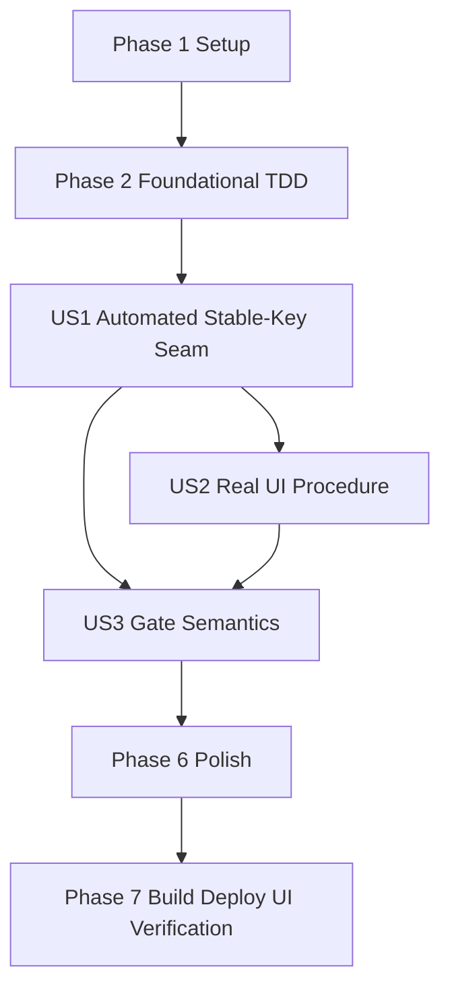

# Tasks: Ticket 0.2 Stable Chat Key Prop Refresh Gate

**Input**: Design documents from `spec/ticket-0-2-stable-chat-key-refresh/`  
**Prerequisites**: `spec/ticket-0-2-stable-chat-key-refresh/plan.md`, `spec/ticket-0-2-stable-chat-key-refresh/spec.md`  
**Verification Scope**: build+ui (`Run verification + UI verification` selected)

**Tests**: Required. User requested TDD where possible, regular typechecking, regular focused tests, and one full suite run at the end.

**Organization**: Tasks are grouped by user story. #120 is a gate ticket: it verifies the candidate stable key and must not migrate production chat behavior.

## Format: `[ID] [P?] [Story] Description`

- **[P]**: Can run in parallel when dependencies are satisfied and files do not conflict
- **[Story]**: Maps to a user story from `spec.md` (`US1`..`US3`)
- Each task names an exact repository-relative target path

## Path Conventions

- Feature artifacts: `spec/ticket-0-2-stable-chat-key-refresh/`
- Entry chat source: `entry/src/main/ets/overlays/AgentFloatWindow/`
- Chat model/source seam: `entry/src/main/ets/overlays/AgentFloatWindow/chat/`
- Entry tests: `entry/src/test/`

## Phase 1: Setup (Shared Infrastructure)

**Purpose**: Re-establish #120 scope after review and protect unrelated dirty files.

- [X] T001 Record current branch, pre-existing unrelated dirty files, and #120 scoped file inventory in `spec/ticket-0-2-stable-chat-key-refresh/verification-record.md`
- [X] T002 [P] Review ArkTS strict rules before `.ets` edits in `docs/style/arkts-1.1.md`
- [X] T003 [P] Review stable-key gate context in `docs/specs/021-chat-streaming-incremental-rendering.md`
- [X] T004 [P] Review existing production path inventory in `entry/src/main/ets/overlays/AgentFloatWindow/AgentMessageList.ets`
- [X] T005 Ensure `spec/feature.json` is not repointed to this ticket and record the ownership boundary in `spec/ticket-0-2-stable-chat-key-refresh/verification-record.md`

---

## Phase 2: Foundational (Blocking Prerequisites)

**Purpose**: Create the focused TDD seam and register it before implementing stable-key assertions.

**Critical**: No user-story gate can be marked PASS until the focused seam exists and runs.

- [X] T006 Create initial failing focused test file for #120 in `entry/src/test/StableChatKeyRefresh.test.ets`
- [X] T007 Register `StableChatKeyRefresh.test.ets` in the existing test suite in `entry/src/test/List.test.ets`
- [X] T008 Run the focused test before implementation and record the red result in `spec/ticket-0-2-stable-chat-key-refresh/verification-record.md`
- [X] T009 Define the candidate stable key expectation as message ID only in `entry/src/test/StableChatKeyRefresh.test.ets`
- [X] T010 Define the observed-row test fixture shape and document any harness-vs-production differences in `spec/ticket-0-2-stable-chat-key-refresh/verification-record.md`

**Checkpoint**: The missing automated seam identified by review exists, is registered, and has an initial red result.

---

## Phase 3: User Story 1 - Stable key refresh is proven (Priority: P1) 🎯 MVP

**Goal**: Prove by focused automated tests that observed row data can change while candidate identity remains message ID only.

**Independent Test**: Run `StableChatKeyRefresh.test.ets` and confirm all three mutation cases pass.

### Tests for User Story 1

- [X] T011 [P] [US1] Add assertion that answer growth leaves the candidate stable key unchanged in `entry/src/test/StableChatKeyRefresh.test.ets`
- [X] T012 [P] [US1] Add assertion that reasoning growth leaves the candidate stable key unchanged in `entry/src/test/StableChatKeyRefresh.test.ets`
- [X] T013 [P] [US1] Add assertion that streaming-to-finished leaves the candidate stable key unchanged in `entry/src/test/StableChatKeyRefresh.test.ets`
- [X] T014 [P] [US1] Add observed answer text update assertion for the same row identity in `entry/src/test/StableChatKeyRefresh.test.ets`
- [X] T015 [P] [US1] Add observed reasoning text update assertion for the same row identity in `entry/src/test/StableChatKeyRefresh.test.ets`
- [X] T016 [P] [US1] Add observed streaming status update assertion for the same row identity in `entry/src/test/StableChatKeyRefresh.test.ets`

### Implementation for User Story 1

- [X] T017 [US1] Implement the test-only stable row fixture without changing production `chatItemKey` in `entry/src/test/StableChatKeyRefresh.test.ets`
- [X] T018 [US1] Add any required pure verification helper in `entry/src/main/ets/overlays/AgentFloatWindow/chat/ChatModels.ets`
- [X] T019 [US1] Run `arkts_check` for changed `.ets` files and record results in `spec/ticket-0-2-stable-chat-key-refresh/verification-record.md`
- [X] T020 [US1] Run the focused stable-key test and record PASS/FAIL evidence for automated seam in `spec/ticket-0-2-stable-chat-key-refresh/verification-record.md`

**Checkpoint**: Automated evidence for the candidate stable key is complete and reproducible.

---

## Phase 4: User Story 2 - Real rendering path confirms the seam (Priority: P1)

**Goal**: Prepare the real production-path UI verification procedure; final Verification executes it exactly once.

**Independent Test**: Review the procedure and confirm it uses `AgentMessageList.ets → LazyForEach → ChatBubble(@Prop msg)` for the same three mutations.

### Tests for User Story 2

- [X] T021 [US2] Define the real UI procedure for answer growth, reasoning growth, and streaming-to-finished in `spec/ticket-0-2-stable-chat-key-refresh/verification-record.md`

### Implementation for User Story 2

- [X] T022 [US2] Add a minimal verification-only UI harness only if existing controls cannot drive the required scenario in `entry/src/main/ets/overlays/AgentFloatWindow/AgentMessageList.ets`
- [X] T023 [US2] Record how the final Verification phase will execute the US2 procedure once and resolve `ui_verification_result` in `spec/ticket-0-2-stable-chat-key-refresh/verification-record.md`
- [X] T024 [US2] Record that if final UI verification is `INCOMPLETE`, the overall gate remains `INCOMPLETE` even when automated tests pass in `spec/ticket-0-2-stable-chat-key-refresh/verification-record.md`

**Checkpoint**: The real-path procedure is prepared without duplicating final UI execution.

---

## Phase 5: User Story 3 - Gate result and fallback branch are explicit (Priority: P1)

**Goal**: Encode PASS/FAIL/INCOMPLETE semantics and fallback handling in the verification record.

**Independent Test**: Inspect `verification-record.md` after final verification and confirm each status maps to the approved downstream action.

### Tests for User Story 3

- [X] T025 [US3] Add record checks for PASS semantics in `entry/src/test/StableChatKeyRefresh.test.ets`
- [X] T026 [US3] Add record checks for FAIL semantics and `id + streaming` fallback in `entry/src/test/StableChatKeyRefresh.test.ets`
- [X] T027 [US3] Add record checks for INCOMPLETE semantics and blocked downstream assumptions in `entry/src/test/StableChatKeyRefresh.test.ets`

### Implementation for User Story 3

- [X] T028 [US3] Add PASS status template text to `spec/ticket-0-2-stable-chat-key-refresh/verification-record.md`
- [X] T029 [US3] Add FAIL status template text and required `id + streaming` fallback impact to `spec/ticket-0-2-stable-chat-key-refresh/verification-record.md`
- [X] T030 [US3] Add INCOMPLETE status template text and blocked-task language to `spec/ticket-0-2-stable-chat-key-refresh/verification-record.md`
- [X] T031 [US3] Confirm production `StreamingReplyDocument`, renderer, history, and persistence paths remain unchanged in `spec/ticket-0-2-stable-chat-key-refresh/verification-record.md`

**Checkpoint**: Final gate resolution can be written unambiguously after Verification.

---

## Phase 6: Polish & Cross-Cutting Concerns

**Purpose**: Clean review findings, run checks, and prepare for final verification.

- [X] T032 Remove stale UI attempts for repository-only workflow concepts (formerly mislabeled US3/US4) from `spec/ticket-0-2-stable-chat-key-refresh/verification-record.md`
- [X] T033 Resolve the `ui_verification_result` marker to a concrete value only after final Verification in `spec/ticket-0-2-stable-chat-key-refresh/tasks.md`
- [X] T034 Run focused entry tests after final `.ets` changes and record results in `spec/ticket-0-2-stable-chat-key-refresh/verification-record.md`
- [X] T035 Run full relevant test suite once and record results in `spec/ticket-0-2-stable-chat-key-refresh/verification-record.md`
- [X] T036 Run naming lint for new files and record results in `spec/ticket-0-2-stable-chat-key-refresh/verification-record.md`
- [X] T037 Review final diff and scoped file list excluding unrelated dirty files in `spec/ticket-0-2-stable-chat-key-refresh/verification-record.md`

---

## Phase 7: Verification

<!-- verification_scope: build+ui -->
<!-- ui_verification_result: PASS -->

**Purpose**: Build, deploy, and perform the single authoritative UI verification for #120. UI verification executes the US2 procedure exactly once at this stage.

- [X] T038 Build project and fix any compilation errors using HarmonyOS build tooling with `build-profile.json5`
- [X] T039 Deploy application to device/emulator with entry module metadata in `entry/src/main/module.json5`
- [X] T040 Run UI verification against the deployed app using the US2 procedure and resolve `ui_verification_result` plus overall gate status in `spec/ticket-0-2-stable-chat-key-refresh/verification-record.md` — PASS: user-run emulator observation of the verification-only harness; all three mutations updated in place with stable key 120

---

## 📊 Dependency Graph



## ⚡ Parallel Execution Guide

| Phase | Tasks | Required Files | Execution Notes |
|-------|-------|----------------|-----------------|
| Setup | T002, T003, T004 | `docs/style/arkts-1.1.md`; `docs/specs/021-chat-streaming-incremental-rendering.md`; `entry/src/main/ets/overlays/AgentFloatWindow/AgentMessageList.ets` | Read-only references can be reviewed in parallel |
| Foundational | T006, T007, T008, T009, T010 | `entry/src/test/StableChatKeyRefresh.test.ets`; `entry/src/test/List.test.ets`; verification record | Create red test seam before implementing fixture behavior |
| US1 | T011-T020 | focused test file; optional ChatModels helper; verification record | Coordinate same-file test edits; production key must remain unchanged |
| US2 | T021-T024 | verification record; optional AgentMessageList harness | Prepare procedure only; final Verification executes it |
| US3 | T025-T031 | focused test file; verification record | Encodes status semantics before final verification |
| Polish | T032-T037 | verification record; tasks; test/lint outputs | Resolve review findings and scoped file inventory |
| Verification | T038-T040 | build profile; module metadata; verification record | Build → deploy → single authoritative UI verification |

## Parallel Example

```text
After T001 records scope, T002/T003/T004 can run in parallel because they only read reference documents.
After T006 creates the focused test file, T011-T016 should be implemented as one coordinated test slice to avoid same-file merge conflicts.
After US1 passes, T021 can prepare the UI procedure while T025-T027 add gate-status record checks, but final UI execution remains reserved for Phase 7.
```

## Dependencies & Execution Order

### Phase Dependencies

- **Setup (Phase 1)**: No dependencies.
- **Foundational (Phase 2)**: Depends on Setup; blocks user-story work.
- **US1 Automated Seam (Phase 3)**: Depends on registered red focused test.
- **US2 UI Procedure (Phase 4)**: Depends on US1's stable-key contract.
- **US3 Gate Semantics (Phase 5)**: Depends on US1 and US2 procedure definitions.
- **Polish (Phase 6)**: Depends on user-story evidence and record templates.
- **Verification (Phase 7)**: Depends on Polish; resolves UI result exactly once.

### User Story Dependencies

- **US1 (P1)**: Automated proof; MVP for this gate.
- **US2 (P1)**: Production-path evidence preparation; required before final PASS.
- **US3 (P1)**: Status semantics; required to interpret final verification.

### Within Each User Story

- Write or update focused tests first; confirm red where feasible.
- Run `arkts_check` after changed `.ets` files.
- Run focused tests regularly after logical slices.
- Run full relevant test suite once at the end.
- Do not change production `chatItemKey` or renderer/history/persistence behavior.

## Implementation Strategy

### MVP First

1. Create and register `StableChatKeyRefresh.test.ets`.
2. Prove message-ID-only identity remains stable through all three automated mutation cases.
3. Record harness-production differences.
4. Prepare real UI verification procedure.
5. Encode gate status semantics.

### Final Validation and Delivery

1. Run focused tests and ArkTS checks.
2. Run full relevant test/lint sweep once.
3. Build and deploy.
4. Execute one authoritative UI verification pass using the US2 procedure.
5. Run code review after verification; report findings and pause before staging or commit.

## Notes

- Total tasks: 40.
- Verification scope: `build+ui`.
- UI result marker remains tri-state until final Verification resolves it.
- PASS requires both automated and real UI evidence.
- FAIL requires an observed stable-key failure and records `id + streaming` fallback.
- INCOMPLETE blocks downstream stable-key assumptions and does not release fallback.
- Every task starts with `- [ ]`, task IDs are sequential, user-story tasks include `[USx]`, and non-story phases omit story labels.
