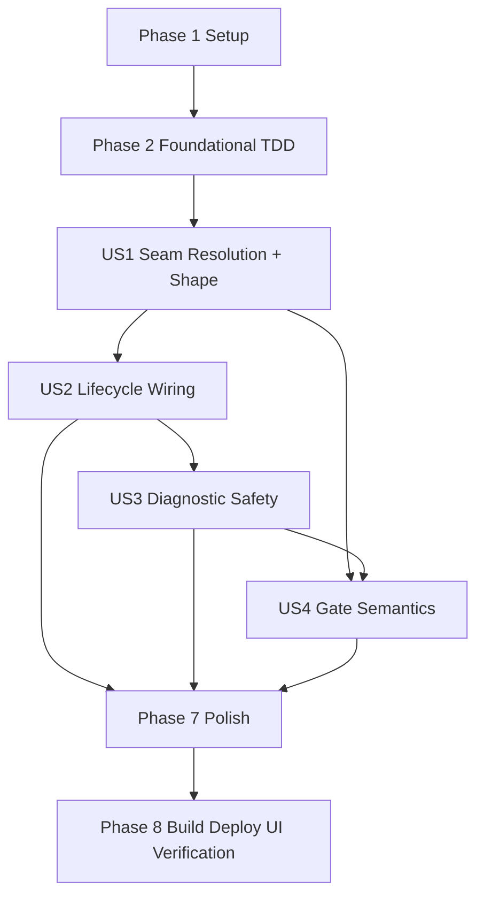

# Tasks: Ticket 0.3 Chat filesDir Context Seam

**Input**: Design documents from `spec/ticket-0-3-chat-filesdir-seam/`
**Prerequisites**: `spec/ticket-0-3-chat-filesdir-seam/plan.md`, `spec/ticket-0-3-chat-filesdir-seam/spec.md`
**Verification Scope**: build+ui (`Run verification + UI verification` selected)

**Tests**: Required. User requested TDD where possible at pre-agreed seams, regular typechecking (arkts_check), regular focused test runs, and one full test suite run at the end.

**Organization**: Tasks are grouped by user story. #121 is a gate ticket: it verifies the filesDir seam and must not migrate storage.

## Format: `[ID] [P?] [Story] Description`

- **[P]**: Can run in parallel when dependencies are satisfied and files do not conflict
- **[Story]**: Maps to a user story from `spec.md` (`US1`..`US4`)
- Each task names an exact repository-relative target path

## Path Conventions

- Feature artifacts: `spec/ticket-0-3-chat-filesdir-seam/`
- Seam service: `entry/src/main/ets/services/ChatFilesDirSeam.ets`
- Chat storage collaborator: `entry/src/main/ets/overlays/AgentFloatWindow/chat/ChatSession.ets`
- Floating window: `entry/src/main/ets/overlays/AgentFloatWindow/AgentFloatWindow.ets`
- Composition root: `entry/src/main/ets/entryability/EntryAbility.ets`
- Entry tests: `entry/src/test/`

## Phase 1: Setup (Shared Infrastructure)

**Purpose**: Re-establish #121 scope and protect unrelated dirty files.

- [X] T001 Record current branch, pre-existing unrelated dirty files, and #121 scoped file inventory in `spec/ticket-0-3-chat-filesdir-seam/verification-record.md`
- [X] T002 [P] Review ArkTS strict rules before `.ets` edits in `docs/style/arkts-1.1.md`
- [X] T003 [P] Review spec 021 storage decisions in `docs/specs/021-chat-streaming-incremental-rendering.md` (context injection path and filesDir gate)
- [X] T004 [P] Review the current seam gap in `entry/src/main/ets/overlays/AgentFloatWindow/chat/ChatSession.ets`, `entry/src/main/ets/overlays/AgentFloatWindow/AgentFloatWindow.ets`, and `entry/src/main/ets/entryability/EntryAbility.ets`
- [X] T005 Ensure `spec/feature.json` is not repointed to this ticket and record the ownership boundary in `spec/ticket-0-3-chat-filesdir-seam/verification-record.md`

---

## Phase 2: Foundational (Blocking Prerequisites)

**Purpose**: Create the focused TDD seam and register it before implementing seam behavior.

**Critical**: No user-story gate can be marked PASS until the focused seam exists and runs.

- [X] T006 Create the initial focused test file with red assertions for shape composition and resolution semantics in `entry/src/test/ChatFilesDirSeam.test.ets`
- [X] T007 Register `ChatFilesDirSeam.test.ets` in the existing test suite in `entry/src/test/List.test.ets`
- [X] T008 Run the focused test before implementation and record the red result in `spec/ticket-0-3-chat-filesdir-seam/verification-record.md`

**Checkpoint**: The focused seam exists, is registered, and has an initial red result.

---

## Phase 3: User Story 1 - Resolved filesDir seam without UI references (Priority: P1) 🎯 MVP

**Goal**: Prove by focused automated tests that the seam resolves the application-level filesDir into the fixed snapshot shape, with blocked-state semantics and no UI references.

**Independent Test**: Run `ChatFilesDirSeam.test.ets` and confirm shape composition, resolution, and blocked-state assertions pass.

### Tests for User Story 1

- [X] T009 [P] [US1] Add assertion that `snapshotDir` and `snapshotFile` compose `<filesDir>/chat-history` and `<filesDir>/chat-history/sessions.json` for a sample filesDir in `entry/src/test/ChatFilesDirSeam.test.ets`
- [X] T010 [P] [US1] Add assertions that a non-empty filesDir resolves and an empty filesDir blocks, with diagnostics carrying state and shape in `entry/src/test/ChatFilesDirSeam.test.ets`

### Implementation for User Story 1

- [X] T011 [US1] Implement the seam model, pure shape helpers, `fromFilesDir`, and the thin `fromApplicationContext` adapter in `entry/src/main/ets/services/ChatFilesDirSeam.ets`
- [X] T012 [US1] Run `arkts_check` for the changed `.ets` files and record results in `spec/ticket-0-3-chat-filesdir-seam/verification-record.md`
- [X] T013 [US1] Run the focused seam test and record PASS/FAIL evidence for US1 in `spec/ticket-0-3-chat-filesdir-seam/verification-record.md`

**Checkpoint**: Automated evidence for seam resolution and the directory shape is complete and reproducible.

---

## Phase 4: User Story 2 - Lifecycle-safe seam (Priority: P1)

**Goal**: Wire the seam end-to-end through the composition root and floating window, and prove lifecycle re-read semantics with an injectable store.

**Independent Test**: Run `ChatFilesDirSeam.test.ets` lifecycle/store assertions, and review the wiring diff for absence of UI references in the collaborator.

### Tests for User Story 2

- [X] T014 [P] [US2] Add store assertions: publish → read roundtrip, absent store → null, republish overwrites in `entry/src/test/ChatFilesDirSeam.test.ets`

### Implementation for User Story 2

- [X] T015 [US2] Implement the seam store interface, the AppStorage-backed production store, `publishChatFilesDirSeam`/`getChatFilesDirSeam`, and the test store hooks in `entry/src/main/ets/services/ChatFilesDirSeam.ets`
- [X] T016 [US2] Publish the seam in `EntryAbility.onCreate` from `this.context.getApplicationContext()` and log the shape-only diagnostic via hilog with `%{public}s` in `entry/src/main/ets/entryability/EntryAbility.ets`
- [X] T017 [US2] Read the seam in `loadHistory()` and hand the resolved filesDir (or empty string when the seam is null) to the collaborator via `recordFilesDir` before `sm.init` in `entry/src/main/ets/overlays/AgentFloatWindow/AgentFloatWindow.ets`
- [X] T018 [US2] Add `recordFilesDir`, `getResolvedSnapshotPath`, and `hasFilesDir` to `ChatSessionManager` while keeping `init`/`save` Preferences behavior unchanged in `entry/src/main/ets/overlays/AgentFloatWindow/chat/ChatSession.ets`
- [X] T019 [US2] Add collaborator retention assertions: record → path/hasFilesDir transitions, and `save()` without init neither throws nor touches the retained filesDir in `entry/src/test/ChatFilesDirSeam.test.ets`
- [X] T020 [US2] Run `arkts_check` for the changed `.ets` files and record results in `spec/ticket-0-3-chat-filesdir-seam/verification-record.md`
- [X] T021 [US2] Run the focused seam test and record PASS/FAIL evidence for US2 in `spec/ticket-0-3-chat-filesdir-seam/verification-record.md`

**Checkpoint**: The seam is wired end-to-end and lifecycle semantics are covered by deterministic automated evidence.

---

## Phase 5: User Story 3 - Verification records the shape without chat content (Priority: P1)

**Goal**: Prove by adversarial tests that diagnostics never carry chat content, session names, reasoning text, or secrets.

**Independent Test**: Run `ChatFilesDirSeam.test.ets` diagnostic-safety assertions with adversarial strings.

### Tests for User Story 3

- [X] T022 [P] [US3] Add adversarial diagnostic-safety assertions: chat content, session names, reasoning text, and API-key strings never appear in any seam diagnostic in `entry/src/test/ChatFilesDirSeam.test.ets`

### Implementation for User Story 3

- [X] T023 [US3] Confirm diagnostics are constructed only from seam state and the filesDir-derived shape in `entry/src/main/ets/services/ChatFilesDirSeam.ets`, and record the construction guarantee in `spec/ticket-0-3-chat-filesdir-seam/verification-record.md`
- [X] T024 [US3] Run the focused seam test and record PASS/FAIL evidence for US3 in `spec/ticket-0-3-chat-filesdir-seam/verification-record.md`

**Checkpoint**: Diagnostic safety is proven by construction and by adversarial automated evidence.

---

## Phase 6: User Story 4 - Gate status and production boundary (Priority: P1)

**Goal**: Encode PASS/FAIL/INCOMPLETE gate semantics and prove the production boundary is preserved.

**Independent Test**: Inspect `verification-record.md` after final verification and confirm each status maps to the approved downstream action; inspect the production diff for forbidden storage changes.

### Tests for User Story 4

- [X] T025 [US4] Add gate-status semantics assertions for PASS, FAIL, and INCOMPLETE in `entry/src/test/ChatFilesDirSeam.test.ets`

### Implementation for User Story 4

- [X] T026 [US4] Grep the production `entry/src/main/ets` diff for AtomicFile and TaskPool imports/invocations and record the result in `spec/ticket-0-3-chat-filesdir-seam/verification-record.md`
- [X] T027 [US4] Review the `ChatSession.ets` diff to confirm the Preferences load/save path is unchanged and record the result in `spec/ticket-0-3-chat-filesdir-seam/verification-record.md`
- [X] T028 [US4] Add PASS/FAIL/INCOMPLETE status template text and blocked-storage-branch language to `spec/ticket-0-3-chat-filesdir-seam/verification-record.md`

**Checkpoint**: Final gate resolution can be written unambiguously after Verification.

---

## Phase 7: Polish & Cross-Cutting Concerns

**Purpose**: Final typecheck, focused test, full suite, naming lint, and scoped diff review.

- [X] T029 Run `arkts_check` for all changed `.ets` files and record results in `spec/ticket-0-3-chat-filesdir-seam/verification-record.md`
- [X] T030 Run the focused `ChatFilesDirSeam.test.ets` and record results in `spec/ticket-0-3-chat-filesdir-seam/verification-record.md`
- [X] T031 Run the full entry test suite once and record results in `spec/ticket-0-3-chat-filesdir-seam/verification-record.md`
- [X] T032 Run naming lint for the new files and record results in `spec/ticket-0-3-chat-filesdir-seam/verification-record.md`
- [X] T033 Review the final diff and scoped file list excluding unrelated dirty files in `spec/ticket-0-3-chat-filesdir-seam/verification-record.md`

---

## Phase 8: Verification

<!-- verification_scope: build+ui -->

**Purpose**: Build, deploy, and perform the single authoritative device/preview verification for #121. The UI verification observes the real filesDir seam resolved by `EntryAbility.onCreate` on device and the floating window lifecycle.

- [X] T034 Build the project and fix any compilation errors using HarmonyOS build tooling with `build-profile.json5`
- [X] T035 Deploy the application to the device/emulator with entry module metadata in `entry/src/main/module.json5`
- [X] T036 Run UI verification against the deployed application (seam diagnostic via device log, floating window open/close lifecycle) and resolve the gate status plus `ui_verification_result` in `spec/ticket-0-3-chat-filesdir-seam/verification-record.md`

---

## 📊 Dependency Graph



## ⚡ Parallel Execution Guide

| Phase | Tasks | Required Files | Execution Notes |
|-------|-------|----------------|-----------------|
| Setup | T002, T003, T004 | `docs/style/arkts-1.1.md`; `docs/specs/021-chat-streaming-incremental-rendering.md`; `ChatSession.ets`; `AgentFloatWindow.ets`; `EntryAbility.ets` | Read-only references reviewed in parallel |
| Foundational | T006, T007, T008 | `entry/src/test/ChatFilesDirSeam.test.ets`; `entry/src/test/List.test.ets`; verification record | Create red test seam before implementing seam behavior |
| US1 | T009-T013 | focused test file; `services/ChatFilesDirSeam.ets`; verification record | Shape/resolution assertions first; service implementation then arkts_check + focused run |
| US2 | T014-T021 | focused test file; `services/ChatFilesDirSeam.ets`; `EntryAbility.ets`; `AgentFloatWindow.ets`; `ChatSession.ets`; verification record | Store assertions first; wiring edits coordinate different files; arkts_check + focused run at the end |
| US3 | T022-T024 | focused test file; `services/ChatFilesDirSeam.ets`; verification record | Adversarial assertions first; construction guarantee recorded |
| US4 | T025-T028 | focused test file; production diff; verification record | Gate semantics assertions; boundary checks are read-only diff/grep |
| Polish | T029-T033 | all changed `.ets` files; verification record; naming lint | arkts_check, focused test, full suite, naming lint, scoped diff |
| Verification | T034-T036 | build profile; module metadata; verification record; device/emulator | Build → deploy → single authoritative UI verification |

## Parallel Example

```text
After T001 records scope, T002/T003/T004 can run in parallel because they only read reference documents.
After T006 creates the focused test file, T009/T010 should be implemented as one coordinated test slice to avoid same-file conflicts.
After US1 passes, T014 (store assertions) can be written while T011's service file is extended, but T015-T018 wiring edits must land before the US2 checkpoint.
T022 and T025 touch the same test file; coordinate them sequentially within their story phases.
```

## Dependencies & Execution Order

### Phase Dependencies

- **Setup (Phase 1)**: No dependencies.
- **Foundational (Phase 2)**: Depends on Setup; blocks user-story work.
- **US1 Seam Resolution (Phase 3)**: Depends on registered red focused test.
- **US2 Lifecycle Wiring (Phase 4)**: Depends on US1's seam model.
- **US3 Diagnostic Safety (Phase 5)**: Depends on US1's diagnostic construction.
- **US4 Gate Semantics (Phase 6)**: Depends on US1-US3 evidence.
- **Polish (Phase 7)**: Depends on user-story evidence.
- **Verification (Phase 8)**: Depends on Polish; resolves the UI result exactly once.

### User Story Dependencies

- **US1 (P1)**: Seam resolution and shape; MVP for this gate.
- **US2 (P1)**: End-to-end wiring and lifecycle coverage.
- **US3 (P1)**: Diagnostic safety evidence.
- **US4 (P1)**: Gate status semantics and production boundary.

### Within Each User Story

- Write focused test assertions first; confirm red where feasible.
- Run `arkts_check` after changed `.ets` files (regular typechecking).
- Run focused tests regularly after logical slices.
- Run the full entry test suite once at the end (Polish phase).
- Do not import AtomicFile/TaskPool in production and do not change the Preferences path.

## Implementation Strategy

### MVP First

1. Record scope and protect unrelated dirty files.
2. Create and register the focused seam test.
3. Prove shape composition, resolution, and blocked semantics.
4. Wire the seam through EntryAbility → floating window → collaborator.
5. Prove lifecycle, diagnostic safety, and gate semantics.
6. Run the full sweep and record evidence.

### Final Validation and Delivery

1. `arkts_check`, focused tests, full suite, naming lint.
2. Build and deploy.
3. Execute one authoritative UI verification pass (device log + floating window lifecycle).
4. Run code review after verification; report findings and pause before staging or commit.
5. Commit the scoped work to the current branch per user instruction.

## Notes

- Total tasks: 36.
- Verification scope: `build+ui`.
- UI result marker remains tri-state until final Verification resolves it.
- PASS requires both automated and device/preview evidence.
- FAIL blocks the storage branch with no Preferences fallback for the new design.
- INCOMPLETE blocks the storage branch and records missing device evidence as blocked tasks.
- Every task starts with `- [ ]`, task IDs are sequential, user-story tasks include `[USx]`, and non-story phases omit story labels.
- After Phase 8, the main agent runs the `/code-review` skill on the scoped diff, pauses for user confirmation (repo red line), then commits to the current branch (`feature/spec-019-p0`).
