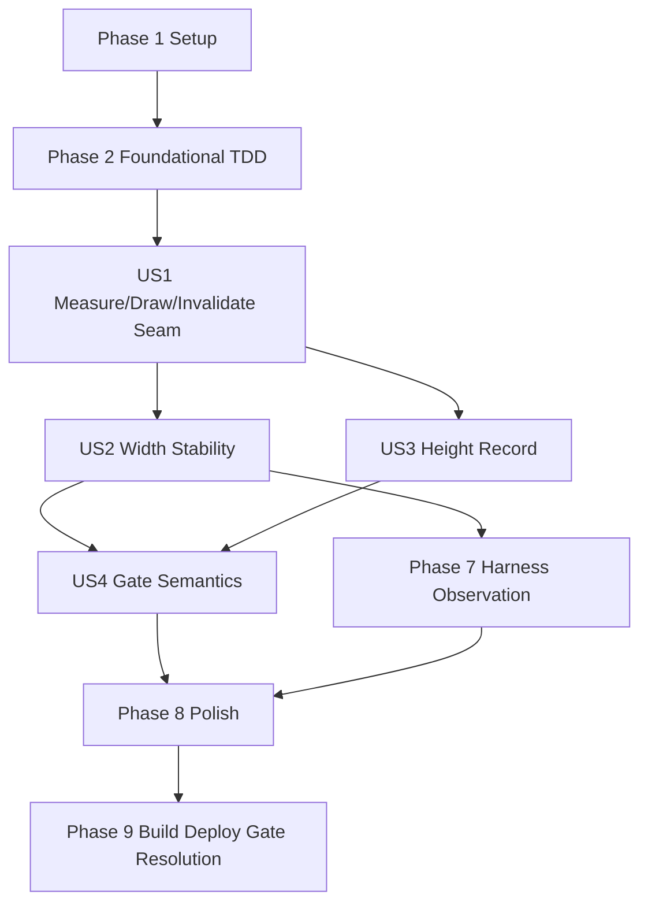

# Tasks: Ticket 0.5 CustomSpan Formula Placeholder Seam

**Input**: Design documents from `spec/ticket-0-5-customspan-placeholder-seam/`
**Prerequisites**: `spec/ticket-0-5-customspan-placeholder-seam/plan.md`, `spec/ticket-0-5-customspan-placeholder-seam/spec.md`
**Verification Scope**: build+ui (`Run verification + UI verification` selected)

**Tests**: Required. User requested TDD where possible at pre-agreed seams, regular typechecking (arkts_check), regular focused test runs, and one full test suite run at the end.

**Organization**: Tasks are grouped by user story. #123 is a gate ticket: it verifies the CustomSpan placeholder seam and must not switch any production chat path.

## Format: `[ID] [P?] [Story] Description`

- **[P]**: Can run in parallel when dependencies are satisfied and files do not conflict
- **[Story]**: Maps to a user story from `spec.md` (`US1`..`US4`)
- Each task names an exact repository-relative target path

## Path Conventions

- Feature artifacts: `spec/ticket-0-5-customspan-placeholder-seam/`
- Seam service: `entry/src/main/ets/services/CustomSpanPlaceholderSeam.ets`
- Temporary harness: `entry/src/main/ets/overlays/AgentFloatWindow/chat/CustomSpanSeamHarnessPage.ets`
- Entry tests: `entry/src/test/`
- Route profile (temporary): `entry/src/main/resources/base/profile/main_pages.json`
- App entry (temporary): `entry/src/main/ets/entryability/EntryAbility.ets`

## Phase 1: Setup (Shared Infrastructure)

**Purpose**: Re-establish #123 scope and protect unrelated dirty files.

- [X] T001 Record current branch, pre-existing unrelated dirty files, and #123 scoped file inventory in `spec/ticket-0-5-customspan-placeholder-seam/verification-record.md`
- [X] T002 [P] Review ArkTS strict rules before `.ets` edits in `docs/style/arkts-1.1.md`
- [X] T003 [P] Review spec 021 §5 (native Markdown + formula placeholders) and §12 (ticket-0 hard gate + CustomSpan failure branch) in `docs/specs/021-chat-streaming-incremental-rendering.md`
- [X] T004 [P] Verify the official CustomSpan API surface (measure/draw/invalidate, CustomSpanMetrics vp, CustomSpanDrawInfo px, API 24 baseline) via `devecocli docs`
- [X] T005 Ensure `spec/feature.json` is not repointed to this ticket and record the ownership boundary in `spec/ticket-0-5-customspan-placeholder-seam/verification-record.md`

---

## Phase 2: Foundational (Blocking Prerequisites)

**Purpose**: Create the focused TDD seam and register it before implementing seam behavior.

**Critical**: No user-story gate can be marked PASS until the focused seam exists and runs.

- [X] T006 Create the initial focused test file with red assertions (width estimate, open-phase width stability, close recompute, gate semantics) importing the not-yet-created service in `entry/src/test/CustomSpanPlaceholderSeam.test.ets`
- [X] T007 Register `CustomSpanPlaceholderSeam.test.ets` in the existing test suite in `entry/src/test/List.test.ets`
- [X] T008 Run the focused test before implementation and record the red result in `spec/ticket-0-5-customspan-placeholder-seam/verification-record.md`

**Checkpoint**: The focused seam exists, is registered, and has an initial red result.

---

## Phase 3: User Story 1 - Minimal measure/draw/invalidate lifecycle (Priority: P1) 🎯 MVP

**Goal**: Provide the CustomSpan seam (model + span + report) so the measure/draw/invalidate lifecycle is implemented and recordable.

**Independent Test**: Unit-test the model's measure metrics and the report's counters; on-device measure/draw/invalidate is proven in Phase 8 via the harness.

### Tests for User Story 1

- [X] T009 [P] [US1] Add report assertions: measure/draw/invalidate counters increment and last metrics/sample are stored in `entry/src/test/CustomSpanPlaceholderSeam.test.ets`

### Implementation for User Story 1

- [X] T010 [US1] Implement `FORMULA_PLACEHOLDER_MAX_CHARS`, `PlaceholderPhase`, `PlaceholderMetrics`, `DrawSample`, `estimatePlaceholderWidthVp`, and `InlineFormulaPlaceholderModel` in `entry/src/main/ets/services/CustomSpanPlaceholderSeam.ets`
- [X] T011 [US1] Implement `CustomSpanVerificationReport` with per-phase width sets and the width-stability getters in `entry/src/main/ets/services/CustomSpanPlaceholderSeam.ets`
- [X] T012 [US1] Implement `InlineFormulaPlaceholderSpan extends CustomSpan` (onMeasure/onDraw/invalidate overrides, gray chip drawing, vp2px injection) in `entry/src/main/ets/services/CustomSpanPlaceholderSeam.ets`
- [X] T013 [US1] Run `arkts_check` for the changed `.ets` files and record results in `spec/ticket-0-5-customspan-placeholder-seam/verification-record.md`
- [X] T014 [US1] Run the focused seam test and record PASS/FAIL evidence for US1 in `spec/ticket-0-5-customspan-placeholder-seam/verification-record.md`

**Checkpoint**: The seam compiles under ArkTS strict, the pure model is green, and the span adapter exists for the harness.

---

## Phase 4: User Story 2 - Width stable while open, updates on close (Priority: P1)

**Goal**: Prove by focused automated tests that deltas never change the open width and close recomputes exactly once.

**Independent Test**: Run `CustomSpanPlaceholderSeam.test.ets` width-stability assertions.

### Tests for User Story 2

- [X] T015 [P] [US2] Add width estimate assertions: deterministic bounds, monotonic growth, 40-char cap in `entry/src/test/CustomSpanPlaceholderSeam.test.ets`
- [X] T016 [P] [US2] Add open-phase assertions: repeated `appendDelta` keeps `measureMetrics().widthVp` frozen in `entry/src/test/CustomSpanPlaceholderSeam.test.ets`
- [X] T017 [P] [US2] Add close-transition assertions: width recomputed once, phase flips, re-close is idempotent in `entry/src/test/CustomSpanPlaceholderSeam.test.ets`
- [X] T018 [P] [US2] Add display-truncation assertions: over-cap content shows ellipsis and capped length in `entry/src/test/CustomSpanPlaceholderSeam.test.ets`

### Implementation for User Story 2

- [X] T019 [US2] Confirm the model freezes `openWidthVp` at construction and recomputes `closedWidthVp` only in `close()` in `entry/src/main/ets/services/CustomSpanPlaceholderSeam.ets`, and record the guarantee in `spec/ticket-0-5-customspan-placeholder-seam/verification-record.md`
- [X] T020 [US2] Run `arkts_check` for the changed `.ets` files and record results in `spec/ticket-0-5-customspan-placeholder-seam/verification-record.md`
- [X] T021 [US2] Run the focused seam test and record PASS/FAIL evidence for US2 in `spec/ticket-0-5-customspan-placeholder-seam/verification-record.md`

**Checkpoint**: The width-stability contract is proven by deterministic automated evidence.

---

## Phase 5: User Story 3 - Height and layout callback record (Priority: P1)

**Goal**: Prove the report captures draw offsets and that the close-phase height change is recorded for the later GeometryChanged design.

**Independent Test**: Run `CustomSpanPlaceholderSeam.test.ets` draw-sample/height assertions; on-device Text `onAreaChange` observation is recorded in Phase 8.

### Tests for User Story 3

- [X] T022 [P] [US3] Add draw-sample assertions: `lineHeight = lineBottom - lineTop`, last sample stored, draw count increments in `entry/src/test/CustomSpanPlaceholderSeam.test.ets`
- [X] T023 [P] [US3] Add height-transition assertions: open height (1.4×fontSize) vs closed height (2.2×fontSize) differ, and the report's last metrics reflect the phase in `entry/src/test/CustomSpanPlaceholderSeam.test.ets`

### Implementation for User Story 3

- [X] T024 [US3] Confirm the model exposes distinct open/closed heights and the harness records Text `onAreaChange` deltas; record the units contract (vp metrics / px draw info) in `spec/ticket-0-5-customspan-placeholder-seam/verification-record.md`
- [X] T025 [US3] Run the focused seam test and record PASS/FAIL evidence for US3 in `spec/ticket-0-5-customspan-placeholder-seam/verification-record.md`

**Checkpoint**: The height/layout callback record surface is proven by automated evidence; device observation remains for Phase 8.

---

## Phase 6: User Story 4 - Gate status and production boundary (Priority: P1)

**Goal**: Encode PASS/FAIL/INCOMPLETE gate semantics and prove the production boundary is preserved.

**Independent Test**: Inspect `verification-record.md` after final verification and confirm each status maps to the approved downstream action; inspect the production diff for forbidden rendering/persistence changes.

### Tests for User Story 4

- [X] T026 [US4] Add gate-status semantics assertions for PASS, FAIL, and INCOMPLETE in `entry/src/test/CustomSpanPlaceholderSeam.test.ets`

### Implementation for User Story 4

- [X] T027 [US4] Grep the production diff for `ChatBubble`, `AgentMessageList`, `chatItemKey`, `MarkdownRenderer`, `FormulaSplitRenderer`, and persistence changes; record the result in `spec/ticket-0-5-customspan-placeholder-seam/verification-record.md`
- [X] T028 [US4] Add PASS/FAIL/INCOMPLETE status template text and the contract-redesign (never finish-only) language to `spec/ticket-0-5-customspan-placeholder-seam/verification-record.md`

**Checkpoint**: Final gate resolution can be written unambiguously after Verification.

---

## Phase 7: On-Device Harness Observation (temporary)

**Purpose**: Build the temporary harness page, observe measure/draw/invalidate on the emulator, then delete the harness with zero residual diff.

- [X] T029 Create `entry/src/main/ets/overlays/AgentFloatWindow/chat/CustomSpanSeamHarnessPage.ets` (Text + span + three buttons + counter panel + hilog tag `CustomSpanSeam` + `onAreaChange` recording)
- [X] T030 Temporarily register the harness route in `entry/src/main/resources/base/profile/main_pages.json` and point `EntryAbility.onWindowStageCreate` `loadContent` at the harness route
- [X] T031 Run `arkts_check` for the harness and changed files; record results in `spec/ticket-0-5-customspan-placeholder-seam/verification-record.md`
- [X] T032 Build (debug) and deploy to the emulator (`MatePad Pro 13`), launch, drive 追加增量 / 闭合公式, and collect device logs for measure/draw/invalidate/area-change evidence in `spec/ticket-0-5-customspan-placeholder-seam/verification-record.md`
- [X] T033 Delete the harness page and restore `main_pages.json` + `EntryAbility.ets` byte-identical to HEAD; verify zero diff

**Checkpoint**: On-device evidence is captured; the harness leaves no production residue.

---

## Phase 8: Polish & Cross-Cutting Concerns

**Purpose**: Final typecheck, focused test, full suite, naming lint, and scoped diff review.

- [X] T034 Run `arkts_check` for all changed `.ets` files and record results in `spec/ticket-0-5-customspan-placeholder-seam/verification-record.md`
- [X] T035 Run the focused `CustomSpanPlaceholderSeam.test.ets` and record results in `spec/ticket-0-5-customspan-placeholder-seam/verification-record.md`
- [X] T036 Run the full entry test suite once and record results in `spec/ticket-0-5-customspan-placeholder-seam/verification-record.md`
- [X] T037 Run naming lint for the new files and record results in `spec/ticket-0-5-customspan-placeholder-seam/verification-record.md`
- [X] T038 Review the final diff and scoped file list excluding unrelated dirty files in `spec/ticket-0-5-customspan-placeholder-seam/verification-record.md`

---

## Phase 9: Verification & Gate Resolution

<!-- verification_scope: build+ui -->

**Purpose**: Build, deploy, and perform the single authoritative device verification for #123 (harness observation evidence from Phase 7), then resolve the gate status.

- [X] T039 Build the project and fix any compilation errors using HarmonyOS build tooling with `build-profile.json5`
- [X] T040 Deploy the application to the device/emulator with entry module metadata in `entry/src/main/module.json5`
- [X] T041 Resolve the gate status and `ui_verification_result` from the Phase 7 device evidence in `spec/ticket-0-5-customspan-placeholder-seam/verification-record.md`
- [X] T042 Run the `/code-review` skill on the scoped diff, pause for user confirmation, then commit the scoped work to the current branch per user instruction

---

## 📊 Dependency Graph



## ⚡ Parallel Execution Guide

| Phase | Tasks | Required Files | Execution Notes |
|-------|-------|----------------|-----------------|
| Setup | T002, T003, T004 | `docs/style/arkts-1.1.md`; `docs/specs/021-chat-streaming-incremental-rendering.md`; devecocli docs | Read-only references reviewed in parallel |
| Foundational | T006, T007, T008 | `entry/src/test/CustomSpanPlaceholderSeam.test.ets`; `entry/src/test/List.test.ets`; verification record | Create red test seam before implementing seam behavior |
| US1 | T009-T014 | focused test file; `services/CustomSpanPlaceholderSeam.ets`; verification record | Report assertions first; model + report + span implementation then arkts_check + focused run |
| US2 | T015-T021 | focused test file; `services/CustomSpanPlaceholderSeam.ets`; verification record | Estimate/stability/close/truncation assertions in one coordinated test slice |
| US3 | T022-T025 | focused test file; `services/CustomSpanPlaceholderSeam.ets`; verification record | Draw-sample + height assertions; units contract recorded |
| US4 | T026-T028 | focused test file; production diff; verification record | Gate semantics assertions; boundary checks are read-only diff/grep |
| Harness | T029-T033 | harness page; `main_pages.json`; `EntryAbility.ets`; emulator | Create → observe → delete with zero diff |
| Polish | T034-T038 | all changed `.ets` files; verification record; naming lint | arkts_check, focused test, full suite, naming lint, scoped diff |
| Verification | T039-T042 | build profile; module metadata; verification record; device/emulator | Build → deploy → gate resolution → code review → commit |

## Parallel Example

```text
After T001 records scope, T002/T003/T004 can run in parallel because they only read reference documents.
After T006 creates the focused test file, T015-T018 should be implemented as one coordinated test slice to avoid same-file conflicts.
T009 (report assertions) can be written while T010/T011 (model + report) are implemented, but T012 (span adapter) must land before the US1 checkpoint.
T022/T023 and T026 touch the same test file; coordinate them sequentially within their story phases.
The harness (T029-T033) is temporary-only; it must be fully deleted before the Polish sweep (T034-T038).
```

## Dependencies & Execution Order

### Phase Dependencies

- **Setup (Phase 1)**: No dependencies.
- **Foundational (Phase 2)**: Depends on Setup; blocks user-story work.
- **US1 Seam (Phase 3)**: Depends on registered red focused test.
- **US2 Width Stability (Phase 4)**: Depends on US1's model.
- **US3 Height Record (Phase 5)**: Depends on US1's report.
- **US4 Gate Semantics (Phase 6)**: Depends on US1-US3 evidence.
- **Harness (Phase 7)**: Depends on US2's model contract; temporary artifacts only.
- **Polish (Phase 8)**: Depends on user-story evidence and harness deletion.
- **Verification (Phase 9)**: Depends on Polish; resolves the gate status exactly once.

### Within Each User Story

- Write focused test assertions first; confirm red where feasible.
- Run `arkts_check` after changed `.ets` files (regular typechecking).
- Run focused tests regularly after logical slices.
- Run the full entry test suite once at the end (Polish phase).
- Do not import LaTeX/KaTeX/`MathTextParser`/`ContentProtocol` rendering and do not touch production chat paths.

## Implementation Strategy

### MVP First

1. Record scope and protect unrelated dirty files.
2. Create and register the focused seam test.
3. Implement model + report + span; prove width estimate, open stability, close recompute.
4. Prove draw-sample and height-transition records.
5. Encode gate semantics and verify the production boundary.
6. Build the temporary harness, observe on the emulator, delete it.
7. Run the full sweep, resolve the gate, code review, commit.

### Final Validation and Delivery

1. `arkts_check`, focused tests, full suite, naming lint, `git diff --check`.
2. Build and deploy.
3. Resolve the gate from the Phase 7 device evidence.
4. Run code review after verification; report findings and pause before staging or commit.
5. Commit the scoped work to the current branch per user instruction.

## Notes

- Total tasks: 42.
- Verification scope: `build+ui`.
- UI result marker remains tri-state until final Verification resolves it.
- PASS requires both automated and device evidence.
- FAIL returns to the three-state rendering contract design; finish-only rendering is never adopted.
- INCOMPLETE blocks the rendering contract and records missing device evidence as blocked tasks.
- Every task starts with `- [X]`, task IDs are sequential, user-story tasks include `[USx]`, and non-story phases omit story labels.
- After Phase 9, the main agent runs the `/code-review` skill on the scoped diff, pauses for user confirmation (repo red line), then commits to the current branch (`feature/spec-019-p0`).
