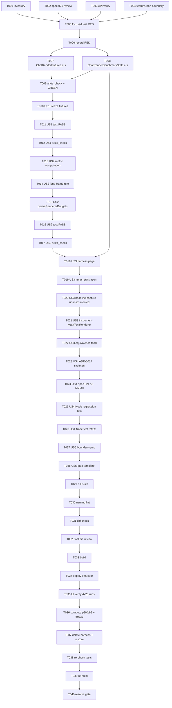

# Tasks: Ticket 0.6 Chat Render Fixtures and Budgets

**Input**: Design documents from `spec/ticket-0-6-chat-render-fixtures-budgets/`
**Prerequisites**: `spec/ticket-0-6-chat-render-fixtures-budgets/plan.md`, `spec/ticket-0-6-chat-render-fixtures-budgets/spec.md`
**Verification scope**: `build+ui`（用户已选择：基准设备证据是本 ticket 核心交付物）

**Tests**: TDD 已要求（spec FR-012 + plan 测试契约）。聚焦 Hypium 测试先写先红，Node 回归断言生产边界与 ADR/spec 回填。

**Organization**: 任务按用户故事分组；US1~US5 均为 P1（硬门禁系列 ticket 惯例）。

## Format: `[ID] [P?] [Story] Description`

- **[P]**: 可并行（不同文件、无依赖）
- **[Story]**: 归属用户故事（仅用户故事阶段任务带标签）
- 描述必须含精确文件路径

## Path Conventions

- Feature 工件: `spec/ticket-0-6-chat-render-fixtures-budgets/`
- 生产 seam 服务: `entry/src/main/ets/services/`
- 生产渲染器（最小埋点）: `entry/src/main/ets/shared/atoms/MathTextRenderer.ets`
- 临时 harness 页（观察后删除）: `entry/src/main/ets/overlays/AgentFloatWindow/chat/`
- 测试: `entry/src/test/`（Hypium）、`scripts/arkts-lint/tests/`（Node .mjs）
- 冻结落点: `docs/adr/0017-renderer-scheduler-budget-baseline.md` + `docs/specs/021-chat-streaming-incremental-rendering.md` §6

---

## Phase 1: Setup (Shared Infrastructure)

**Purpose**: 环境盘点、参考文档核对、官方 API 验证、所有权边界

- [X] T001 Record current branch, pre-existing unrelated dirty files, and #124 scoped file inventory in `spec/ticket-0-6-chat-render-fixtures-budgets/verification-record.md`
- [X] T002 [P] Review spec 021 §6 (RendererScheduler budgets) and §12 (ticket-0 hard gate, fixture/metric failure branches) in `docs/specs/021-chat-streaming-incremental-rendering.md`; record findings in `spec/ticket-0-6-chat-render-fixtures-budgets/verification-record.md`
- [X] T003 [P] Verify official APIs via `devecocli docs`: `@ohos.graphics.displaySync` (frame timestamp), `@ohos.hichecker` (slow-event rules), `hidebug.getAppVMMemoryInfo` (steady memory); record docIds and API 24 availability in `spec/ticket-0-6-chat-render-fixtures-budgets/verification-record.md`
- [X] T004 Ensure `spec/feature.json` is not repointed to this ticket and record the ownership boundary in `spec/ticket-0-6-chat-render-fixtures-budgets/verification-record.md`

---

## Phase 2: Foundational (Blocking Prerequisites)

**Purpose**: 纯逻辑 fixture/统计/预算推导 + 测量 seam 服务 + TDD 红步

**⚠️ CRITICAL**: 用户故事全部依赖本阶段完成

- [X] T005 Write focused Hypium test `entry/src/test/ChatRenderFixturesBudget.test.ets` (fixtures determinism, percentile p50/p95, visible condition, long-frame classification, budget derivation, stats counters/snapshot semantics including N-calls-→-N-count assertions for `recordWebCreate`/`recordHeightUpdate`/`recordCacheHit`/`recordCacheMiss`/`recordDegradation`) and register it in `entry/src/test/List.test.ets`
- [X] T006 Run the focused test before implementation with the DevEco-bundled hvigor runner and record the RED result in `spec/ticket-0-6-chat-render-fixtures-budgets/verification-record.md`
- [X] T007 [P] Implement pure fixture/statistics/budget logic in `entry/src/main/ets/services/ChatRenderFixtures.ets` (fixtures A/B/C/C′ constants, `percentile()`, `isVisibleSample()`, `classifyLongFrames()`, `deriveRendererBudgets()`)
- [X] T008 [P] Implement the measurement seam in `entry/src/main/ets/services/ChatRenderBenchmarkStats.ets` (always-on integer counters, gated sample buffering, `enableForRun`/`disable`/`snapshot`, structured hilog dump)
- [X] T009 Run `arkts_check` on the two new `.ets` files and the focused test; record GREEN foundational evidence in `spec/ticket-0-6-chat-render-fixtures-budgets/verification-record.md`

**Checkpoint**: Foundation ready — 纯逻辑与 seam 可独立验证

---

## Phase 3: User Story 1 - Deterministic A/B/C/C′ fixtures (Priority: P1)

**Goal**: 四组确定性 fixture，字符数一致、公式数 0/2/6/6、C′ 三对连续闭合

**Independent Test**: `ChatRenderFixturesBudget.test.ets` 的 fixture 断言组全绿

- [X] T010 [US1] Freeze fixture constants in `entry/src/main/ets/services/ChatRenderFixtures.ets`: exactly 2000 UTF-16 code-units per fixture (the same unit as the Q19 offset decision), character-identical across A/B/C/C′ except formula count (0/2/6/6) and formula close timing; C′ arranged as 3 consecutive closed pairs; deterministic strings
- [X] T011 [US1] Run the focused fixture assertions in `entry/src/test/ChatRenderFixturesBudget.test.ets` and record PASS evidence in `spec/ticket-0-6-chat-render-fixtures-budgets/verification-record.md`
- [X] T012 [US1] Run `arkts_check` for `ChatRenderFixtures.ets` and record the result in `spec/ticket-0-6-chat-render-fixtures-budgets/verification-record.md`

**Checkpoint**: US1 独立可验证 — fixture 定义冻结

---

## Phase 4: User Story 2 - Frozen metric definitions and percentile reporting (Priority: P1)

**Goal**: `visible` 判定、T 指标计算、长帧规则、p50/p95、预算推导公式全部为可单测纯函数

**Independent Test**: `ChatRenderFixturesBudget.test.ets` 的指标/统计/推导断言组全绿

- [X] T013 [US2] Implement frozen metric computation in `entry/src/main/ets/services/ChatRenderFixtures.ets`: `isVisibleSample()` (rendered + in viewport + height applied), timing metric computations (`T_firstDeltaToVisible`, `finish→visible`, `T_finishToStable` with the 500ms-no-change stability rule). Freeze the `T_firstDeltaToVisible` semantics: record-only, no hard gate; the observation alarm line p95 ≤1.5s is recorded as an observation when exceeded and never blocks the gate; a product-level threshold is a separate decision not mixed into this gate
- [X] T014 [US2] Implement long-frame classification in `entry/src/main/ets/services/ChatRenderFixtures.ets`: frame duration >32ms is a long frame; consecutive-long-frame violation detection
- [X] T015 [US2] Implement `deriveRendererBudgets()` in `entry/src/main/ets/services/ChatRenderFixtures.ets` per the plan formula: `maxWebCreatesPerFrame = clamp(floor(32 / median(perCreateWorkMs)), 1, 4)`; `maxWebWorkMsPerFrame = clamp(round(p75(perCreateWorkMs)), 1, 16)`
- [X] T016 [US2] Run focused metric/budget assertions with synthetic evidence in `entry/src/test/ChatRenderFixturesBudget.test.ets` and record PASS evidence in `spec/ticket-0-6-chat-render-fixtures-budgets/verification-record.md`
- [X] T017 [US2] Run `arkts_check` for `ChatRenderFixtures.ets` and record the result in `spec/ticket-0-6-chat-render-fixtures-budgets/verification-record.md`

**Checkpoint**: US2 独立可验证 — 指标与推导公式冻结

---

## Phase 5: User Story 3 - Measurement seam + benchmark harness (Priority: P1)

**Goal**: 临时 harness 页（含未埋点基线捕获）+ 生产渲染器最小埋点 + 行为等价三件套证明，驱动生产渲染链路自动跑 4×20 次

**Independent Test**: 同一 fixture 在埋点前后渲染输出一致（DOM 结构/可见文本/高度）+ 全量套件通过 + 计数单测 N→N + harness 页 `arkts_check` + 模拟器实际运行出报告

- [X] T018 [US3] Create temporary harness page `entry/src/main/ets/overlays/AgentFloatWindow/chat/ChatRenderBenchmarkHarness.ets`: query `ArkWebWarmupService.getBenchmarkBaselinePrecondition()` (fail fast when not `valid`), drive production `ChatBubble` via `@State ChatMsg` with fixed-chunk/fixed-tick delta injection, DisplaySync frame sampling in the finish+500ms window, `hidebug.getAppVMMemoryInfo()` at finish+30s, auto-run 4 fixtures × 20 runs, emit structured `[ChatRenderBench]` hilog lines and per-fixture p50/p95 summaries, and append raw per-run samples (one record per run) to `filesDir/chat-render-benchmark/<fixture>.json`
- [X] T019 [US3] Temporarily register the harness page in `entry/src/main/resources/base/profile/main_pages.json` and set the temporary entry in `entry/src/main/ets/entryability/EntryAbility.ets` (both to be restored byte-identical later)
- [X] T020 [US3] Run a BASELINE capture with the still UN-instrumented `MathTextRenderer`: drive one fixed fixture through the harness and record its render outputs (per-block heights, visible text, degradation counts, page-load count) to `filesDir` and hilog as the pre-seam reference
- [X] T021 [US3] Instrument `entry/src/main/ets/shared/atoms/MathTextRenderer.ets` minimally: wrap all `webHeight` assignments in a private `setWebHeight()` that records height updates, call `recordWebCreate()` in `onPageEnd`, record cache hit/miss in `cacheGet`, record degradation at `webFailed` set and plainFallback entry — via `entry/src/main/ets/services/ChatRenderBenchmarkStats.ets`
- [X] T022 [US3] Produce the behavior-equivalence triad evidence in `spec/ticket-0-6-chat-render-fixtures-budgets/verification-record.md`: (a) re-run the same fixed fixture with the instrumented renderer and diff render outputs against the T020 baseline — DOM structure / visible text / heights must be identical; (b) `arkts_check` plus the full entry test suite pass; (c) stats counting unit tests prove N calls → count N for every counter

**Checkpoint**: US3 就绪 — 行为等价三件套成立 + harness 可运行

---

## Phase 6: User Story 4 - RendererScheduler budget defaults frozen from evidence (Priority: P1)

**Goal**: ADR-0017 骨架 + spec 021 §6 回填骨架 + Node 回归断言（数值待真机证据填入）

**Independent Test**: Node 回归断言通过（边界 + 回填存在）；ADR 推导可复算

- [X] T023 [US4] Create `docs/adr/0017-renderer-scheduler-budget-baseline.md` with the derivation rule, device model (MatePad Pro 13 emulator), fixture/metric definitions reference, and evidence placeholders to be filled from device runs
- [X] T024 [US4] Backfill `docs/specs/021-chat-streaming-incremental-rendering.md` §6 with the frozen budget derivation and value placeholders (to be finalized from device evidence)
- [X] T025 [US4] Create Node regression test `scripts/arkts-lint/tests/chat-render-benchmark-gate.test.mjs`: assert no `StreamingReplyDocument`/`RendererScheduler`/`RenderTick` in the production diff, `MathTextRenderer` render logic preserved, harness file absent and `main_pages.json`/`EntryAbility.ets` restored after cleanup, ADR-0017 and spec 021 §6 contain the frozen budget values
- [X] T026 [US4] Run the focused Node regression test and record PASS evidence in `spec/ticket-0-6-chat-render-fixtures-budgets/verification-record.md`

**Checkpoint**: US4 骨架就绪 — 等真机证据填值

---

## Phase 7: User Story 5 - Gate status, warmup precondition, production boundary (Priority: P1)

**Goal**: 门禁三态模板 + 生产边界 grep 证据

**Independent Test**: 生产 diff 审查 + 门禁语义模板就位

- [X] T027 [US5] Grep the production `entry/src/main/ets` diff for `StreamingReplyDocument`, `RendererScheduler`, `RenderTick` absence; confirm `MarkdownRenderer`/`FormulaSplitRenderer` and Preferences chat-history paths intact; record results in `spec/ticket-0-6-chat-render-fixtures-budgets/verification-record.md`
- [X] T028 [US5] Add PASS/FAIL/INCOMPLETE gate status template text to `spec/ticket-0-6-chat-render-fixtures-budgets/verification-record.md`: PASS requires ≥20 runs per fixture + frozen budgets + boundary intact; FAIL = not reproducible (fix fixtures first, never pass on subjective smoothness) or `T_finishToStable` p95 >500ms or boundary violation; INCOMPLETE = device evidence missing. Also freeze: `T_firstDeltaToVisible` is observation-only (no hard gate); skipping collection out of fear that `T_finishToStable` p95 exceeds 500ms is FORBIDDEN — collection must run, exceeding the threshold is a FAIL, never a skip reason

**Checkpoint**: 门禁与边界语义冻结

---

## Phase 8: Polish & Cross-Cutting Concerns

**Purpose**: 全量检查与最终 diff 盘点

- [X] T029 [P] Run the full entry Hypium suite once with the DevEco-bundled hvigor runner and record results in `spec/ticket-0-6-chat-render-fixtures-budgets/verification-record.md`
- [X] T030 [P] Run naming lint (`node scripts/naming-lint/index.mjs`) and record results in `spec/ticket-0-6-chat-render-fixtures-budgets/verification-record.md`
- [X] T031 Run `git diff --check` and record results in `spec/ticket-0-6-chat-render-fixtures-budgets/verification-record.md`
- [X] T032 Review the final scoped diff against the T001 pre-existing dirty inventory (exclude unrelated #019/spec021 dirty work) and record the scoped file list in `spec/ticket-0-6-chat-render-fixtures-budgets/verification-record.md`

---

## Phase 9: Verification

<!-- verification_scope: build+ui -->

**Purpose**: 构建、部署、设备基准自动运行（4×20，单进程完成，无人工 UI 交互验证）、证据转录、预算冻结、harness 清理、门禁定级

- [X] T033 Build the project (debug) with `build_project` and fix any compilation errors until success; record build evidence in `spec/ticket-0-6-chat-render-fixtures-budgets/verification-record.md`
- [X] T034 Deploy the app to the MatePad Pro 13 emulator (127.0.0.1:5555) via `start_app`; confirm the harness page is the entry. **Single-process constraint (hard)**: 启动 → warmup → precondition 查询 → 4×20 采集 MUST complete in the same process session; the app MUST NOT be restarted mid-collection (the precondition is in-process state — a restart resets it to initial/unknown and fails the gate)
- [X] T035 Run the device benchmark against the deployed harness: let the 4 fixtures × 20 runs complete (≈50–60 min, monitor structured `[ChatRenderBench]` progress lines), collect hilog incrementally via `hdc_log`. **No manual UI interaction** — the core is automatic benchmark execution + automatic collection. Raw per-run samples are appended by the harness to `filesDir/chat-render-benchmark/<fixture>.json` (one record per run, dual-channel with structured hilog); an interruption (emulator crash/timeout) retains completed fixture groups so no full re-run is needed. **Skip prohibition**: collection MUST run — skipping out of concern that `T_finishToStable` p95 may exceed 500ms is forbidden; exceeding the threshold is a FAIL, never a reason to skip. Record raw per-run numbers in `spec/ticket-0-6-chat-render-fixtures-budgets/verification-record.md`
- [X] T036 Compute p50/p95 per fixture from the RAW collected runs (recompute from raw samples, not from pre-summarized numbers); transcribe the raw per-run data into the `docs/adr/0017-renderer-scheduler-budget-baseline.md` evidence section and the verification record; fill the frozen budget values into `docs/adr/0017-renderer-scheduler-budget-baseline.md` and `docs/specs/021-chat-streaming-incremental-rendering.md` §6; record the derivation recomputation in `spec/ticket-0-6-chat-render-fixtures-budgets/verification-record.md`
- [X] T037 Delete the temporary harness page `entry/src/main/ets/overlays/AgentFloatWindow/chat/ChatRenderBenchmarkHarness.ets`; restore `entry/src/main/resources/base/profile/main_pages.json` and `entry/src/main/ets/entryability/EntryAbility.ets` byte-identical; verify zero residual diff and record the proof in `spec/ticket-0-6-chat-render-fixtures-budgets/verification-record.md`
- [X] T038 Re-run `arkts_check` on all changed `.ets` files, the focused `ChatRenderFixturesBudget.test.ets`, and the Node `chat-render-benchmark-gate.test.mjs` after cleanup; record results in `spec/ticket-0-6-chat-render-fixtures-budgets/verification-record.md`
- [X] T039 Re-run the debug build after cleanup and record the result in `spec/ticket-0-6-chat-render-fixtures-budgets/verification-record.md`
- [X] T040 Resolve the final gate status (PASS / FAIL / INCOMPLETE) using the collected device evidence, warmup precondition state, budget freeze, and production boundary checks; record the final status in `spec/ticket-0-6-chat-render-fixtures-budgets/verification-record.md`

---

## Dependencies & Execution Order

### Phase Dependencies

- **Setup (Phase 1)**: 无依赖，立即开始
- **Foundational (Phase 2)**: 依赖 Setup 完成；**BLOCKS 所有用户故事**
- **User Stories (Phase 3–7)**: 全部依赖 Foundational 完成；按 P1 顺序串行（US1 → US2 → US3 → US4 → US5）
- **Polish (Phase 8)**: 依赖全部用户故事完成
- **Verification (Phase 9)**: 依赖全部前序阶段

### User Story Dependencies

- **US1**: Foundational 后即可开始，无故事间依赖
- **US2**: 依赖 US1（同一 `ChatRenderFixtures.ets` 顺序扩展）
- **US3**: 依赖 Foundational 的 T008（stats seam）；埋点对象 `MathTextRenderer.ets` 独立于 US1/US2
- **US4**: 骨架不依赖 US3 实现；真机数值依赖 Verification 的 T035/T036
- **US5**: 依赖 US3 完成（生产 diff 才存在）

### Within Each User Story

- 测试（T005/T006）必须先写并 RED 后再实现
- 纯函数先行，埋点次之，harness 最后
- 每故事完成后跑对应聚焦断言并记录证据

---

## Parallel Example: Foundational Phase

```bash
# T007 与 T008 为不同文件、无依赖，可并行实现：
Task: "Implement pure fixture/statistics/budget logic in entry/src/main/ets/services/ChatRenderFixtures.ets"
Task: "Implement the measurement seam in entry/src/main/ets/services/ChatRenderBenchmarkStats.ets"

# 完成后合流到 T009（arkts_check + 聚焦测试 GREEN）
```

---

## 📊 Dependency Graph



## ⚡ Parallel Execution Guide

| Phase | Tasks | Required Files | Execution Notes |
|---|---|---|---|
| Setup | T002, T003 (并行) | docs/specs/021 + devecocli docs | T001 先行；T004 独立 |
| Foundational | T007, T008 (并行) | 无（新文件） | T005/T006 红步先行；T007/T008 完成后 T009 |
| US1 | T010→T011→T012 串行 | ChatRenderFixtures.ets | 依赖 Foundational |
| US2 | T013→T014→T015→T016→T017 串行 | ChatRenderFixtures.ets | 依赖 US1 |
| US3 | T018→T019→T020→T021→T022 串行 | MathTextRenderer.ets + harness | 依赖 Foundational(T008)；T020 基线捕获必须在 T021 埋点之前 |
| US4 | T023→T024→T025→T026 | ADR + spec + Node test | T023/T024 可并行（不同文件） |
| US5 | T027, T028 | verification-record | T027 依赖 US3 完成 |
| Polish | T029, T030 并行 | 测试套件 + lint | T031/T032 收尾 |
| Verification | T033→T040 串行 | 全部 | 依赖所有前序阶段 |

## Implementation Strategy

1. **MVP (US1)**: Setup + Foundational → US1（fixture 冻结 + 测试绿）→ 停止验证
2. **增量**: US2（指标/推导纯函数）→ US3（埋点 + harness）→ US4（ADR/spec 骨架 + Node 断言）→ US5（边界）→ Polish
3. **验证**: 构建 → 部署模拟器 → 4×20 UI 验证 → 证据转录 + 预算冻结 → harness 删除 + 恢复 → 复查 → 门禁定级

## Notes

- [P] 任务 = 不同文件、无依赖
- [Story] 标签映射到 spec.md 用户故事
- 每个故事独立可测、独立交付
- 红步证据必须记录（T006）
- 生产边界（US5 T027）与 harness 清理（T037）是硬验收项，缺失则 gate 记为 FAIL/INCOMPLETE，绝不 PASS；DevEco 模拟器性能目标未达时记录为 `PASS_WITH_EMULATOR_PERFORMANCE_FOLLOW_UP`，不伪装达标
- 设备证据不可复现时：先修 fixture/指标（FAIL），不以主观流畅度放行（spec 021 §12）；设备证据可复现但 DevEco 模拟器性能目标未达时，保留原始数据并转为性能跟进
- **单进程约束**（硬）：启动 → warmup → precondition 查询 → 4×20 采集同一进程完成，不得中途重启（precondition 为进程内状态，重启即重置）
- **原始数据保留**：每 run 原始样本落盘 `filesDir/chat-render-benchmark/`（与结构化 hilog 双通道）；中断保留已完成组、不整轮重跑；ADR 可复算必须基于原始样本
- **禁止跳过采集**：不得因担心 `T_finishToStable` p95 超过 500ms 而跳过采集；DevEco 模拟器超过该初始性能目标时记录性能跟进，不降低目标；Verification 阶段无人工 UI 交互验证
- 每步 `.ets` 编辑后跑 `arkts_check`；最终 full suite 一次
- 结束点：Phase 9 完成后停止，`/code-review` 与 commit 前等待用户确认
